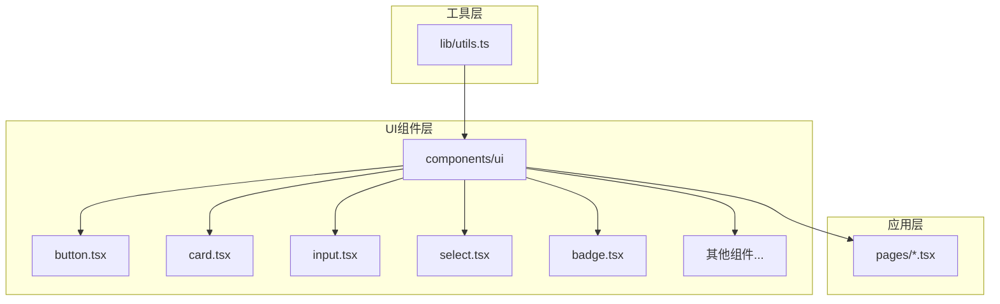
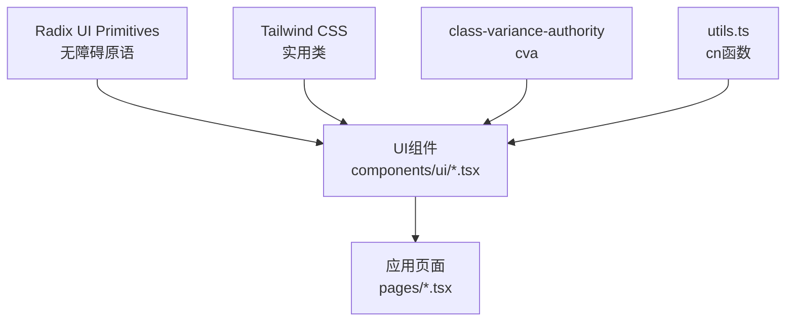
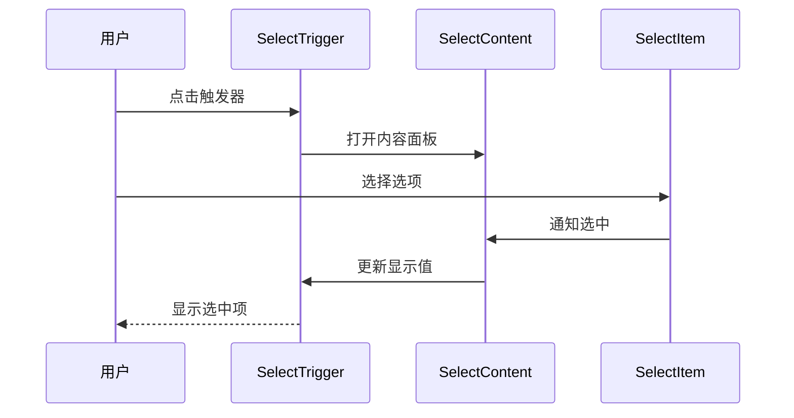
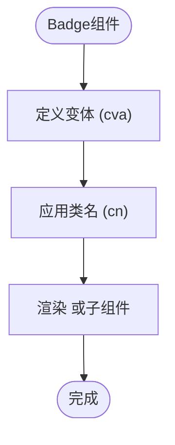
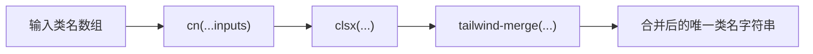
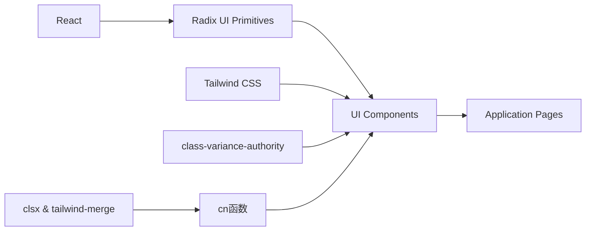

# UI组件架构

<cite>
**本文档引用文件**  
- [button.tsx](file://src/components/ui/button.tsx)
- [badge.tsx](file://src/components/ui/badge.tsx)
- [card.tsx](file://src/components/ui/card.tsx)
- [input.tsx](file://src/components/ui/input.tsx)
- [select.tsx](file://src/components/ui/select.tsx)
- [textarea.tsx](file://src/components/ui/textarea.tsx)
- [slider.tsx](file://src/components/ui/slider.tsx)
- [switch.tsx](file://src/components/ui/switch.tsx)
- [table.tsx](file://src/components/ui/table.tsx)
- [tabs.tsx](file://src/components/ui/tabs.tsx)
- [tooltip.tsx](file://src/components/ui/tooltip.tsx)
- [label.tsx](file://src/components/ui/label.tsx)
- [utils.ts](file://src/lib/utils.ts)
</cite>

## 目录
1. [简介](#简介)
2. [项目结构](#项目结构)
3. [核心组件](#核心组件)
4. [架构概览](#架构概览)
5. [详细组件分析](#详细组件分析)
6. [依赖分析](#依赖分析)
7. [性能考量](#性能考量)
8. [故障排除指南](#故障排除指南)
9. [结论](#结论)

## 简介
本文档深入解析基于Radix UI与Tailwind CSS构建的原子化设计系统。该系统通过`components/ui`目录下的可复用UI组件，实现了高度一致、无障碍且可定制的用户界面。所有组件均采用Radix UI的无样式原语（primitives）确保最佳可访问性，并通过Tailwind CSS与`class-variance-authority`（cva）进行灵活的样式管理。`src/lib/utils.ts`中的`cn`工具函数在类名合并中扮演核心角色，是组件开发的基石。本文档旨在为开发者提供创建新组件的规范指南。

## 项目结构
项目采用清晰的模块化结构，将UI组件集中管理于`src/components/ui`目录下。每个组件以独立的`.tsx`文件实现，遵循原子设计原则，便于复用和维护。业务逻辑页面位于`src/pages`，通过组合这些基础组件构建复杂界面。



**图示来源**
- [button.tsx](file://src/components/ui/button.tsx)
- [utils.ts](file://src/lib/utils.ts)

**本节来源**
- [src/components/ui](file://src/components/ui)
- [src/pages](file://src/pages)

## 核心组件
`components/ui`目录下的组件是整个设计系统的基石。它们共同的特点是：
1.  **基于Radix UI**：使用Radix UI提供的`@radix-ui/react-*`包作为底层原语，确保组件具备原生级别的无障碍支持（如键盘导航、ARIA属性）。
2.  **Tailwind CSS驱动**：样式完全由Tailwind的实用类（utility classes）定义，实现快速开发和一致的视觉风格。
3.  **cva变体管理**：通过`class-variance-authority`定义组件的变体（variants）和尺寸（sizes），提供清晰的API。
4.  **`cn`工具函数**：利用`src/lib/utils.ts`中的`cn`函数安全地合并动态类名。

**本节来源**
- [button.tsx](file://src/components/ui/button.tsx)
- [utils.ts](file://src/lib/utils.ts)

## 架构概览
该UI架构采用分层设计，将无障碍逻辑、样式定义和组件实现分离。



**图示来源**
- [button.tsx](file://src/components/ui/button.tsx)
- [utils.ts](file://src/lib/utils.ts)

## 详细组件分析

### 按钮组件分析
`button.tsx`是理解该设计系统API设计的典范。

#### 组件API与变体管理
`buttonVariants`常量使用`cva`函数定义了按钮的`variant`（如default, destructive, outline）和`size`（如default, sm, lg, icon）两个维度的样式变体。`defaultVariants`设定了默认值。

```mermaid
classDiagram
class Button {
+className : string
+variant : "default" | "destructive" | "outline" | "secondary" | "ghost" | "link"
+size : "default" | "sm" | "lg" | "icon"
+asChild : boolean
+...props : React.ComponentProps<"button">
}
class buttonVariants {
+variants : { variant : {...}, size : {...} }
+defaultVariants : { variant : "default", size : "default" }
}
Button --> buttonVariants : "使用"
```

**图示来源**
- [button.tsx](file://src/components/ui/button.tsx#L7-L35)

#### 渲染逻辑与asChild模式
`Button`组件通过`asChild` prop实现灵活的渲染。当`asChild`为`true`时，使用Radix UI的`Slot`组件，允许将按钮的样式和行为应用到任意子组件上，极大地增强了复用性。

**本节来源**
- [button.tsx](file://src/components/ui/button.tsx#L37-L58)

### 输入框与选择器组件分析
`input.tsx`和`select.tsx`展示了基础表单元素的实现。

#### 基础输入框
`Input`组件直接包装原生`<input>`元素，通过`cn`函数合并了大量Tailwind类，定义了边框、阴影、焦点状态、禁用状态和验证错误状态的样式，确保了统一的交互体验。

**本节来源**
- [input.tsx](file://src/components/ui/input.tsx)

#### 复合选择器
`Select`组件是一个复合组件，由多个子组件（`SelectTrigger`, `SelectContent`, `SelectItem`等）构成。它完全基于`@radix-ui/react-select`，利用其强大的弹出层、滚动和键盘导航功能，开发者只需专注于样式定制。



**图示来源**
- [select.tsx](file://src/components/ui/select.tsx)

### 卡片与标签组件分析
`card.tsx`和`badge.tsx`体现了容器类和装饰类组件的设计。

#### 卡片布局
`Card`组件提供了一个结构化的容器，包含`CardHeader`, `CardTitle`, `CardDescription`, `CardContent`, `CardFooter`等子组件，用于组织内容区块。

**本节来源**
- [card.tsx](file://src/components/ui/card.tsx)

#### 标签样式
`Badge`组件使用`cva`定义了不同变体（default, secondary, destructive, outline）的样式，常用于状态标记或分类。



**图示来源**
- [badge.tsx](file://src/components/ui/badge.tsx#L7-L26)

### 工具函数分析
`src/lib/utils.ts`中的`cn`函数是整个UI系统的关键。

#### `cn`函数的作用
`cn`函数是`clsx`和`tailwind-merge`的封装。`clsx`用于条件性地合并类名，而`tailwind-merge`则能智能地合并冲突的Tailwind类（例如，`p-2 p-4`会被合并为`p-4`），确保最终的样式是可预测的。



**本节来源**
- [utils.ts](file://src/lib/utils.ts#L5-L7)

## 依赖分析
系统依赖关系清晰，层次分明。



**图示来源**
- [bun.lock](file://bun.lock)
- [utils.ts](file://src/lib/utils.ts)

**本节来源**
- [bun.lock](file://bun.lock)
- [package.json](file://package.json)

## 性能考量
由于组件主要由轻量级的React函数组件和静态的Tailwind类构成，运行时性能开销极小。Radix UI的原语经过优化，确保了无障碍功能不会带来显著的性能负担。类名合并由`tailwind-merge`在编译时或运行时高效处理。

## 故障排除指南
- **样式未生效**：检查是否正确使用了`cn`函数合并类名，避免Tailwind类冲突。
- **无障碍问题**：确保遵循Radix UI文档，正确使用其提供的props和ARIA属性。
- **变体不工作**：检查`cva`配置中的`variants`键名是否与组件props一致。

**本节来源**
- [button.tsx](file://src/components/ui/button.tsx)
- [utils.ts](file://src/lib/utils.ts)

## 结论
该项目的UI组件架构通过结合Radix UI、Tailwind CSS和`class-variance-authority`，成功构建了一个既美观又无障碍、高度可复用且易于维护的原子化设计系统。`cn`工具函数是连接样式与组件的桥梁。开发者在创建新组件时，应严格遵循此模式：使用Radix原语保证无障碍，使用cva定义变体，使用`cn`合并类名，从而保持整个应用UI的一致性和高质量。