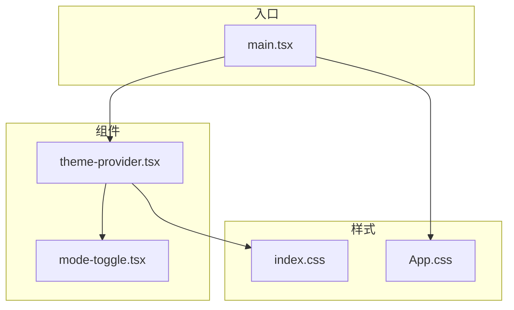
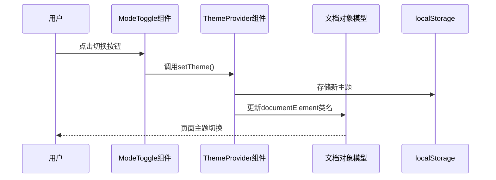
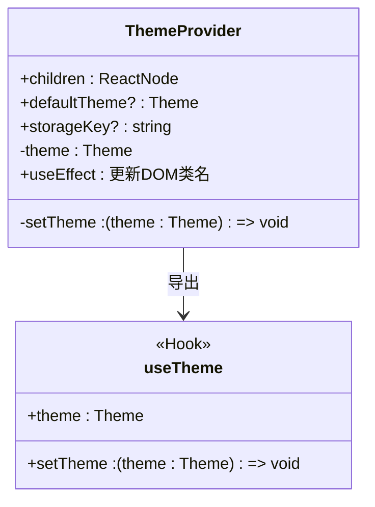
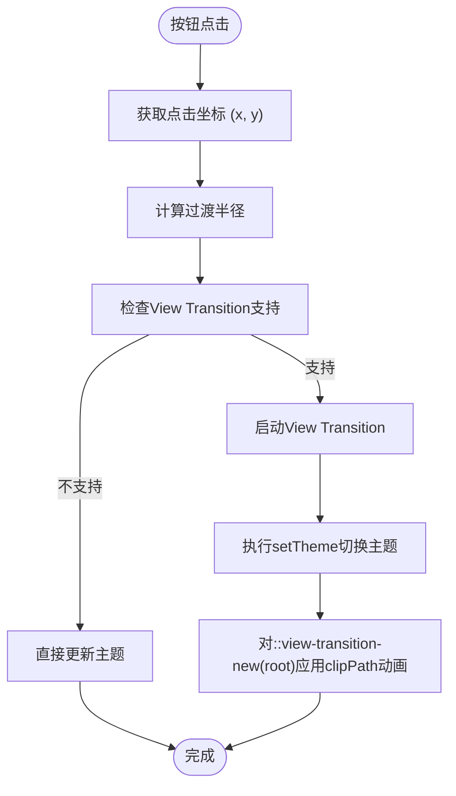

# 主题系统

<cite>
**本文档中引用的文件**  
- [main.tsx](file://src/main.tsx)
- [theme-provider.tsx](file://src/components/theme-provider.tsx)
- [mode-toggle.tsx](file://src/components/mode-toggle.tsx)
- [index.css](file://src/index.css)
- [App.css](file://src/App.css)
- [router.tsx](file://src/plugins/router.tsx)
- [README.md](file://README.md)
- [package.json](file://package.json)
</cite>

## 目录
1. [简介](#简介)
2. [项目结构](#项目结构)
3. [核心组件](#核心组件)
4. [架构概述](#架构概述)
5. [详细组件分析](#详细组件分析)
6. [依赖分析](#依赖分析)
7. [性能考虑](#性能考虑)
8. [故障排除指南](#故障排除指南)
9. [结论](#结论)

## 简介
“主题系统”是基于 React + TypeScript + Vite + Bun 构建的现代化工具库项目中的核心功能之一，旨在为用户提供深色与浅色模式的无缝切换体验。该系统结合了 Tailwind CSS 和 shadcn/ui 的设计能力，利用 React 的上下文机制实现主题状态的全局管理。通过 `theme-provider` 和 `mode-toggle` 两个核心组件，实现了用户偏好存储、系统主题适配以及动画过渡效果，提升了整体用户体验。

**Section sources**
- [README.md](file://README.md#L3-L297)

## 项目结构
项目采用模块化结构，将主题相关组件集中于 `src/components/` 目录下。`theme-provider.tsx` 负责提供主题上下文，`mode-toggle.tsx` 实现主题切换按钮，两者共同构成主题系统的核心。全局样式定义在 `src/index.css` 中，使用 CSS 自定义属性管理深色与浅色模式的颜色变量。应用入口 `main.tsx` 通过 `ThemeProvider` 包裹整个应用，确保主题状态可被所有子组件访问。



**Diagram sources**
- [main.tsx](file://src/main.tsx#L1-L23)
- [theme-provider.tsx](file://src/components/theme-provider.tsx#L1-L74)
- [mode-toggle.tsx](file://src/components/mode-toggle.tsx#L1-L53)
- [index.css](file://src/index.css#L1-L251)

**Section sources**
- [main.tsx](file://src/main.tsx#L1-L23)
- [theme-provider.tsx](file://src/components/theme-provider.tsx#L1-L74)
- [mode-toggle.tsx](file://src/components/mode-toggle.tsx#L1-L53)
- [index.css](file://src/index.css#L1-L251)
- [App.css](file://src/App.css#L1-L43)

## 核心组件
主题系统的核心由 `ThemeProvider` 和 `ModeToggle` 两个组件构成。`ThemeProvider` 使用 React 的 `createContext` 创建主题上下文，管理当前主题状态（dark、light 或 system），并将状态持久化至 `localStorage`。`ModeToggle` 组件则通过 `useTheme` Hook 订阅主题状态，提供可视化切换按钮。切换时利用浏览器的 View Transitions API 实现从点击位置扩散的动画效果，增强交互体验。

**Section sources**
- [theme-provider.tsx](file://src/components/theme-provider.tsx#L1-L74)
- [mode-toggle.tsx](file://src/components/mode-toggle.tsx#L1-L53)

## 架构概述
整个主题系统的架构遵循 React 的上下文模式，实现了状态的集中管理与分发。应用启动时，`main.tsx` 中的 `ThemeProvider` 组件初始化主题状态，默认为深色模式，并监听系统偏好。当用户通过 `ModeToggle` 触发切换时，`setTheme` 函数更新状态并写入 `localStorage`，同时触发 `useEffect` 中的 DOM 操作，动态添加或移除 `dark` 类名，从而激活 Tailwind CSS 的暗色变体。样式文件 `index.css` 定义了两套颜色变量，通过类名切换实现主题变更。



**Diagram sources**
- [main.tsx](file://src/main.tsx#L1-L23)
- [theme-provider.tsx](file://src/components/theme-provider.tsx#L1-L74)
- [mode-toggle.tsx](file://src/components/mode-toggle.tsx#L1-L53)

## 详细组件分析

### ThemeProvider 分析
`ThemeProvider` 是主题系统的核心，它封装了主题状态的逻辑。组件接受 `defaultTheme` 和 `storageKey` 作为可选参数，优先从 `localStorage` 读取用户上次选择的主题。若无存储，则使用默认值。`useEffect` 钩子监听 `theme` 变化，负责更新 DOM 的类名。当主题为 `system` 时，会查询 `prefers-color-scheme` 媒体查询来匹配系统设置。`useTheme` Hook 提供了便捷的 API，供其他组件安全地访问主题状态。



**Diagram sources**
- [theme-provider.tsx](file://src/components/theme-provider.tsx#L1-L74)

**Section sources**
- [theme-provider.tsx](file://src/components/theme-provider.tsx#L1-L74)

### ModeToggle 分析
`ModeToggle` 组件是一个功能丰富的主题切换按钮。它使用 `useTheme` 获取当前主题和 `setTheme` 函数。点击事件处理器 `handleThemeChange` 计算点击位置到视口最远角落的距离作为过渡半径。如果浏览器支持 `document.startViewTransition`，则使用 View Transitions API 创建平滑的圆形展开/收缩动画。按钮的视觉状态通过 Tailwind CSS 的 `translate-x` 类控制，图标根据主题显示月亮或太阳。



**Diagram sources**
- [mode-toggle.tsx](file://src/components/mode-toggle.tsx#L1-L53)

**Section sources**
- [mode-toggle.tsx](file://src/components/mode-toggle.tsx#L1-L53)

## 依赖分析
主题系统依赖于多个外部库和内部模块。核心依赖包括 `react` 和 `react-dom` 用于构建 UI 和上下文管理，`lucide-react` 提供 `Moon` 和 `Sun` 图标。项目使用 `@tanstack/react-router` 进行路由管理，其 `router.tsx` 文件在 `main.tsx` 中被引用。样式方面，`tailwindcss` 和 `tailwindcss-animate` 是关键依赖，`index.css` 中的 `@plugin "tailwindcss-animate"` 启用了动画支持。`package.json` 明确列出了所有生产依赖和开发依赖。

```mermaid
graph LR
A[theme-provider.tsx] --> B[react]
C[mode-toggle.tsx] --> B
C --> D[lucide-react]
E[main.tsx] --> F[@tanstack/react-router]
G[index.css] --> H[tailwindcss]
G --> I[tailwindcss-animate]
```

**Diagram sources**
- [package.json](file://package.json#L1-L91)
- [main.tsx](file://src/main.tsx#L1-L23)
- [theme-provider.tsx](file://src/components/theme-provider.tsx#L1-L74)
- [mode-toggle.tsx](file://src/components/mode-toggle.tsx#L1-L53)
- [index.css](file://src/index.css#L1-L251)

**Section sources**
- [package.json](file://package.json#L1-L91)

## 性能考虑
主题切换的性能表现优异。状态管理使用轻量级的 React Context，避免了不必要的重新渲染。动画效果通过 CSS `clipPath` 和 `@keyframes` 实现，利用了浏览器的硬件加速。View Transitions API 的使用确保了动画的流畅性，即使在处理复杂 DOM 结构时也能保持高帧率。`localStorage` 的读写操作开销极小，对性能影响可忽略。整体架构避免了大型库的引入，保持了较小的包体积。

## 故障排除指南
常见问题包括主题不持久化和动画不生效。若主题切换后刷新页面恢复默认，应检查 `localStorage` 是否被禁用或 `storageKey` 是否冲突。动画不生效通常是因为浏览器不支持 View Transitions API，此时会优雅降级为直接切换。若 `useTheme` 抛出错误，说明组件未被 `ThemeProvider` 包裹，需检查 `main.tsx` 中的组件树结构。样式问题可检查 `index.css` 是否正确导入，以及 Tailwind 的 `dark` 类名是否被正确应用。

**Section sources**
- [theme-provider.tsx](file://src/components/theme-provider.tsx#L66-L73)
- [mode-toggle.tsx](file://src/components/mode-toggle.tsx#L16-L37)
- [index.css](file://src/index.css#L7-L76)

## 结论
该主题系统设计精良，实现了功能完整、体验流畅的深色/浅色模式切换。通过 React Context 进行状态管理，结合现代 CSS 特性与 View Transitions API，提供了出色的用户体验。代码结构清晰，组件职责分明，易于维护和扩展。系统充分考虑了用户偏好和浏览器兼容性，是一个现代化前端应用中主题管理的优秀实践案例。