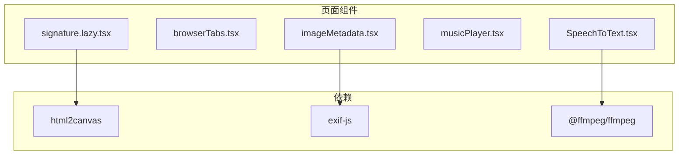
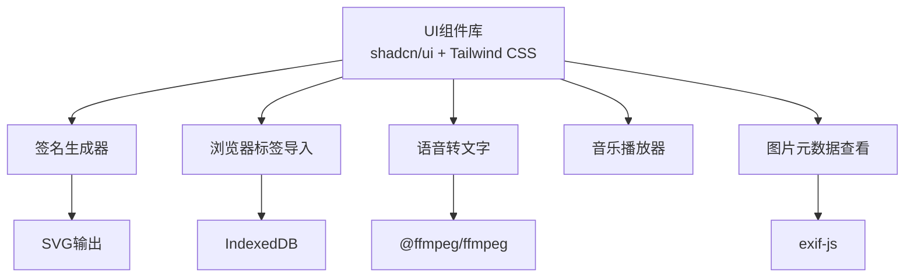
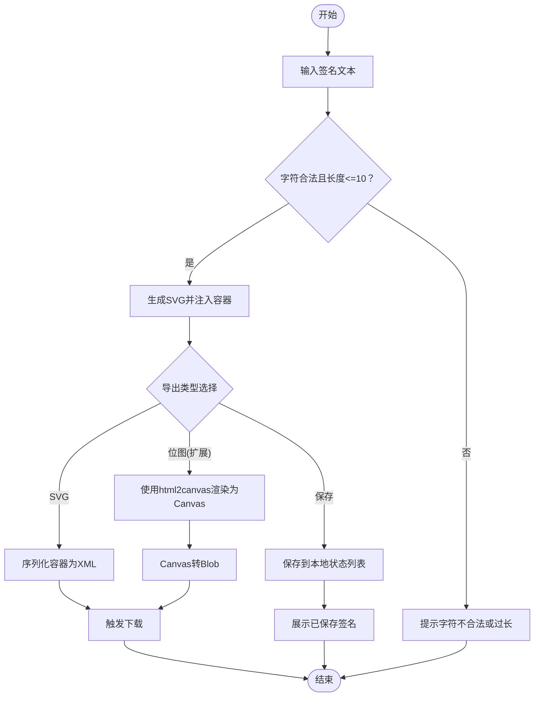
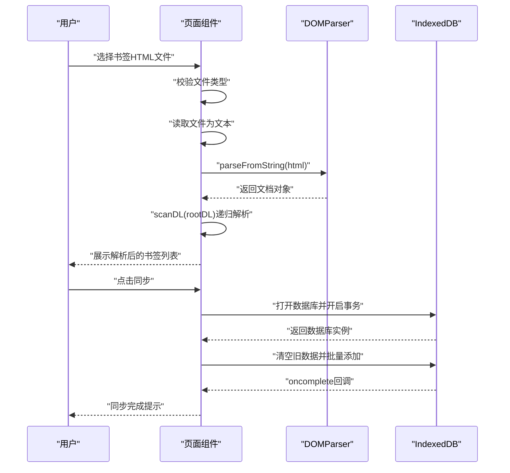
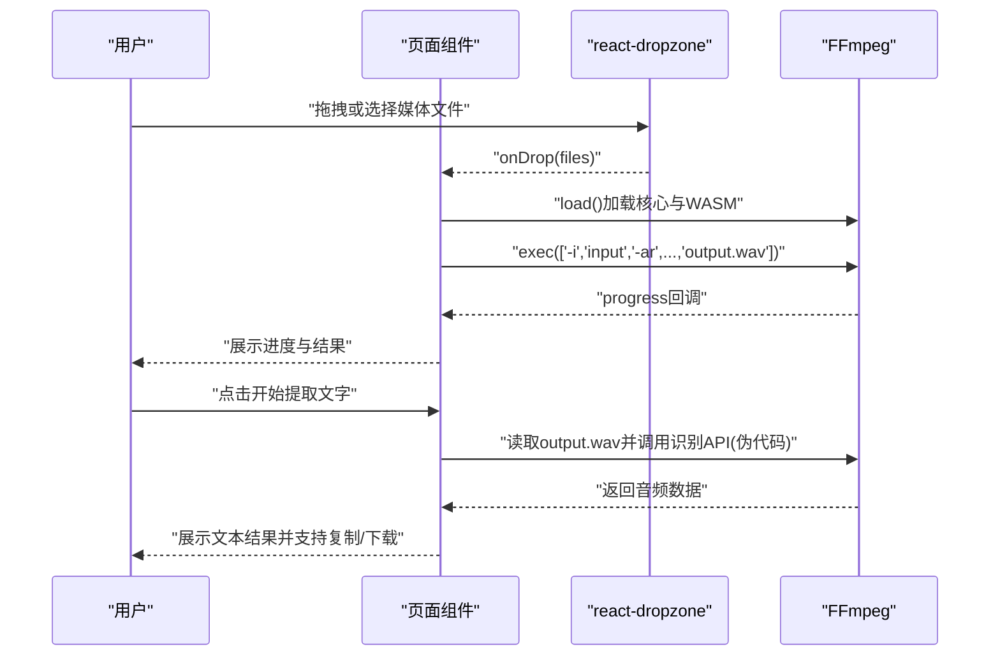
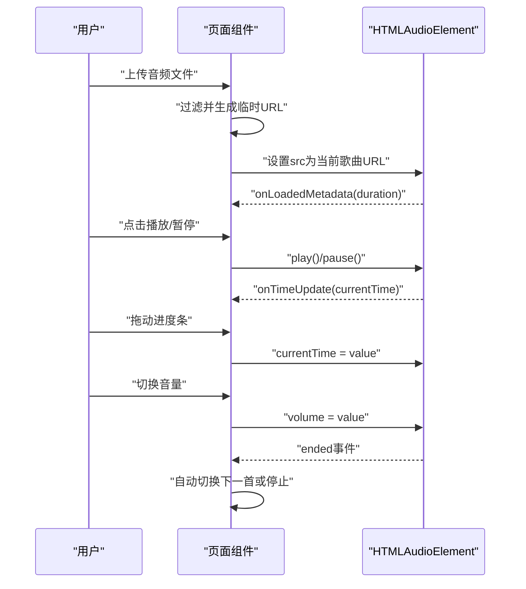
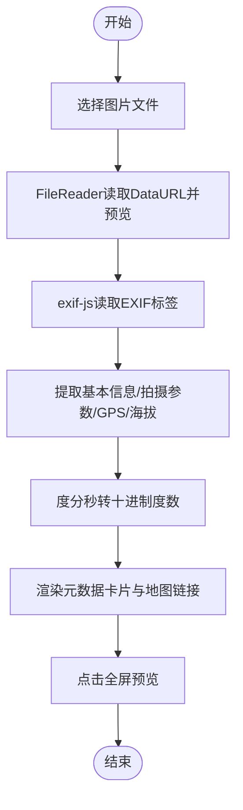
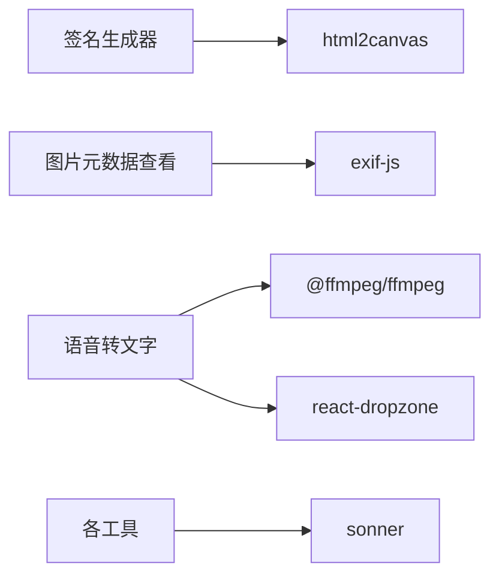

# 其他工具

<cite>
**本文引用的文件**
- [signature.lazy.tsx](file://src/pages/signature.lazy.tsx)
- [browserTabs.tsx](file://src/pages/browserTabs.tsx)
- [SpeechToText.tsx](file://src/pages/SpeechToText.tsx)
- [musicPlayer.tsx](file://src/pages/musicPlayer.tsx)
- [imageMetadata.tsx](file://src/pages/imageMetadata.tsx)
- [package.json](file://package.json)
- [README.md](file://README.md)
</cite>

## 目录
1. [简介](#简介)
2. [项目结构](#项目结构)
3. [核心组件](#核心组件)
4. [架构总览](#架构总览)
5. [详细组件分析](#详细组件分析)
6. [依赖分析](#依赖分析)
7. [性能考虑](#性能考虑)
8. [故障排查指南](#故障排查指南)
9. [结论](#结论)
10. [附录](#附录)

## 简介
本章节聚焦于项目中的“其他工具”模块，具体包括：
- 电子签名生成：在页面中生成个性化签名并导出为矢量图形。
- 浏览器标签导入：解析浏览器导出的书签HTML文件，提取书签数据并持久化到本地数据库。
- 语音转文字：基于音视频文件进行音频提取与转写（当前为流程示意，需接入实际语音识别服务）。
- 音乐播放器：本地音频文件上传与播放控制。
- 图片元数据查看：读取图片EXIF信息并展示。

这些工具均以独立页面组件形式存在，采用现代前端技术栈实现，强调易用性与可扩展性。

**章节来源**
- [README.md](file://README.md#L72-L75)

## 项目结构
- 页面组件位于 src/pages 下，每个工具以独立文件实现，便于维护与扩展。
- 依赖管理集中在 package.json 中，包含 html2canvas、exif-js、@ffmpeg/ffmpeg 等关键库。

**图表来源**
- [package.json](file://package.json#L18-L59)
- [signature.lazy.tsx](file://src/pages/signature.lazy.tsx#L1-L169)
- [imageMetadata.tsx](file://src/pages/imageMetadata.tsx#L1-L272)
- [SpeechToText.tsx](file://src/pages/SpeechToText.tsx#L1-L204)

**章节来源**
- [package.json](file://package.json#L18-L59)

## 核心组件
- 签名生成器：负责输入校验、字体渲染、SVG生成与导出。
- 浏览器标签导入：负责HTML解析、书签提取、IndexedDB存储与展示。
- 语音转文字：负责媒体文件上传、FFmpeg音频提取、文本结果展示与下载。
- 音乐播放器：负责本地音频上传、播放控制、进度与音量控制、自动切换。
- 图片元数据查看：负责图片上传、EXIF解析、GPS坐标转换与地图链接。

**章节来源**
- [signature.lazy.tsx](file://src/pages/signature.lazy.tsx#L1-L169)
- [browserTabs.tsx](file://src/pages/browserTabs.tsx#L1-L228)
- [SpeechToText.tsx](file://src/pages/SpeechToText.tsx#L1-L204)
- [musicPlayer.tsx](file://src/pages/musicPlayer.tsx#L1-L258)
- [imageMetadata.tsx](file://src/pages/imageMetadata.tsx#L1-L272)

## 架构总览
各工具组件相对独立，通过统一的路由与UI组件库进行组织。数据流主要分为三类：
- 文件输入与本地处理：签名生成、音乐播放器、图片元数据查看。
- 外部依赖集成：语音转文字使用FFmpeg；签名生成可扩展为html2canvas导出位图。
- 本地存储：浏览器标签导入使用IndexedDB持久化。

**图表来源**
- [signature.lazy.tsx](file://src/pages/signature.lazy.tsx#L1-L169)
- [browserTabs.tsx](file://src/pages/browserTabs.tsx#L1-L228)
- [SpeechToText.tsx](file://src/pages/SpeechToText.tsx#L1-L204)
- [musicPlayer.tsx](file://src/pages/musicPlayer.tsx#L1-L258)
- [imageMetadata.tsx](file://src/pages/imageMetadata.tsx#L1-L272)
- [package.json](file://package.json#L18-L59)

## 详细组件分析

### 签名生成器（signature.lazy.tsx）
- 功能要点
  - 输入长度与字符集限制，仅允许英文与常见标点。
  - 使用内联SVG渲染签名文本，支持字号调节与字体嵌入。
  - 支持导出为SVG文件与保存至本地状态列表。
- 关键流程
  - 输入变更触发英文检测与截断处理。
  - 生成签名时动态拼接SVG并注入到容器元素。
  - 导出SVG时序列化容器内容为XML并触发下载。
  - 保存签名时将容器的外层HTML作为字符串存入数组。
- 技术挑战与解决方案
  - 字体跨域与渲染稳定性：通过Google Fonts引入字体并在样式中声明，避免本地字体导致的跨域问题。
  - 字符集限制：正则表达式校验确保只接受英文与常见标点，防止非预期字符影响渲染。
  - 导出策略：直接导出SVG而非位图，保证矢量清晰度与可编辑性。
- 可能的扩展方向
  - 引入html2canvas导出位图：在现有SVG基础上增加位图导出选项，满足不同应用场景。
  - 多语言支持：扩展字符集规则与字体选择，支持更多书写风格。
  - 批量签名模板：提供预设模板与自定义样式参数。

**图表来源**
- [signature.lazy.tsx](file://src/pages/signature.lazy.tsx#L1-L169)

**章节来源**
- [signature.lazy.tsx](file://src/pages/signature.lazy.tsx#L1-L169)

### 浏览器标签导入（browserTabs.tsx）
- 功能要点
  - 支持Chrome/Firefox导出的书签HTML文件导入。
  - 解析HTML中的DL/DT结构，提取书签链接、标题、添加时间、图标与层级。
  - 使用IndexedDB进行本地存储，支持一键同步。
- DOM解析逻辑
  - 使用DOMParser解析HTML文档。
  - 递归扫描DL节点，遍历DT子节点，提取A标签属性与嵌套DL。
  - 将解析结果映射为标准化的书签对象数组。
- 存储与展示
  - 初始化数据库并创建对象存储空间。
  - 读取时全量获取并渲染；写入时清空旧数据并批量新增。
  - 展示时按网格布局呈现书签卡片，包含图标、标题、域名与时间信息。
- 技术挑战与解决方案
  - HTML格式差异：针对不同浏览器导出的HTML结构差异，采用通用的DL/DT/A选择器策略，确保兼容性。
  - IndexedDB事务：使用只读/读写事务分离，避免并发冲突；在oncomplete回调中更新状态。
  - 错误处理：对解析失败与数据库异常进行toast提示，保障用户体验。
- 可能的扩展方向
  - 支持书签分类与树形展示。
  - 增加搜索与筛选功能。
  - 导出为标准书签格式（如HTML或JSON）。

**图表来源**
- [browserTabs.tsx](file://src/pages/browserTabs.tsx#L1-L228)

**章节来源**
- [browserTabs.tsx](file://src/pages/browserTabs.tsx#L1-L228)

### 语音转文字（SpeechToText.tsx）
- 功能要点
  - 支持拖拽或选择音视频文件（MP4、AVI、MP3、WAV）。
  - 使用FFmpeg将媒体文件转换为WAV格式，便于后续识别。
  - 展示处理进度与结果，支持复制与下载文本稿。
- 当前实现状态
  - 已完成FFmpeg初始化与音频提取流程。
  - 文本结果展示与下载逻辑已实现。
  - 语音识别API调用部分为伪代码占位，需接入实际服务（如Whisper、Azure等）。
- 技术挑战与解决方案
  - 跨域与资源加载：通过toBlobURL加载FFmpeg核心与WASM资源，避免跨域问题。
  - 进度监听：利用ffmpeg.on("progress")回调更新UI进度条。
  - 错误处理：捕获转换异常并通过toast提示，保持界面友好。
- 可能的扩展方向
  - 集成主流语音识别服务，实现真实转写。
  - 支持实时麦克风录音与流式识别。
  - 多语言模型与自适应采样率。

**图表来源**
- [SpeechToText.tsx](file://src/pages/SpeechToText.tsx#L1-L204)
- [package.json](file://package.json#L18-L59)

**章节来源**
- [SpeechToText.tsx](file://src/pages/SpeechToText.tsx#L1-L204)

### 音乐播放器（musicPlayer.tsx）
- 功能要点
  - 支持多音频文件上传，自动过滤非音频类型。
  - 播放控制：播放/暂停、上一首/下一首、进度拖动、音量调节。
  - 自动下一首：监听音频ended事件，循环播放列表。
  - 播放列表展示：点击切换当前歌曲。
- 技术实现
  - 使用URL.createObjectURL为每个文件生成临时URL，避免上传体积过大。
  - 通过audioRef引用管理HTMLAudioElement，绑定事件与状态。
  - 使用useState管理播放状态、当前时间、音量与播放列表索引。
- 技术挑战与解决方案
  - 资源释放：播放列表为空时及时停止播放，避免内存泄漏。
  - 时间显示：使用onLoadedMetadata获取duration，配合onTimeUpdate更新currentTime。
  - 事件清理：在effect中注册与清理ended事件，避免重复绑定。
- 可能的扩展方向
  - 支持播放列表排序与删除。
  - 增加均衡器与音效插件。
  - 本地播放历史与收藏功能。

**图表来源**
- [musicPlayer.tsx](file://src/pages/musicPlayer.tsx#L1-L258)

**章节来源**
- [musicPlayer.tsx](file://src/pages/musicPlayer.tsx#L1-L258)

### 图片元数据查看（imageMetadata.tsx）
- 功能要点
  - 支持图片上传与预览，读取EXIF信息并展示基本信息、拍摄参数与位置信息。
  - 支持全屏预览与地图跳转（基于经纬度）。
- EXIF解析流程
  - 使用FileReader读取图片为DataURL用于预览。
  - 通过exif-js异步读取EXIF标签，提取相机信息、曝光参数、GPS坐标与海拔。
  - 对GPS坐标进行度分秒转换为十进制度数，便于展示与地图跳转。
- 技术挑战与解决方案
  - 类型断言：由于EXIF挂载在window上，使用类型断言访问其API。
  - 错误处理：解析失败时给出toast提示，避免页面崩溃。
  - 地图链接：当存在经纬度时提供Google Maps跳转链接。
- 可能的扩展方向
  - 支持更多图片格式（如HEIC、RAW）。
  - 增加EXIF编辑与导出功能。
  - 提供元数据对比与批量查看。

**图表来源**
- [imageMetadata.tsx](file://src/pages/imageMetadata.tsx#L1-L272)
- [package.json](file://package.json#L18-L59)

**章节来源**
- [imageMetadata.tsx](file://src/pages/imageMetadata.tsx#L1-L272)

## 依赖分析
- html2canvas：用于将DOM或Canvas渲染为位图，可用于签名生成器的位图导出扩展。
- exif-js：用于读取图片EXIF信息，支持相机参数与GPS坐标解析。
- @ffmpeg/ffmpeg：用于音视频处理，将媒体转换为WAV格式以供识别。
- react-dropzone：提供拖拽上传能力，简化文件选择与验证。
- sonner：全局提示组件，统一错误与成功提示。

**图表来源**
- [package.json](file://package.json#L18-L59)
- [signature.lazy.tsx](file://src/pages/signature.lazy.tsx#L1-L169)
- [imageMetadata.tsx](file://src/pages/imageMetadata.tsx#L1-L272)
- [SpeechToText.tsx](file://src/pages/SpeechToText.tsx#L1-L204)

**章节来源**
- [package.json](file://package.json#L18-L59)

## 性能考虑
- 文件上传与预览
  - 音频与图片采用URL.createObjectURL生成临时地址，避免大文件上传阻塞主线程。
  - 图片预览使用DataURL，注意大图可能导致内存占用上升。
- FFmpeg处理
  - 通过进度回调实时更新UI，避免长时间无响应。
  - 资源通过toBlobURL按需加载，减少初始包体。
- DOM解析与存储
  - 浏览器标签HTML解析采用递归扫描，建议对超大书签文件进行分页或虚拟滚动展示。
  - IndexedDB批量写入时先清空再插入，降低碎片化风险。
- UI交互
  - 使用轻量级UI组件库，避免不必要的重渲染。
  - 对高频事件（如进度拖动）进行节流或防抖处理。

[本节为通用指导，无需特定文件引用]

## 故障排查指南
- 签名导出SVG失败
  - 检查容器元素是否存在且已注入SVG内容。
  - 确认序列化XML与Blob类型正确。
- 浏览器标签导入失败
  - 确认选择的是HTML文件且内容结构符合DL/DT规范。
  - 检查IndexedDB是否可用及版本升级是否成功。
- 语音转文字转换失败
  - 确认FFmpeg已成功加载核心与WASM资源。
  - 检查媒体文件格式是否受支持。
  - 识别API调用需替换为实际服务，否则结果为占位文本。
- 音乐播放器无法播放
  - 检查上传文件类型是否为音频。
  - 确认audioRef引用有效且src已设置。
- 图片元数据解析失败
  - 确认图片包含EXIF信息。
  - 检查GPS标签是否存在，避免除零或越界。

**章节来源**
- [signature.lazy.tsx](file://src/pages/signature.lazy.tsx#L73-L87)
- [browserTabs.tsx](file://src/pages/browserTabs.tsx#L23-L38)
- [SpeechToText.tsx](file://src/pages/SpeechToText.tsx#L23-L41)
- [musicPlayer.tsx](file://src/pages/musicPlayer.tsx#L146-L158)
- [imageMetadata.tsx](file://src/pages/imageMetadata.tsx#L48-L94)

## 结论
上述五个“其他工具”分别覆盖了签名生成、书签导入、语音转文字、音乐播放与图片元数据查看等实用场景。它们在实现上注重用户体验与可扩展性，同时通过外部依赖与本地存储实现功能闭环。未来可在语音识别服务接入、签名位图导出、书签管理增强等方面继续深化。

[本节为总结性内容，无需特定文件引用]

## 附录
- 使用场景建议
  - 签名生成：适合文档签署、个人签名定制与批量导出。
  - 浏览器标签：适合跨设备书签迁移与统一管理。
  - 语音转文字：适合会议记录、教学素材整理与无障碍辅助。
  - 音乐播放器：适合本地音乐欣赏与简单播放控制。
  - 图片元数据查看：适合摄影爱好者与内容创作者的信息检索。

[本节为概念性内容，无需特定文件引用]