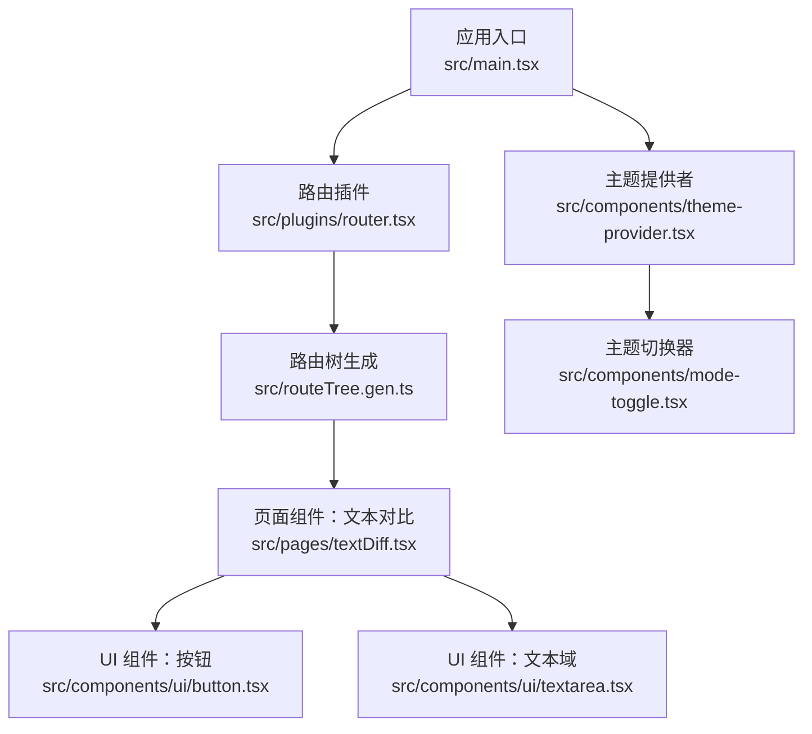
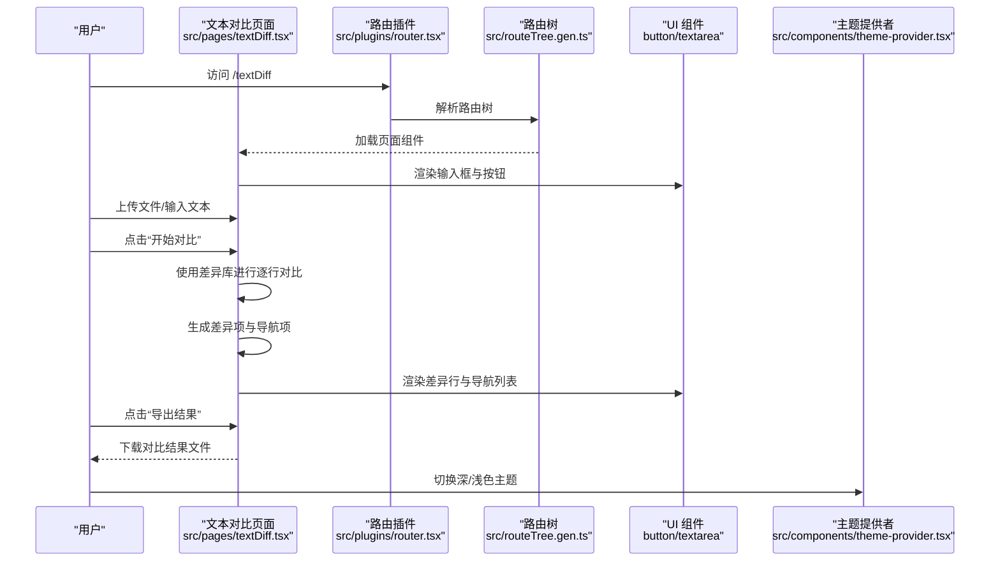
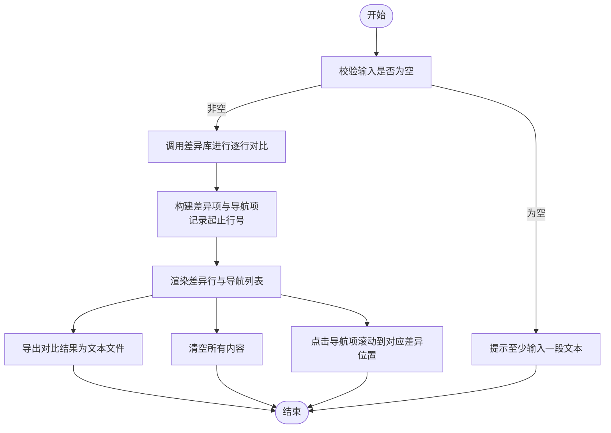
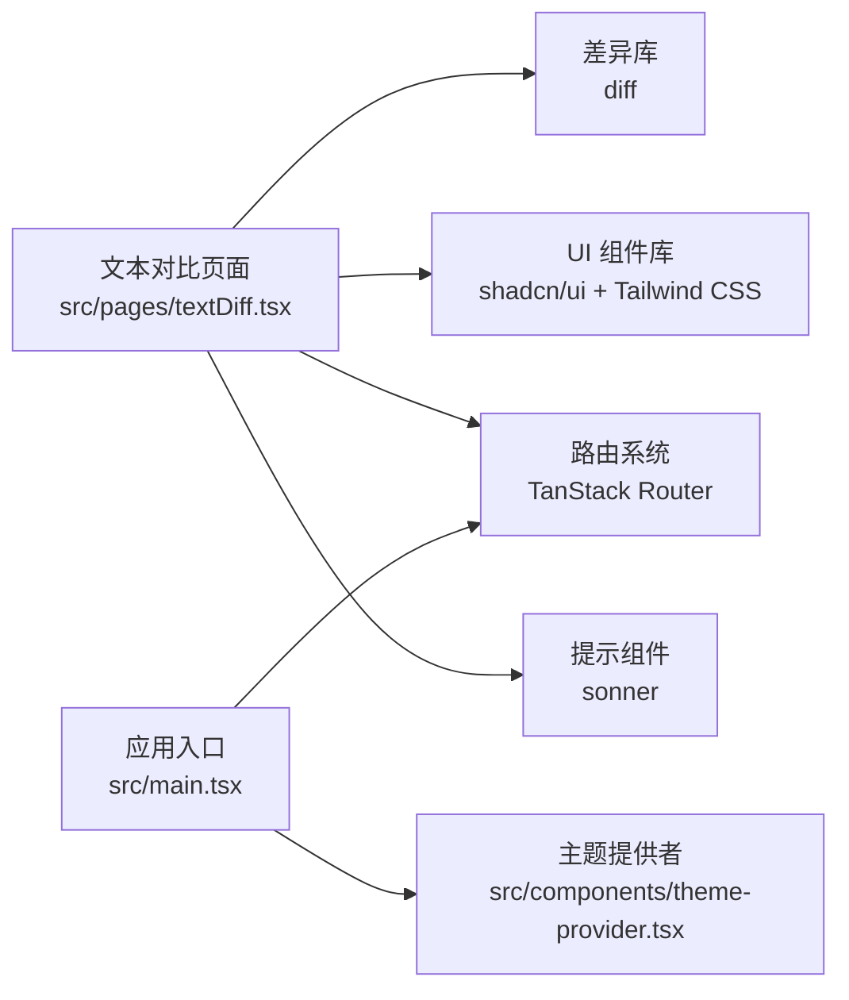

# 文本对比工具

<cite>
**本文引用的文件**
- [src/pages/textDiff.tsx](file://src/pages/textDiff.tsx)
- [src/main.tsx](file://src/main.tsx)
- [src/plugins/router.tsx](file://src/plugins/router.tsx)
- [src/routeTree.gen.ts](file://src/routeTree.gen.ts)
- [src/components/ui/button.tsx](file://src/components/ui/button.tsx)
- [src/components/ui/textarea.tsx](file://src/components/ui/textarea.tsx)
- [src/components/theme-provider.tsx](file://src/components/theme-provider.tsx)
- [src/components/mode-toggle.tsx](file://src/components/mode-toggle.tsx)
- [package.json](file://package.json)
- [README.md](file://README.md)
</cite>

## 目录
1. [简介](#简介)
2. [项目结构](#项目结构)
3. [核心组件](#核心组件)
4. [架构总览](#架构总览)
5. [详细组件分析](#详细组件分析)
6. [依赖分析](#依赖分析)
7. [性能考虑](#性能考虑)
8. [故障排查指南](#故障排查指南)
9. [结论](#结论)
10. [附录](#附录)

## 简介
本项目是一个基于 React + TypeScript + Vite + Bun 的现代化工具库，提供多种实用在线工具。文本对比工具是其中的一个页面级功能，用于对比两段文本的差异，支持按行进行高亮展示、差异导航、文件上传以及结果导出。该工具使用了第三方差异算法库对文本进行逐行对比，并通过自定义 UI 组件呈现结果。

## 项目结构
该工具位于页面目录中，采用模块化组织：
- 页面组件：src/pages/textDiff.tsx
- 路由与插件：src/plugins/router.tsx、src/routeTree.gen.ts
- 应用入口：src/main.tsx
- UI 组件：src/components/ui/button.tsx、src/components/ui/textarea.tsx
- 主题系统：src/components/theme-provider.tsx、src/components/mode-toggle.tsx
- 依赖与技术栈：package.json、README.md

图表来源
- [src/main.tsx](file://src/main.tsx#L1-L23)
- [src/plugins/router.tsx](file://src/plugins/router.tsx#L1-L19)
- [src/routeTree.gen.ts](file://src/routeTree.gen.ts#L47-L86)
- [src/pages/textDiff.tsx](file://src/pages/textDiff.tsx#L1-L460)
- [src/components/ui/button.tsx](file://src/components/ui/button.tsx#L1-L59)
- [src/components/ui/textarea.tsx](file://src/components/ui/textarea.tsx#L1-L19)
- [src/components/theme-provider.tsx](file://src/components/theme-provider.tsx#L1-L73)
- [src/components/mode-toggle.tsx](file://src/components/mode-toggle.tsx#L1-L52)

章节来源
- [src/main.tsx](file://src/main.tsx#L1-L23)
- [src/plugins/router.tsx](file://src/plugins/router.tsx#L1-L19)
- [src/routeTree.gen.ts](file://src/routeTree.gen.ts#L47-L86)
- [src/pages/textDiff.tsx](file://src/pages/textDiff.tsx#L1-L460)

## 核心组件
- 文本对比页面组件：负责输入框、文件上传、执行对比、渲染差异、差异导航、导出结果与清空操作。
- UI 组件：按钮与文本域，提供一致的交互与视觉风格。
- 路由与导航：基于 TanStack Router 的文件路由与路由树生成。
- 主题系统：提供深浅色主题切换与持久化。

章节来源
- [src/pages/textDiff.tsx](file://src/pages/textDiff.tsx#L1-L460)
- [src/components/ui/button.tsx](file://src/components/ui/button.tsx#L1-L59)
- [src/components/ui/textarea.tsx](file://src/components/ui/textarea.tsx#L1-L19)
- [src/plugins/router.tsx](file://src/plugins/router.tsx#L1-L19)
- [src/routeTree.gen.ts](file://src/routeTree.gen.ts#L47-L86)
- [src/components/theme-provider.tsx](file://src/components/theme-provider.tsx#L1-L73)

## 架构总览
文本对比工具采用页面级组件 + UI 组件 + 路由 + 主题系统的分层架构。页面组件通过差异库对文本进行逐行对比，生成差异项与导航项，再以自定义行组件进行渲染。路由系统负责页面导航，主题系统提供统一的主题切换能力。

图表来源
- [src/pages/textDiff.tsx](file://src/pages/textDiff.tsx#L1-L460)
- [src/plugins/router.tsx](file://src/plugins/router.tsx#L1-L19)
- [src/routeTree.gen.ts](file://src/routeTree.gen.ts#L47-L86)
- [src/components/ui/button.tsx](file://src/components/ui/button.tsx#L1-L59)
- [src/components/ui/textarea.tsx](file://src/components/ui/textarea.tsx#L1-L19)
- [src/components/theme-provider.tsx](file://src/components/theme-provider.tsx#L1-L73)

## 详细组件分析

### 文本对比页面组件（TextDiffTool）
职责与流程
- 输入与文件上传：分别维护左右两侧文本，支持通过文件选择器读取文本文件并填充对应输入框。
- 对比逻辑：调用差异库对两段文本进行逐行对比，生成差异项数组与导航项数组；记录每段差异的起止行号，便于滚动定位与导出。
- 渲染与交互：使用自定义行组件对差异进行高亮渲染；提供差异导航列表，点击可平滑滚动到对应差异位置；支持隐藏/显示导航；支持导出对比结果为纯文本文件；支持一键清空。
- 错误处理：在输入为空、文件读取失败、对比异常时给出提示。

图表来源
- [src/pages/textDiff.tsx](file://src/pages/textDiff.tsx#L78-L224)

章节来源
- [src/pages/textDiff.tsx](file://src/pages/textDiff.tsx#L1-L460)

### UI 组件（按钮与文本域）
- 按钮组件：提供多种变体与尺寸，统一的交互与视觉风格，用于对比、导出、清空、返回首页等操作。
- 文本域组件：提供一致的输入样式与占位符，支持多行文本输入与自动换行。

章节来源
- [src/components/ui/button.tsx](file://src/components/ui/button.tsx#L1-L59)
- [src/components/ui/textarea.tsx](file://src/components/ui/textarea.tsx#L1-L19)

### 路由与导航
- 路由插件：基于 TanStack Router 创建路由器实例，注册默认未找到页面组件。
- 路由树：通过生成文件定义页面路由，包含多个工具页面（如签名生成、坐标计算、JSON转TS等），文本对比页面作为其中一个文件路由页面。

章节来源
- [src/plugins/router.tsx](file://src/plugins/router.tsx#L1-L19)
- [src/routeTree.gen.ts](file://src/routeTree.gen.ts#L47-L86)

### 主题系统
- 主题提供者：根据系统偏好或用户选择设置根元素类名，实现深浅色主题切换与持久化。
- 主题切换器：提供带视图过渡动画的主题切换按钮，增强交互体验。

章节来源
- [src/components/theme-provider.tsx](file://src/components/theme-provider.tsx#L1-L73)
- [src/components/mode-toggle.tsx](file://src/components/mode-toggle.tsx#L1-L52)

## 依赖分析
- 差异算法库：用于逐行对比文本，输出差异片段集合。
- UI 组件库：基于 shadcn/ui 与 Tailwind CSS，提供一致的视觉与交互体验。
- 路由系统：TanStack Router，支持文件路由与懒加载。
- 主题系统：本地存储持久化主题状态。
- 提示组件：用于全局提示反馈。

图表来源
- [src/pages/textDiff.tsx](file://src/pages/textDiff.tsx#L1-L460)
- [src/main.tsx](file://src/main.tsx#L1-L23)
- [package.json](file://package.json#L1-L91)

章节来源
- [package.json](file://package.json#L1-L91)
- [README.md](file://README.md#L1-L297)

## 性能考虑
- 组件记忆化：差异行组件与结果容器均使用记忆化以减少重复渲染，提高长文本对比时的渲染性能。
- 按需渲染：仅对新增与删除的差异行进行行号与侧边标记渲染，相等行不显示额外标记，降低 DOM 数量。
- 导航列表：仅在存在差异时显示导航，避免不必要的布局开销。
- 滚动定位：使用平滑滚动与一次性高亮动画，避免频繁重排。

章节来源
- [src/pages/textDiff.tsx](file://src/pages/textDiff.tsx#L38-L77)
- [src/pages/textDiff.tsx](file://src/pages/textDiff.tsx#L159-L169)

## 故障排查指南
- 文件读取失败：当文件读取触发错误回调时，会弹出提示。请检查文件格式与大小限制。
- 对比失败：当对比过程中抛出异常时，会弹出失败提示。请确认输入文本有效且差异库可用。
- 无对比结果可导出：当尚未执行对比或结果为空时，导出会提示无结果。请先执行对比后再导出。
- 无法返回首页：路由插件已注册默认未找到组件，若导航异常，请检查路由配置与页面路径。

章节来源
- [src/pages/textDiff.tsx](file://src/pages/textDiff.tsx#L88-L105)
- [src/pages/textDiff.tsx](file://src/pages/textDiff.tsx#L114-L157)
- [src/pages/textDiff.tsx](file://src/pages/textDiff.tsx#L172-L199)
- [src/plugins/router.tsx](file://src/plugins/router.tsx#L1-L19)

## 结论
文本对比工具通过清晰的页面组件职责划分、稳定的差异算法与高效的 UI 渲染，提供了直观易用的文本差异对比能力。配合路由与主题系统，整体具备良好的扩展性与用户体验。建议后续可增加差异高亮、行号联动、对比历史等功能以进一步提升实用性。

## 附录
- 在线体验与开发指南请参考项目自述文件中的相关信息。

章节来源
- [README.md](file://README.md#L1-L297)