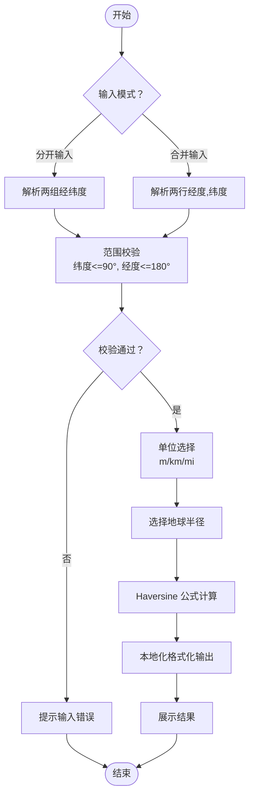

# 地理坐标工具

<cite>
**本文引用的文件列表**
- [calculateDistance.lazy.tsx](file://src/pages/calculateDistance.lazy.tsx)
- [coordinate.lazy.tsx](file://src/pages/coordinate.lazy.tsx)
- [package.json](file://package.json)
- [README.md](file://README.md)
- [index.tsx](file://src/pages/index.tsx)
- [utils.ts](file://src/lib/utils.ts)
</cite>

## 目录
1. [简介](#简介)
2. [项目结构](#项目结构)
3. [核心组件](#核心组件)
4. [架构总览](#架构总览)
5. [详细组件分析](#详细组件分析)
6. [依赖分析](#依赖分析)
7. [性能考量](#性能考量)
8. [故障排查指南](#故障排查指南)
9. [结论](#结论)
10. [附录](#附录)

## 简介
本文件面向“地理坐标工具”模块，围绕两类核心能力展开：经纬度距离计算与坐标系转换（WGS84 与 GCJ02）。文档将深入解析 calculateDistance.lazy.tsx 中采用 Haversine 公式的球面距离计算原理与代码实现；解析 coordinate.lazy.tsx 中集成的坐标纠偏算法调用与批量处理流程；总结表单输入验证、单位切换（米/千米/英里）与结果可视化的交互设计模式；并给出地理计算中的常见误差来源、规避策略，以及如何在其他项目中复用这些地理处理逻辑。

## 项目结构
- 页面级组件位于 src/pages 下，分别承载“距离计算”和“坐标转换”两大功能页。
- 依赖 sunrise-utils 提供坐标转换能力，用于 WGS84 与 GCJ02 的互转。
- UI 组件来自本地 UI 库与第三方库（shadcn/ui、Tailwind CSS 等），统一通过组件库封装交互与样式。

图表来源
- [calculateDistance.lazy.tsx](file://src/pages/calculateDistance.lazy.tsx#L1-L202)
- [coordinate.lazy.tsx](file://src/pages/coordinate.lazy.tsx#L1-L447)
- [package.json](file://package.json#L18-L59)
- [utils.ts](file://src/lib/utils.ts#L1-L18)

章节来源
- [README.md](file://README.md#L33-L75)
- [index.tsx](file://src/pages/index.tsx#L183-L191)

## 核心组件
- 距离计算器（calculateDistance.lazy.tsx）
  - 支持两种输入模式：分开输入（经度/纬度各一栏）与合并输入（经度,纬度 一行）。
  - 支持单位切换：米（m）、千米（km）、英里（mi）。
  - 使用 Haversine 公式计算球面距离，并对结果进行格式化展示。
- 坐标转换器（coordinate.lazy.tsx）
  - 支持单点转换与批量转换，支持 CSV 导入与导出。
  - 通过 sunrise-utils 的 CoordinateTransform 实现 WGS84 与 GCJ02 的互转。
  - 对输入进行格式校验与错误提示，批量转换时逐行处理并记录错误。

章节来源
- [calculateDistance.lazy.tsx](file://src/pages/calculateDistance.lazy.tsx#L1-L202)
- [coordinate.lazy.tsx](file://src/pages/coordinate.lazy.tsx#L1-L447)

## 架构总览
- 数据流
  - 输入层：用户在页面输入经纬度、选择单位或坐标系、切换输入模式。
  - 处理层：根据输入模式解析坐标；进行范围校验；执行距离计算或坐标转换。
  - 输出层：格式化结果显示；批量转换支持复制与导出 CSV。
- 交互层
  - 使用 shadcn/ui 的 Select/Input/Button/Tabs 等组件组织表单与操作区。
  - 使用 sonner 提示消息，统一错误与成功反馈。
  - 使用 utils.ts 的复制到剪贴板能力，提升结果复用效率。

图表来源
- [calculateDistance.lazy.tsx](file://src/pages/calculateDistance.lazy.tsx#L27-L87)
- [coordinate.lazy.tsx](file://src/pages/coordinate.lazy.tsx#L141-L245)
- [utils.ts](file://src/lib/utils.ts#L9-L17)

## 详细组件分析

### 距离计算器（Haversine 公式）
- 数学原理
  - Haversine 公式用于计算球面上两点的大圆距离，考虑地球半径与经纬度差值，通过正弦与余弦函数组合求解中间变量 a，再由 atan2 得到角度 c，最终乘以地球半径得到距离。
  - 该公式适合中小距离估算，且在大多数在线工具场景下具有足够精度。
- 代码实现要点
  - 输入解析：支持分开输入与合并输入两种模式；合并输入通过逗号分隔解析经纬度。
  - 范围校验：对纬度绝对值不超过 90，经度绝对值不超过 180 进行校验。
  - 单位切换：根据单位映射地球半径（米/千米/英里）。
  - 结果格式化：使用本地化数字格式化保留两位小数，拼接单位后展示。
- 设计模式
  - 表单输入验证：在计算前集中校验，避免无效输入进入计算。
  - 单位切换：通过下拉选择控制半径映射，便于扩展其他单位。
  - 结果可视化：按钮触发计算，计算完成后以较大字号展示结果，直观易读。

图表来源
- [calculateDistance.lazy.tsx](file://src/pages/calculateDistance.lazy.tsx#L27-L87)

章节来源
- [calculateDistance.lazy.tsx](file://src/pages/calculateDistance.lazy.tsx#L1-L202)

### 坐标转换器（WGS84 与 GCJ02）
- 技术细节
  - 依赖 sunrise-utils 的 CoordinateTransform 提供坐标纠偏算法，支持 wgs84ToGcj02 与 gcj02ToWgs84 两个方向的转换。
  - 单点转换：解析输入的经度/纬度，校验格式与格式差异，调用转换函数并格式化输出。
  - 批量转换：支持多行输入或 CSV 导入，逐行解析并转换，遇到格式错误时记录“格式错误”，转换失败时记录“转换失败”，最后汇总结果。
  - CSV 导入/导出：限制文件大小与类型，解析后过滤空行；导出时仅保留有效坐标，生成 CSV 文件并触发下载。
- 设计模式
  - Tabs 切换：单点与批量两个 Tab，界面清晰，职责分离。
  - 错误提示：使用 sonner 统一提示，区分不同错误类型（格式错误、转换失败、无有效输入等）。
  - 结果复用：提供复制到剪贴板与导出 CSV，满足快速复用与批量落地需求。

图表来源
- [coordinate.lazy.tsx](file://src/pages/coordinate.lazy.tsx#L141-L245)
- [coordinate.lazy.tsx](file://src/pages/coordinate.lazy.tsx#L40-L139)

章节来源
- [coordinate.lazy.tsx](file://src/pages/coordinate.lazy.tsx#L1-L447)
- [package.json](file://package.json#L55-L55)

### 表单输入验证、单位切换与结果可视化
- 输入验证
  - 距离计算：校验经纬度范围与格式；坐标解析失败时提示输入无效。
  - 坐标转换：单点转换校验格式与格式差异；批量转换逐行校验并记录错误。
- 单位切换
  - 距离计算：通过 Select 控制单位（m/km/mi），内部映射地球半径。
  - 坐标转换：不涉及单位切换，但支持格式选择（WGS84/GCJ02）。
- 结果可视化
  - 距离计算：按钮触发计算，结果显示在居中大字区域，便于阅读。
  - 坐标转换：单点与批量分别展示结果，支持复制与导出。

章节来源
- [calculateDistance.lazy.tsx](file://src/pages/calculateDistance.lazy.tsx#L27-L87)
- [coordinate.lazy.tsx](file://src/pages/coordinate.lazy.tsx#L141-L245)

## 依赖分析
- 外部依赖
  - sunrise-utils：提供坐标转换能力（CoordinateTransform）。
  - sonner：统一提示消息（错误/成功/警告）。
  - shadcn/ui：基础 UI 组件（Select/Input/Button/Tabs/Card 等）。
  - Tailwind CSS：样式工具类。
- 内部依赖
  - utils.ts：提供复制到剪贴板的通用方法，被 coordinate.lazy.tsx 的复制按钮复用。

图表来源
- [coordinate.lazy.tsx](file://src/pages/coordinate.lazy.tsx#L1-L40)
- [calculateDistance.lazy.tsx](file://src/pages/calculateDistance.lazy.tsx#L1-L12)
- [utils.ts](file://src/lib/utils.ts#L1-L18)
- [package.json](file://package.json#L18-L59)

章节来源
- [package.json](file://package.json#L18-L59)
- [utils.ts](file://src/lib/utils.ts#L1-L18)

## 性能考量
- 计算复杂度
  - 距离计算：纯数学运算，时间复杂度为 O(1)，空间复杂度 O(1)。
  - 坐标转换：单点转换 O(1)，批量转换 O(n)（n 为行数）。
- 优化建议
  - 批量转换：可在 UI 层增加“去重/过滤空行”的预处理，减少无效迭代。
  - 导入 CSV：对大文件可考虑分块读取与进度提示，避免阻塞主线程。
  - 结果导出：对超大结果集可分批写入 Blob，降低内存峰值。
- 交互优化
  - 使用防抖/节流避免频繁触发计算（如输入框实时计算）。
  - 对长列表导出增加“导出进度”提示，提升用户体验。

## 故障排查指南
- 输入格式错误
  - 距离计算：提示“请输入有效的经纬度值”；检查经度/纬度是否为数字。
  - 坐标转换：单点转换提示“坐标格式错误”，检查是否为“经度,纬度”格式。
- 范围越界
  - 距离计算：提示“经纬度数值超出有效范围”，检查纬度是否超过 90°，经度是否超过 180°。
- 相同格式转换
  - 坐标转换：提示“源格式和目标格式相同”，请切换不同格式。
- 批量转换异常
  - 部分坐标转换失败：逐行检查格式；转换失败时会标注“转换失败”。
  - 无有效输入：提示“没有有效的坐标输入”，请至少输入一个有效坐标。
- CSV 导入/导出
  - 导入失败：检查文件大小与类型；过大或非 CSV 会被拒绝。
  - 导出失败：确认存在有效坐标；否则提示“没有有效的坐标数据可导出”。

章节来源
- [calculateDistance.lazy.tsx](file://src/pages/calculateDistance.lazy.tsx#L50-L60)
- [coordinate.lazy.tsx](file://src/pages/coordinate.lazy.tsx#L141-L170)
- [coordinate.lazy.tsx](file://src/pages/coordinate.lazy.tsx#L172-L245)
- [coordinate.lazy.tsx](file://src/pages/coordinate.lazy.tsx#L40-L139)

## 结论
- 本模块以简洁的 UI 与稳定的算法实现了两类核心地理功能：距离计算与坐标转换。
- Haversine 公式在距离计算中提供了高可用性与易理解性；坐标转换通过 sunrise-utils 的纠偏算法满足国内地图服务的合规要求。
- 通过统一的表单验证、单位切换与结果可视化，提升了用户交互体验与结果复用效率。
- 建议在生产环境中结合业务场景评估更精确的椭球模型（如 Vincenty）以进一步提升精度，并对批量处理与大文件导入增加异步与进度反馈。

## 附录

### 常见误差来源与规避策略
- 地球模型误差
  - 误差来源：Haversine 假设完美球体，实际地球为椭球体。
  - 规避策略：对高精度需求场景改用椭球模型（如 Vincenty）；或在项目中引入椭球参数（WGS84）以提升精度。
- 坐标系差异
  - 误差来源：不同地图服务使用的坐标系不同（WGS84、GCJ02、BD09 等）。
  - 规避策略：明确业务所用地图服务的坐标系，统一转换；对国内业务优先使用 GCJ02。
- 输入格式与精度
  - 误差来源：输入格式不规范、小数位过多导致显示拥挤。
  - 规避策略：严格格式校验；对结果进行合理的小数位控制（如保留 6 位）。
- 批量处理边界情况
  - 误差来源：空行、格式错误、缺失字段。
  - 规避策略：批量处理前先清洗数据；对错误行单独记录并提示。

### 在其他项目中复用建议
- 距离计算
  - 可抽取为独立函数，接收经纬度与单位参数，返回格式化后的距离字符串。
  - 引入类型定义（经纬度、单位枚举）以增强可维护性。
- 坐标转换
  - 将 CoordinateTransform 的调用封装为统一接口，支持 WGS84 与 GCJ02 的双向转换。
  - 提供批量转换的通用流程（解析、转换、汇总、导出），便于复用。
- UI 与交互
  - 将表单验证、提示消息、复制与导出等通用逻辑抽离为可复用的 Hook 或工具函数。
  - 保持组件职责单一，通过 props 传递配置项，便于在不同页面复用。

章节来源
- [calculateDistance.lazy.tsx](file://src/pages/calculateDistance.lazy.tsx#L27-L87)
- [coordinate.lazy.tsx](file://src/pages/coordinate.lazy.tsx#L141-L245)
- [utils.ts](file://src/lib/utils.ts#L9-L17)