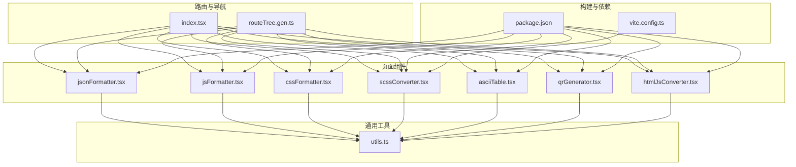
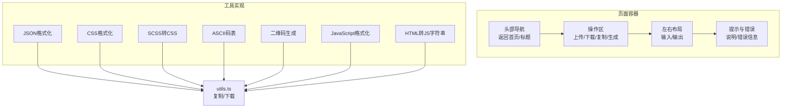
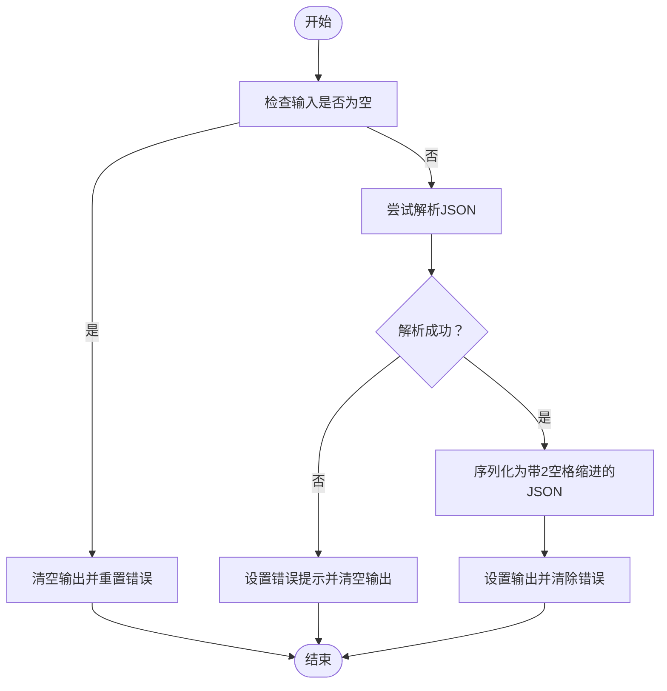
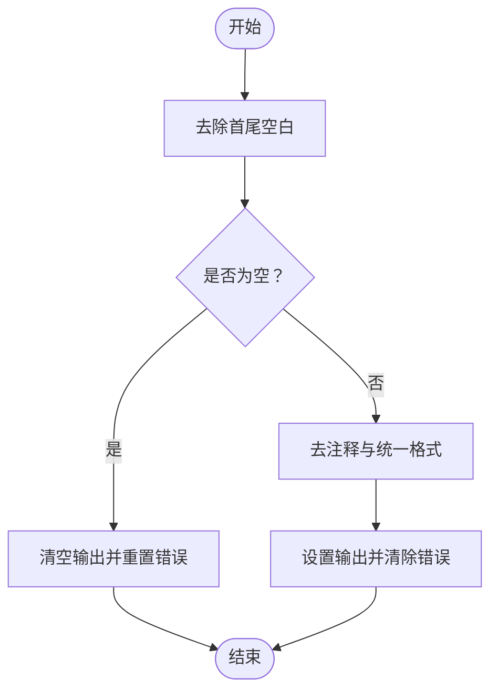
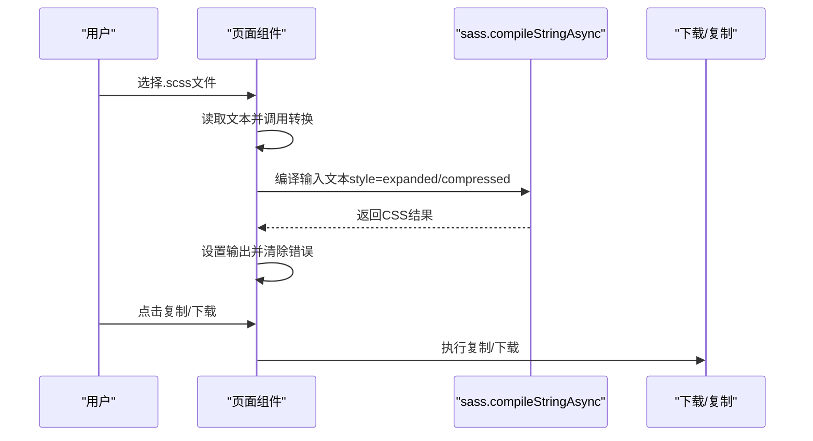
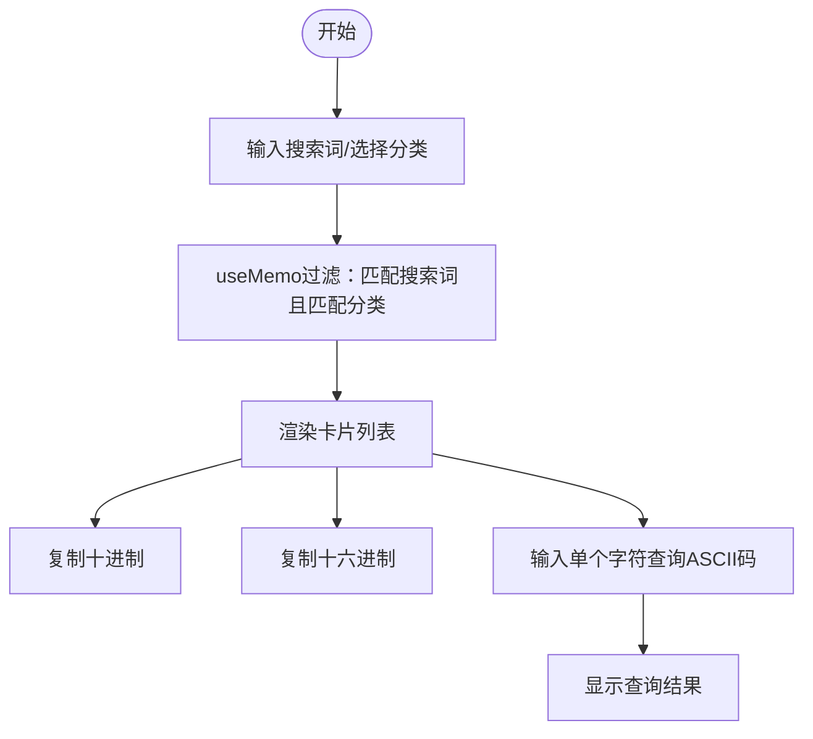
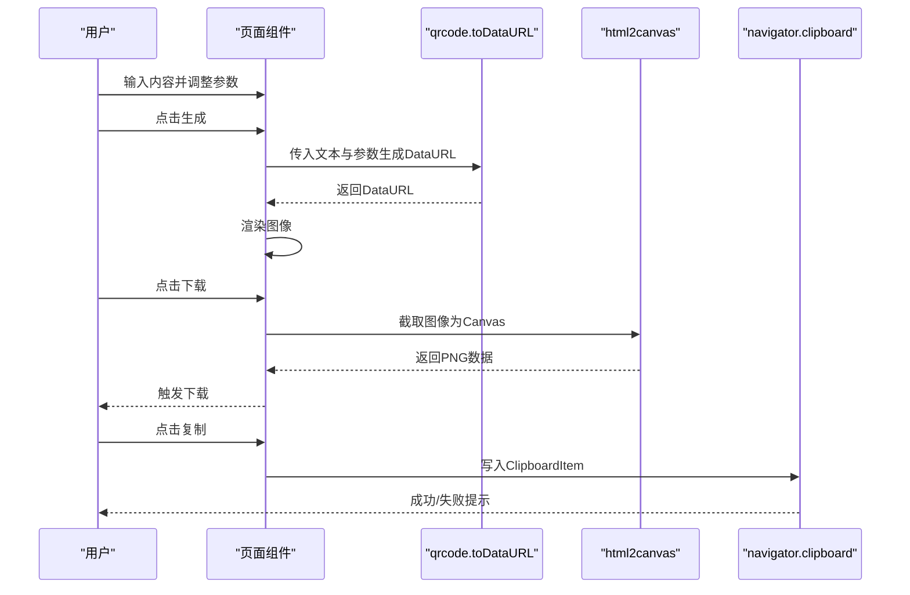
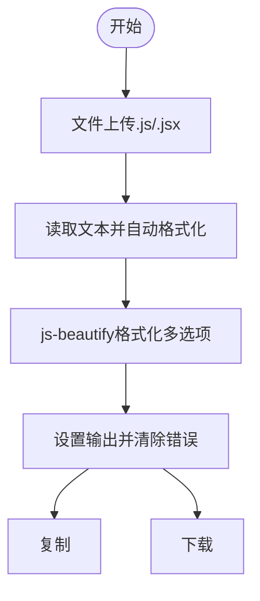
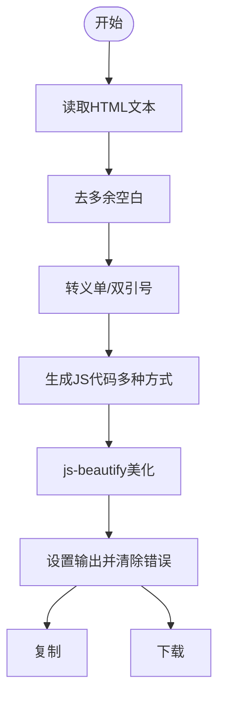
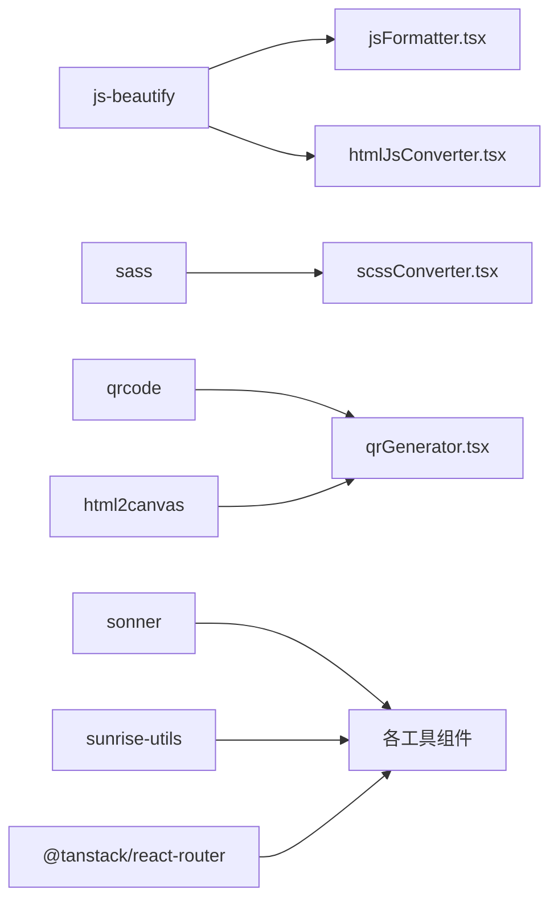

# 开发辅助工具

<cite>
**本文引用的文件列表**
- [jsonFormatter.tsx](file://src/pages/jsonFormatter.tsx)
- [jsFormatter.tsx](file://src/pages/jsFormatter.tsx)
- [cssFormatter.tsx](file://src/pages/cssFormatter.tsx)
- [scssConverter.tsx](file://src/pages/scssConverter.tsx)
- [asciiTable.tsx](file://src/pages/asciiTable.tsx)
- [qrGenerator.tsx](file://src/pages/qrGenerator.tsx)
- [htmlJsConverter.tsx](file://src/pages/htmlJsConverter.tsx)
- [utils.ts](file://src/lib/utils.ts)
- [index.tsx](file://src/pages/index.tsx)
- [package.json](file://package.json)
- [vite.config.ts](file://vite.config.ts)
- [routeTree.gen.ts](file://src/routeTree.gen.ts)
</cite>

## 目录
1. [简介](#简介)
2. [项目结构](#项目结构)
3. [核心组件](#核心组件)
4. [架构总览](#架构总览)
5. [详细组件分析](#详细组件分析)
6. [依赖关系分析](#依赖关系分析)
7. [性能考量](#性能考量)
8. [故障排查指南](#故障排查指南)
9. [结论](#结论)
10. [附录](#附录)

## 简介
本技术文档聚焦于“开发辅助工具”模块，涵盖以下功能：
- JSON格式化
- CSS格式化
- SCSS转CSS（使用 sass.js）
- ASCII码表（数据结构与搜索）
- 二维码生成（使用 qrcode 与 html2canvas）
- JavaScript格式化（使用 js-beautify）
- HTML转JavaScript字符串（含转义与美化）

文档将从系统架构、组件关系、数据流、处理逻辑、集成点、错误处理与性能特性等方面进行深入分析，并提供可访问性改进建议与性能优化策略，帮助开发者快速集成类似功能。

## 项目结构
该模块位于 src/pages 下，每个工具均为独立页面组件，采用 TanStack Router 进行路由管理；通用工具函数集中在 src/lib/utils.ts；首页索引文件负责导航与分类展示。

图表来源
- [index.tsx](file://src/pages/index.tsx#L193-L231)
- [routeTree.gen.ts](file://src/routeTree.gen.ts#L141-L193)
- [utils.ts](file://src/lib/utils.ts#L1-L18)
- [package.json](file://package.json#L18-L58)
- [vite.config.ts](file://vite.config.ts#L38-L78)

章节来源
- [index.tsx](file://src/pages/index.tsx#L193-L231)
- [routeTree.gen.ts](file://src/routeTree.gen.ts#L141-L193)

## 核心组件
- JSON格式化：基于原生 JSON 解析与序列化，提供复制、下载与错误提示。
- CSS格式化：正则清洗与格式化，支持文件上传与下载。
- SCSS转CSS：使用 sass.compileStringAsync，支持压缩与展开两种风格。
- ASCII码表：内置完整ASCII表，提供搜索、分类筛选与复制能力。
- 二维码生成：基于 qrcode.toDataURL 生成数据URL，支持 html2canvas 导出PNG。
- JavaScript格式化：使用 js-beautify，支持文件上传与自定义格式化选项。
- HTML转JS字符串：对HTML进行清理与转义，生成多种JS使用方式并美化。

章节来源
- [jsonFormatter.tsx](file://src/pages/jsonFormatter.tsx#L1-L140)
- [cssFormatter.tsx](file://src/pages/cssFormatter.tsx#L1-L179)
- [scssConverter.tsx](file://src/pages/scssConverter.tsx#L1-L182)
- [asciiTable.tsx](file://src/pages/asciiTable.tsx#L1-L402)
- [qrGenerator.tsx](file://src/pages/qrGenerator.tsx#L1-L258)
- [jsFormatter.tsx](file://src/pages/jsFormatter.tsx#L1-L188)
- [htmlJsConverter.tsx](file://src/pages/htmlJsConverter.tsx#L1-L202)

## 架构总览
各工具组件均遵循统一的页面结构：顶部导航、操作区（上传/下载/复制/生成）、左右布局的输入输出区、底部错误提示与说明。通用工具函数提供复制到剪贴板与本地文件下载能力。

图表来源
- [jsonFormatter.tsx](file://src/pages/jsonFormatter.tsx#L58-L139)
- [cssFormatter.tsx](file://src/pages/cssFormatter.tsx#L83-L178)
- [scssConverter.tsx](file://src/pages/scssConverter.tsx#L75-L181)
- [asciiTable.tsx](file://src/pages/asciiTable.tsx#L180-L401)
- [qrGenerator.tsx](file://src/pages/qrGenerator.tsx#L106-L257)
- [jsFormatter.tsx](file://src/pages/jsFormatter.tsx#L89-L187)
- [htmlJsConverter.tsx](file://src/pages/htmlJsConverter.tsx#L107-L201)
- [utils.ts](file://src/lib/utils.ts#L1-L18)

## 详细组件分析

### JSON格式化工具
- 输入输出：左侧输入Textarea，右侧只读输出Textarea。
- 格式化流程：校验非空 -> JSON.parse -> JSON.stringify（缩进2空格）。
- 错误处理：捕获异常并提示“JSON格式无效，请检查输入”，清空输出。
- 交互：复制、下载、返回首页。

图表来源
- [jsonFormatter.tsx](file://src/pages/jsonFormatter.tsx#L21-L40)

章节来源
- [jsonFormatter.tsx](file://src/pages/jsonFormatter.tsx#L1-L140)

### CSS格式化工具
- 输入输出：左右布局，支持文件上传（.css）。
- 格式化流程：去空白 -> 去注释 -> 统一花括号/分号/逗号/空行格式。
- 错误处理：异常时提示“CSS格式无效，请检查输入”。

图表来源
- [cssFormatter.tsx](file://src/pages/cssFormatter.tsx#L22-L52)

章节来源
- [cssFormatter.tsx](file://src/pages/cssFormatter.tsx#L1-L179)

### SCSS转CSS工具
- 输入输出：左右布局，支持文件上传（.scss）。
- 编译流程：compileStringAsync，根据压缩开关选择 expanded/compressed。
- 错误处理：异常时提示“SCSS格式无效，请检查输入”。

图表来源
- [scssConverter.tsx](file://src/pages/scssConverter.tsx#L22-L63)

章节来源
- [scssConverter.tsx](file://src/pages/scssConverter.tsx#L1-L182)

### ASCII码表工具
- 数据结构：定义 AsciiCode 接口与 ASCII_CODES 数组，覆盖控制字符、空白字符、标点符号、数字、大小写字母。
- 搜索与筛选：useMemo 计算过滤结果，支持按十进制、十六进制、字符、描述与分类筛选。
- 交互：字符输入框实时查询对应ASCII码；支持复制十进制/十六进制；分类徽章切换；常用视图筛选。

图表来源
- [asciiTable.tsx](file://src/pages/asciiTable.tsx#L128-L179)
- [asciiTable.tsx](file://src/pages/asciiTable.tsx#L137-L148)

章节来源
- [asciiTable.tsx](file://src/pages/asciiTable.tsx#L1-L402)

### 二维码生成器
- 参数设置：纠错级别（L/M/Q/H）、版本、边距、前景/背景色、尺寸、样式（点/角样式）、Logo配置。
- 生成流程：qrcode.toDataURL -> 生成数据URL -> 显示图像。
- 导出流程：html2canvas -> Canvas -> PNG下载；或 ClipboardItem -> 复制到剪贴板。

图表来源
- [qrGenerator.tsx](file://src/pages/qrGenerator.tsx#L55-L104)

章节来源
- [qrGenerator.tsx](file://src/pages/qrGenerator.tsx#L1-L258)

### JavaScript格式化工具
- 输入输出：左右布局，支持文件上传（.js/.jsx）。
- 格式化流程：js-beautify，配置包括缩进、换行、条件空格、结尾换行、逗号位置等。
- 错误处理：异常时提示“JavaScript格式无效，请检查输入”。

图表来源
- [jsFormatter.tsx](file://src/pages/jsFormatter.tsx#L23-L76)

章节来源
- [jsFormatter.tsx](file://src/pages/jsFormatter.tsx#L1-L188)

### HTML转JavaScript字符串工具
- 输入输出：左右布局，支持文件上传（.html）。
- 转换流程：清理多余空白 -> 转义单/双引号 -> 生成多种JS使用方式（createElement/innerHTML/模板字符串） -> js-beautify美化。
- 错误处理：异常时提示“转换失败，请检查输入的HTML代码”。

图表来源
- [htmlJsConverter.tsx](file://src/pages/htmlJsConverter.tsx#L24-L75)

章节来源
- [htmlJsConverter.tsx](file://src/pages/htmlJsConverter.tsx#L1-L202)

## 依赖关系分析
- 工具库依赖
  - js-beautify：用于JavaScript与HTML的格式化。
  - sass：用于SCSS编译。
  - qrcode：用于二维码生成。
  - html2canvas：用于二维码截图导出。
  - sonner：用于消息提示。
  - sunrise-utils：用于本地文件下载。
  - @tanstack/react-router：用于页面路由。
- 构建分包
  - vite.config.ts 对 sass、html2canvas 等进行手动分包，优化加载与缓存。

图表来源
- [package.json](file://package.json#L18-L58)
- [vite.config.ts](file://vite.config.ts#L38-L78)

章节来源
- [package.json](file://package.json#L18-L58)
- [vite.config.ts](file://vite.config.ts#L38-L78)

## 性能考量
- 防抖输入处理
  - 在输入频繁变化的场景（如实时格式化），建议对输入事件进行防抖，减少不必要的格式化与重渲染。例如在 JavaScript/HTML 转换页面，当前采用手动触发格式化，避免频繁计算。
- 大文件处理
  - 对于大型CSS/SCSS/JS/HTML，建议限制一次性处理的大小，或采用分块处理与进度反馈。
- 并行与异步
  - SCSS编译与二维码生成均为异步操作，注意并发控制与错误恢复，避免阻塞主线程。
- UI渲染优化
  - ASCII码表使用 useMemo 过滤，建议结合虚拟列表（如 react-window）处理大量条目，提升滚动性能。
- 构建优化
  - vite.config.ts 已对 sass 与 html2canvas 进行分包，确保按需加载，减少首屏体积。

章节来源
- [jsFormatter.tsx](file://src/pages/jsFormatter.tsx#L148-L156)
- [htmlJsConverter.tsx](file://src/pages/htmlJsConverter.tsx#L164-L170)
- [vite.config.ts](file://vite.config.ts#L38-L78)

## 故障排查指南
- JSON格式化
  - 症状：输入无效JSON导致报错。
  - 处理：检查输入是否为合法JSON；确认无尾逗号、注释等非法语法。
- CSS格式化
  - 症状：格式化后出现多余空行或不一致缩进。
  - 处理：确认输入为标准CSS；若包含复杂嵌套，建议先简化再格式化。
- SCSS转CSS
  - 症状：编译失败或样式丢失。
  - 处理：检查SCSS语法；确认变量/嵌套/混合正确；尝试关闭压缩模式定位问题。
- ASCII码表
  - 症状：搜索无结果或筛选异常。
  - 处理：确认搜索词大小写与描述匹配；检查分类筛选是否正确。
- 二维码生成
  - 症状：生成失败或导出失败。
  - 处理：检查输入内容长度与字符集；降低尺寸或边距；确认浏览器允许剪贴板权限。
- JavaScript/HTML格式化
  - 症状：格式化结果不符合预期。
  - 处理：调整js-beautify配置；确认输入为合法代码；必要时先清理再格式化。

章节来源
- [jsonFormatter.tsx](file://src/pages/jsonFormatter.tsx#L21-L40)
- [cssFormatter.tsx](file://src/pages/cssFormatter.tsx#L22-L52)
- [scssConverter.tsx](file://src/pages/scssConverter.tsx#L45-L63)
- [asciiTable.tsx](file://src/pages/asciiTable.tsx#L137-L148)
- [qrGenerator.tsx](file://src/pages/qrGenerator.tsx#L55-L104)
- [jsFormatter.tsx](file://src/pages/jsFormatter.tsx#L42-L76)
- [htmlJsConverter.tsx](file://src/pages/htmlJsConverter.tsx#L24-L75)

## 结论
本模块以简洁的页面结构与明确的处理流程实现了多项开发辅助功能。通过统一的工具函数与路由体系，开发者可以快速扩展更多格式化与转换工具。建议在后续迭代中引入防抖输入、虚拟列表、分块处理与更细粒度的错误提示，进一步提升用户体验与性能表现。

## 附录
- 集成建议
  - 将通用工具函数（复制/下载）集中管理，便于复用。
  - 为每个工具提供“一键复制/下载”的快捷操作，减少用户步骤。
  - 对于耗时操作（如二维码生成、SCSS编译）提供进度指示与取消机制。
- 可访问性改进
  - 为输入/输出Textarea提供键盘快捷键（如 Ctrl/Cmd+Enter 触发格式化/生成）。
  - 为按钮与控件提供清晰的aria-label与键盘导航支持。
  - 为错误提示与说明文本提供对比度良好的颜色与字体大小。