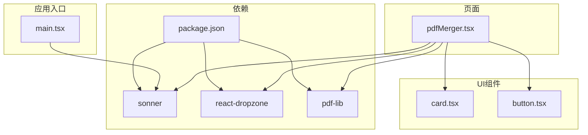
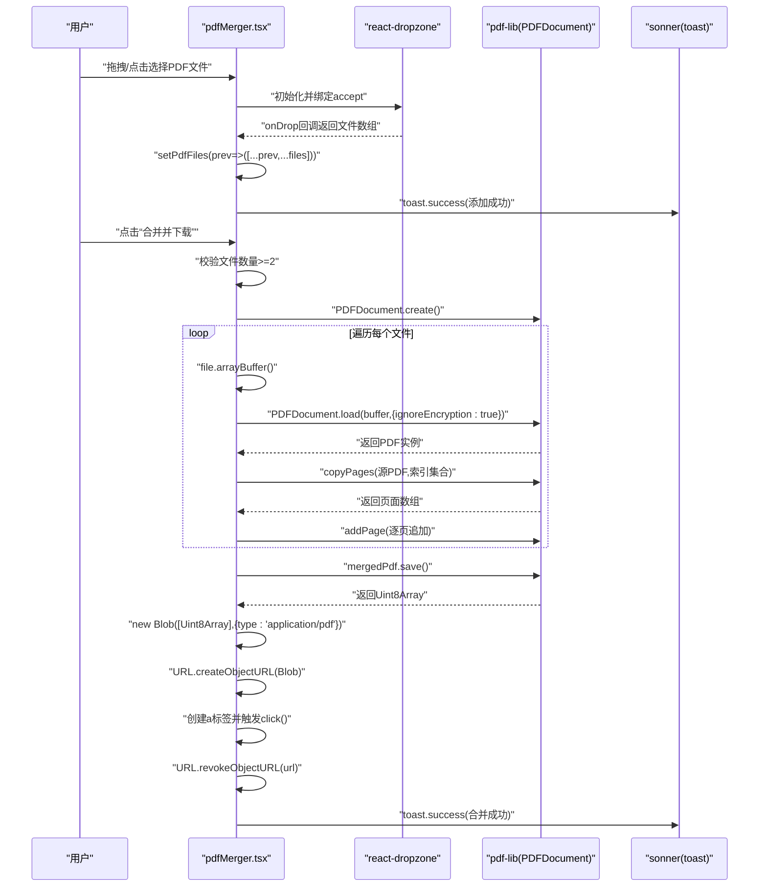
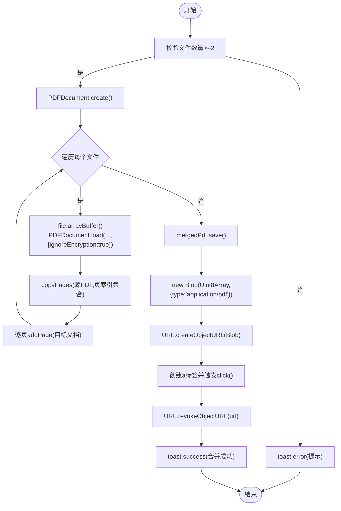
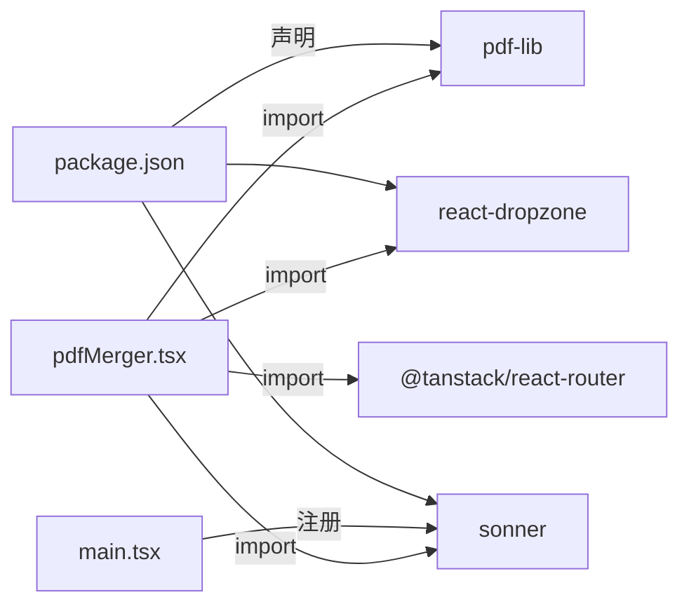

# PDF合并

<cite>
**本文引用的文件**
- [pdfMerger.tsx](file://src/pages/pdfMerger.tsx)
- [card.tsx](file://src/components/ui/card.tsx)
- [button.tsx](file://src/components/ui/button.tsx)
- [package.json](file://package.json)
- [main.tsx](file://src/main.tsx)
- [utils.ts](file://src/lib/utils.ts)
</cite>

## 目录
1. [简介](#简介)
2. [项目结构](#项目结构)
3. [核心组件](#核心组件)
4. [架构总览](#架构总览)
5. [详细组件分析](#详细组件分析)
6. [依赖分析](#依赖分析)
7. [性能考虑](#性能考虑)
8. [故障排查指南](#故障排查指南)
9. [结论](#结论)

## 简介
本文件围绕 src/pages/pdfMerger.tsx 实现，系统性阐述浏览器端使用 pdf-lib 合并 PDF 的完整流程，包括：
- 如何在浏览器端创建 PDFDocument 实例、加载多个 PDF 文件、复制页面并合并到新文档
- 基于 react-dropzone 的文件上传机制与 UI 列表管理（添加、移除、排序）
- 合并后生成 Blob 并触发自动下载
- 关键点：在 PDFDocument.load() 中启用 ignoreEncryption 以支持加密 PDF 的处理
- 错误处理策略（文件数量校验、合并失败提示）
- 性能优化建议（大文件分块处理、内存释放）

## 项目结构
- 页面入口位于 src/pages/pdfMerger.tsx，负责合并逻辑与 UI 交互
- UI 组件来自 src/components/ui，包括 Card、Button 等
- 依赖通过 package.json 管理，其中包含 pdf-lib、react-dropzone、sonner 等
- 应用根组件在 src/main.tsx 中注册全局通知组件 Toaster

图表来源
- [pdfMerger.tsx](file://src/pages/pdfMerger.tsx#L1-L183)
- [card.tsx](file://src/components/ui/card.tsx#L1-L69)
- [button.tsx](file://src/components/ui/button.tsx#L1-L59)
- [package.json](file://package.json#L1-L89)
- [main.tsx](file://src/main.tsx#L1-L18)

章节来源
- [pdfMerger.tsx](file://src/pages/pdfMerger.tsx#L1-L183)
- [package.json](file://package.json#L1-L89)
- [main.tsx](file://src/main.tsx#L1-L18)

## 核心组件
- 页面容器与布局：使用 Card 组件承载标题、返回按钮与内容区域
- 操作按钮：使用 Button 组件实现返回首页、清空列表、合并并下载等操作
- 文件上传区：基于 react-dropzone 提供拖拽/点击上传 PDF
- 合并流程：使用 pdf-lib 的 PDFDocument.create/load/copyPages/save 流程
- 通知系统：使用 sonner 的 toast 进行成功/错误提示
- 全局通知：在应用入口注册 Toaster，确保 toast 正常显示

章节来源
- [pdfMerger.tsx](file://src/pages/pdfMerger.tsx#L1-L183)
- [card.tsx](file://src/components/ui/card.tsx#L1-L69)
- [button.tsx](file://src/components/ui/button.tsx#L1-L59)
- [main.tsx](file://src/main.tsx#L1-L18)

## 架构总览
下图展示了从用户交互到合并完成的端到端流程，包括文件上传、状态管理、合并逻辑与下载触发。

图表来源
- [pdfMerger.tsx](file://src/pages/pdfMerger.tsx#L1-L183)

## 详细组件分析

### 页面组件：PdfMergerComponent
- 负责：
  - 管理 pdfFiles 状态（File[]）
  - 使用 useDropzone 接受 PDF 文件并更新状态
  - 提供移除、上下移动排序、清空列表、合并并下载等操作
  - 调用 pdf-lib 完成合并与下载
  - 使用 toast 提示用户反馈

- 关键交互：
  - 拖拽上传：通过 getRootProps/getInputProps 绑定 Dropzone 行为
  - 文件列表渲染：遍历 pdfFiles 展示名称与大小，提供排序与删除
  - 合并按钮：disabled 状态由 isProcessing 控制；点击后进入合并流程

- 错误处理：
  - 文件数量不足时提示错误
  - 合并异常捕获并提示错误
  - 成功后提示成功

- 下载流程：
  - 保存为 Uint8Array
  - 包装为 Blob
  - 生成临时 URL
  - 动态创建 a 标签并触发下载
  - 释放临时 URL

章节来源
- [pdfMerger.tsx](file://src/pages/pdfMerger.tsx#L1-L183)

### UI 组件集成
- Card：用于包裹整个页面卡片式布局，包含头部标题与返回按钮、内容区域
- Button：用于返回首页、清空列表、合并并下载等操作按钮，支持不同变体与尺寸
- Toaster：在应用入口注册，使 toast 生效

章节来源
- [card.tsx](file://src/components/ui/card.tsx#L1-L69)
- [button.tsx](file://src/components/ui/button.tsx#L1-L59)
- [main.tsx](file://src/main.tsx#L1-L18)

### 合并流程详解：mergePDFs
- 输入校验：当文件数小于 2 时，提示“请至少添加两个PDF文件”
- 创建目标文档：调用 PDFDocument.create() 创建新的 PDF 文档实例
- 加载与复制页面：
  - 将每个文件转换为 ArrayBuffer
  - 使用 PDFDocument.load(buffer, { ignoreEncryption: true }) 加载 PDF
  - 使用 copyPages(源PDF, 源PDF的页索引集合) 复制页面
  - 将复制的页面逐页添加到目标文档
- 保存与下载：
  - 调用 mergedPdf.save() 返回 Uint8Array
  - new Blob([Uint8Array], { type: 'application/pdf' })
  - URL.createObjectURL(Blob) 生成临时 URL
  - 创建 a 标签并设置 href 与 download，触发 click
  - URL.revokeObjectURL(url) 释放临时 URL
- 错误处理：try/catch 捕获异常并 toast.error
- 状态控制：isProcessing 控制按钮禁用与加载提示

图表来源
- [pdfMerger.tsx](file://src/pages/pdfMerger.tsx#L44-L82)

章节来源
- [pdfMerger.tsx](file://src/pages/pdfMerger.tsx#L44-L82)

### 文件上传机制：react-dropzone
- accept 限定为 application/pdf
- onDrop 回调将新文件追加到现有列表
- toast 提示添加数量
- UI 通过 getRootProps/getInputProps 绑定拖拽区域

章节来源
- [pdfMerger.tsx](file://src/pages/pdfMerger.tsx#L19-L25)

### 文件列表管理：添加、移除、排序
- 添加：onDrop 将新文件追加到 pdfFiles
- 移除：handleRemoveFile 根据索引过滤掉对应文件
- 排序：moveFile 通过交换相邻元素实现上移/下移
- 清空：清空列表并提示

章节来源
- [pdfMerger.tsx](file://src/pages/pdfMerger.tsx#L27-L42)

### 合并后 Blob 生成与自动下载
- 保存：mergedPdf.save() 返回 Uint8Array
- 包装：new Blob([Uint8Array], { type: 'application/pdf' })
- 生成 URL：URL.createObjectURL(Blob)
- 下载：动态创建 a 标签，设置 href 与 download，触发 click
- 释放：URL.revokeObjectURL(url)

章节来源
- [pdfMerger.tsx](file://src/pages/pdfMerger.tsx#L66-L76)

### 与 UI 组件的集成方式
- Card：包裹页面主体，提供标题与返回按钮
- Button：返回首页、清空列表、合并并下载
- Toaster：在应用入口注册，统一管理 toast 显示

章节来源
- [card.tsx](file://src/components/ui/card.tsx#L1-L69)
- [button.tsx](file://src/components/ui/button.tsx#L1-L59)
- [main.tsx](file://src/main.tsx#L1-L18)

## 依赖分析
- pdf-lib：用于在浏览器端创建、加载、复制页面与保存 PDF
- react-dropzone：提供拖拽/点击上传能力
- sonner：提供 toast 通知
- @tanstack/react-router：页面路由与导航

图表来源
- [pdfMerger.tsx](file://src/pages/pdfMerger.tsx#L1-L12)
- [package.json](file://package.json#L1-L89)
- [main.tsx](file://src/main.tsx#L1-L18)

章节来源
- [package.json](file://package.json#L1-L89)
- [pdfMerger.tsx](file://src/pages/pdfMerger.tsx#L1-L12)
- [main.tsx](file://src/main.tsx#L1-L18)

## 性能考虑
- 大文件分块处理
  - 当前实现逐个文件读取并合并，适合中小规模文件
  - 对于超大文件，建议采用分块读取与分批合并策略，避免一次性占用过多内存
- 内存释放
  - 已在下载后调用 URL.revokeObjectURL(url)，释放临时 URL
  - 建议在合并完成后主动释放中间变量（如 Uint8Array、PDF 实例），减少内存峰值
- 并发与顺序
  - 当前按顺序加载与复制页面，保证顺序一致性
  - 若需提升吞吐量，可在允许的情况下对独立 PDF 的加载/复制进行并发处理（注意浏览器限制与内存压力）
- UI 响应
  - 使用 isProcessing 控制按钮禁用与加载提示，避免重复提交
- 错误与回退
  - 对单个文件加载失败进行局部错误处理，不影响其他文件的合并

[本节为通用性能建议，不直接分析具体文件，故无章节来源]

## 故障排查指南
- 文件数量不足
  - 现象：点击合并按钮提示“请至少添加两个PDF文件”
  - 处理：添加足够的 PDF 文件后再尝试合并
- 加密 PDF 无法打开
  - 现象：加载 PDF 报错
  - 处理：确认已启用 ignoreEncryption 选项；若仍失败，检查 PDF 是否受密码保护且密码未知
- 合并失败
  - 现象：toast.error 显示合并失败
  - 处理：检查网络与浏览器兼容性；尝试较小文件；查看浏览器控制台错误信息
- 下载失败
  - 现象：点击下载无反应
  - 处理：确认浏览器未拦截弹窗；检查 URL.createObjectURL 是否成功；确认 URL.revokeObjectURL 是否在下载后调用
- 内存占用过高
  - 现象：大文件合并时页面卡顿
  - 处理：分块处理与释放中间变量；关闭不必要的标签页；降低同时处理的文件数量

章节来源
- [pdfMerger.tsx](file://src/pages/pdfMerger.tsx#L44-L82)

## 结论
pdfMerger.tsx 通过 react-dropzone 实现 PDF 文件上传，借助 pdf-lib 在浏览器端完成多 PDF 的加载、复制与合并，并在合并完成后生成 Blob 触发自动下载。关键改进点在于启用 ignoreEncryption 以支持加密 PDF 的处理。配合 toast 提示与 Card/Button 等 UI 组件，形成完整的用户体验闭环。针对大文件与高内存场景，建议采用分块处理与及时释放内存的策略，以提升稳定性与性能。