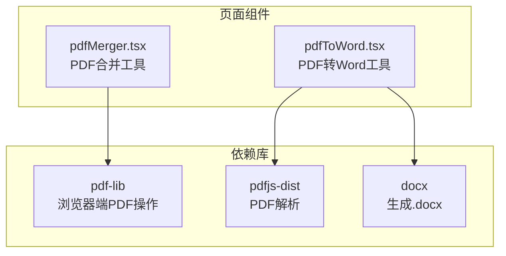
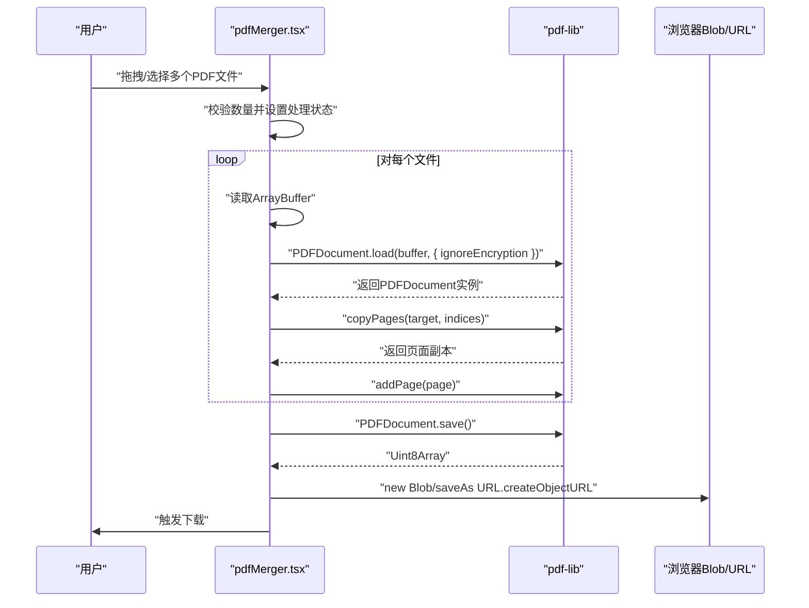
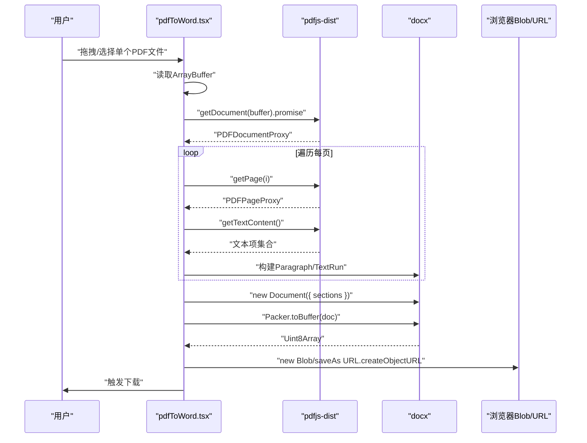
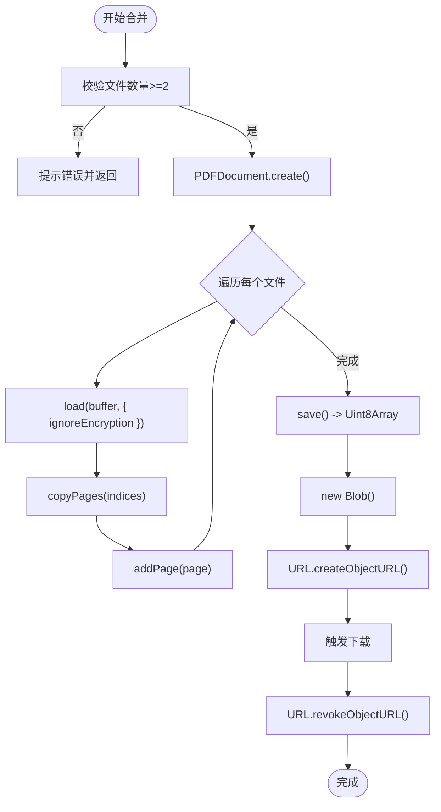
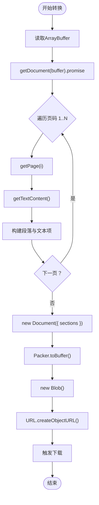
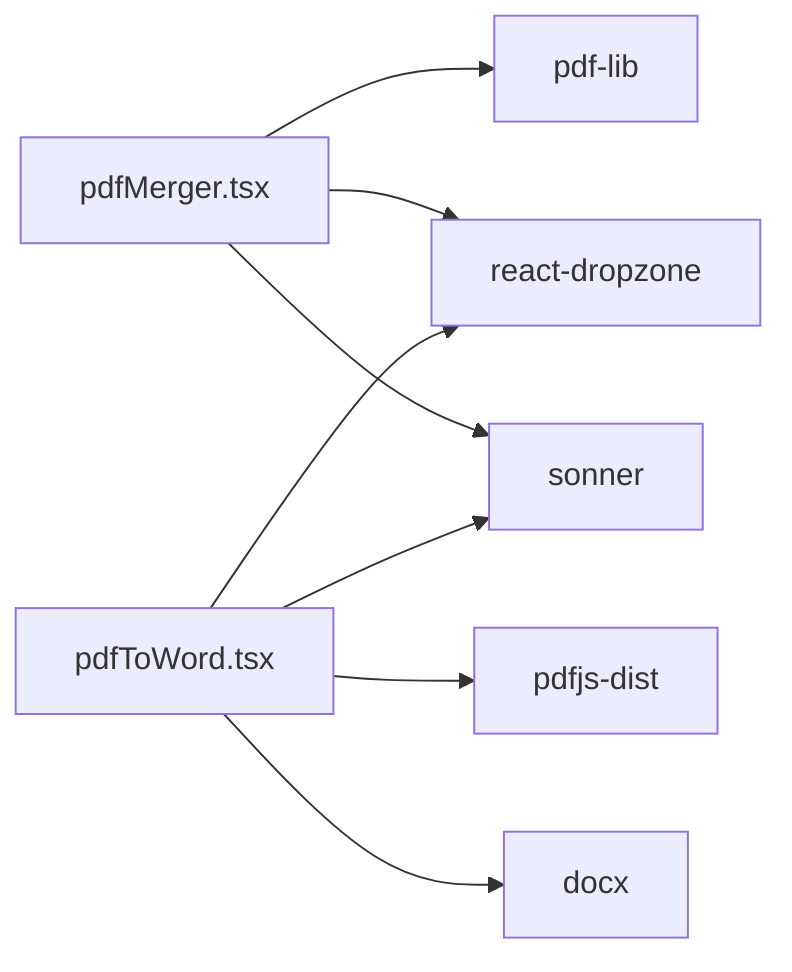

# PDF处理

<cite>
**本文引用的文件**
- [pdfMerger.tsx](file://src/pages/pdfMerger.tsx)
- [pdfToWord.tsx](file://src/pages/pdfToWord.tsx)
- [package.json](file://package.json)
- [README.md](file://README.md)
</cite>

## 目录
1. [简介](#简介)
2. [项目结构](#项目结构)
3. [核心组件](#核心组件)
4. [架构总览](#架构总览)
5. [详细组件分析](#详细组件分析)
6. [依赖分析](#依赖分析)
7. [性能考虑](#性能考虑)
8. [故障排查指南](#故障排查指南)
9. [结论](#结论)
10. [附录](#附录)

## 简介
本文件面向开发者，系统性梳理浏览器端PDF处理工具的实现与最佳实践，重点覆盖两大功能：
- PDF合并：使用pdf-lib在浏览器端创建、加载、复制页面并保存为新PDF，支持文件上传、顺序调整、加密PDF处理与自动下载。
- PDF转Word：使用pdfjs-dist解析PDF文本内容，结合docx库生成.docx文件，包含页面标题、段落与文本样式构建。

同时，文档给出错误处理、大文件内存管理与性能优化建议，并提供扩展新PDF处理功能的思路与路径。

## 项目结构
- 功能入口位于 src/pages 下的 pdfMerger.tsx 与 pdfToWord.tsx。
- 依赖通过 package.json 引入，核心库包括 pdf-lib、pdfjs-dist、docx 等。
- README.md 明确列出“PDF合并”“PDF转Word”等现有功能。

图表来源
- [pdfMerger.tsx](file://src/pages/pdfMerger.tsx#L1-L20)
- [pdfToWord.tsx](file://src/pages/pdfToWord.tsx#L1-L15)
- [package.json](file://package.json#L18-L59)

章节来源
- [README.md](file://README.md#L33-L52)
- [package.json](file://package.json#L18-L59)

## 核心组件
- PDF合并组件（pdfMerger.tsx）
  - 负责文件拖拽上传、顺序调整、合并执行、加密PDF处理与下载。
  - 关键API：PDFDocument.create()、PDFDocument.load()、copyPages()、addPage()、save()。
- PDF转Word组件（pdfToWord.tsx）
  - 负责单文件上传、文本抽取、段落与样式构建、生成并下载.docx。

章节来源
- [pdfMerger.tsx](file://src/pages/pdfMerger.tsx#L14-L82)
- [pdfToWord.tsx](file://src/pages/pdfToWord.tsx#L15-L142)

## 架构总览
浏览器端PDF处理的整体流程如下：
- 合并流程：用户上传多个PDF → 逐个读取为ArrayBuffer → 加载为PDFDocument → 复制页面到目标文档 → 保存为Blob → 触发下载。
- 转Word流程：用户上传单个PDF → 读取为ArrayBuffer → 使用pdfjs-dist解析 → 遍历页面提取文本内容 → 构建Paragraph/TextRun → 生成docx文档 → 保存为Blob → 触发下载。

图表来源
- [pdfMerger.tsx](file://src/pages/pdfMerger.tsx#L44-L82)

图表来源
- [pdfToWord.tsx](file://src/pages/pdfToWord.tsx#L47-L142)

## 详细组件分析

### PDF合并组件（pdfMerger.tsx）
- 文件上传与顺序管理
  - 使用react-dropzone接收PDF文件，支持多文件拖拽；提供上移/下移与删除操作，便于调整合并顺序。
- 合并流程与API使用
  - 创建目标PDF：PDFDocument.create()
  - 加载源PDF：PDFDocument.load(buffer, { ignoreEncryption: true })
  - 复制页面：copyPages(sourcePDF, sourcePDF.getPageIndices())
  - 添加页面：addPage(page)
  - 保存输出：save()返回Uint8Array，封装为Blob并通过URL.createObjectURL触发下载
- 错误处理与用户体验
  - 数量校验：少于两个文件时提示
  - try/catch捕获异常并toast提示
  - 处理状态isProcessing控制按钮禁用与动画
- 加密PDF处理
  - 通过ignoreEncryption选项跳过密码保护的PDF加载限制，提高兼容性

图表来源
- [pdfMerger.tsx](file://src/pages/pdfMerger.tsx#L44-L82)

章节来源
- [pdfMerger.tsx](file://src/pages/pdfMerger.tsx#L14-L82)

### PDF转Word组件（pdfToWord.tsx）
- 文件上传与预览
  - 限制单文件上传，展示文件名与大小，提供转换与下载按钮。
- 文本解析与段落构建
  - 使用pdfjs-dist.getDocument获取PDF文档代理，遍历每页getPage(i)，调用getTextContent()获取文本项集合。
  - 为每页插入带粗体与字号的标题段落，随后按文本项拼接段落，遇到换行或句号结尾时拆分段落。
  - 使用docx的Document、Paragraph、TextRun构建文档结构。
- 输出与下载
  - Packer.toBuffer生成Uint8Array，封装为Blob并创建URL，设置download属性触发下载。

图表来源
- [pdfToWord.tsx](file://src/pages/pdfToWord.tsx#L47-L142)

章节来源
- [pdfToWord.tsx](file://src/pages/pdfToWord.tsx#L15-L142)

## 依赖分析
- pdf-lib
  - 用于在浏览器端创建、加载、复制页面与保存PDF。
  - 版本：^1.17.1
- pdfjs-dist
  - 用于解析PDF文档、获取页面与文本内容。
  - 版本：^5.2.133
- docx
  - 用于构建与打包.docx文档。
  - 版本：^9.4.1
- react-dropzone
  - 用于拖拽上传文件。
- sonner
  - 用于Toast提示。

图表来源
- [package.json](file://package.json#L18-L59)
- [pdfMerger.tsx](file://src/pages/pdfMerger.tsx#L1-L12)
- [pdfToWord.tsx](file://src/pages/pdfToWord.tsx#L1-L12)

章节来源
- [package.json](file://package.json#L18-L59)

## 性能考虑
- 内存管理
  - 合并与转Word均涉及大量ArrayBuffer与Uint8Array的创建与传递，应避免重复拷贝与冗余缓存。
  - 使用URL.createObjectURL生成临时URL后，在下载完成后及时调用URL.revokeObjectURL释放内存。
  - 对于超大PDF，建议分批处理或限制并发页面解析，避免主线程阻塞。
- 并发与异步
  - 合并流程中对每个文件依次await，避免并发导致的内存峰值过高；如需加速，可考虑分批并发与队列控制。
  - 转Word流程中每页getTextContent()为异步，建议在UI层显示进度提示。
- UI响应
  - 使用isProcessing状态禁用按钮与显示动画，提升用户感知。
- 体积与格式
  - 合并前可对文件大小进行提示，避免一次性加载过多大文件。
  - 转Word仅提取文本，不包含图像与复杂排版，如需保留格式可考虑OCR或服务端方案。

[本节为通用性能建议，无需特定文件引用]

## 故障排查指南
- 合并失败
  - 若提示“请至少添加两个PDF文件”，请确认已选择多个文件。
  - 若出现加载错误，检查PDF是否受密码保护；当前实现已启用ignoreEncryption选项，但仍可能受浏览器安全策略限制。
  - 检查浏览器控制台是否有pdf-lib相关报错。
- 转换失败
  - 若PDF为扫描版或嵌入字体缺失，可能导致文本抽取不完整或空白。
  - 检查pdfjs-dist版本与浏览器兼容性。
  - 确认docx依赖正常安装。
- 下载失败
  - 确认浏览器允许自动下载与弹窗；若被拦截，引导用户手动点击下载。
  - 检查Blob类型与URL是否正确生成。

章节来源
- [pdfMerger.tsx](file://src/pages/pdfMerger.tsx#L44-L82)
- [pdfToWord.tsx](file://src/pages/pdfToWord.tsx#L47-L142)

## 结论
本项目以轻量、纯前端的方式实现了PDF合并与PDF转Word两大常用功能。通过pdf-lib与pdfjs-dist的组合，既能在浏览器端高效完成页面复制与文本抽取，又能借助docx生成标准的Word文档。建议在生产环境中进一步完善大文件处理策略、错误恢复与进度反馈，并根据业务需求扩展更多PDF处理能力（如裁剪、旋转、加水印、OCR等）。

[本节为总结性内容，无需特定文件引用]

## 附录

### API使用要点速查
- PDF合并
  - 创建：PDFDocument.create()
  - 加载：PDFDocument.load(buffer, { ignoreEncryption })
  - 复制：copyPages(sourcePDF, indices)
  - 添加：addPage(page)
  - 保存：save()返回Uint8Array
- PDF转Word
  - 解析：getDocument(buffer).promise
  - 页面：getPage(i)
  - 文本：getTextContent()
  - 构建：Document、Paragraph、TextRun
  - 打包：Packer.toBuffer(doc)

章节来源
- [pdfMerger.tsx](file://src/pages/pdfMerger.tsx#L52-L66)
- [pdfToWord.tsx](file://src/pages/pdfToWord.tsx#L52-L128)

### 扩展新PDF处理功能的建议
- 增强合并：支持页面范围选择、方向调整、页面分割、水印叠加、加密输出等。
- 增强转Word：保留表格、图片、字体样式与段落格式；引入OCR识别扫描版PDF；支持导出为其他格式（如HTML、Markdown）。
- 性能优化：分页异步解析、Web Worker分担计算、增量渲染与进度条。
- 错误与回退：对不可解析的PDF提供降级方案与用户提示。

[本节为概念性建议，无需特定文件引用]