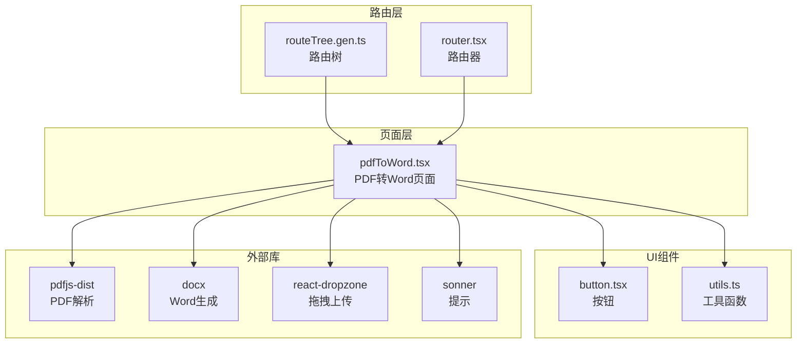
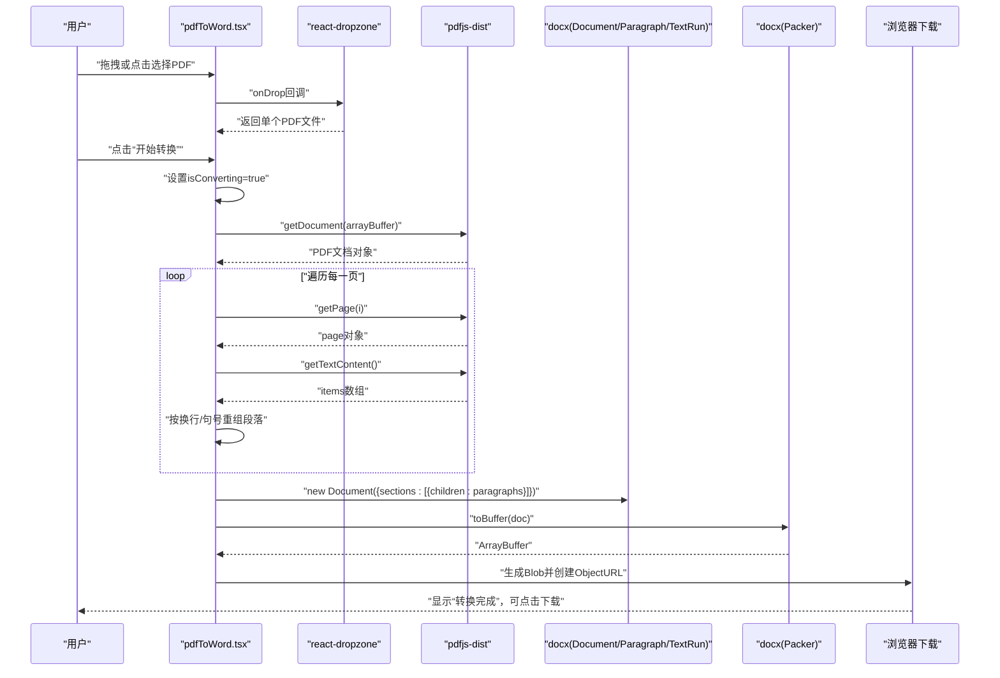
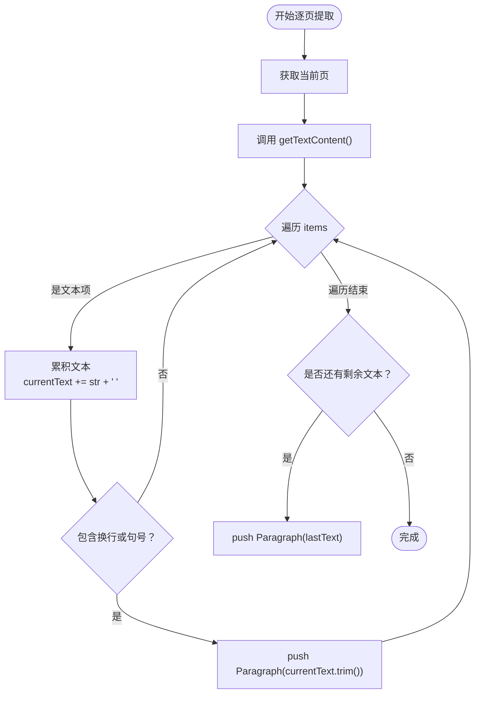
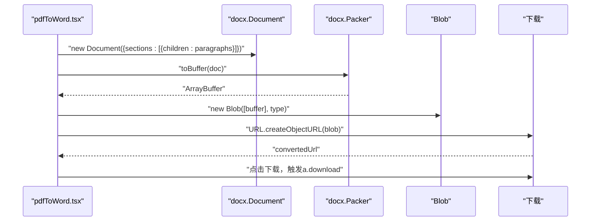
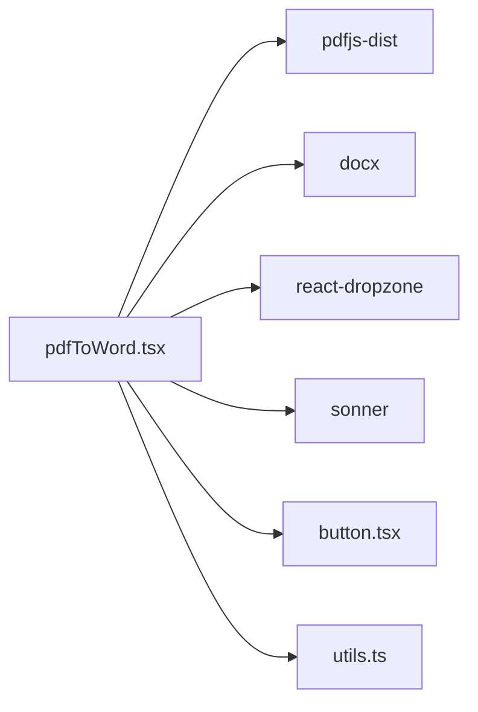

# PDF转Word

<cite>
**本文引用的文件**
- [src/pages/pdfToWord.tsx](file://src/pages/pdfToWord.tsx)
- [package.json](file://package.json)
- [src/lib/utils.ts](file://src/lib/utils.ts)
- [src/components/ui/button.tsx](file://src/components/ui/button.tsx)
- [src/plugins/router.tsx](file://src/plugins/router.tsx)
- [src/routeTree.gen.ts](file://src/routeTree.gen.ts)
</cite>

## 目录
1. [简介](#简介)
2. [项目结构](#项目结构)
3. [核心组件](#核心组件)
4. [架构总览](#架构总览)
5. [详细组件分析](#详细组件分析)
6. [依赖分析](#依赖分析)
7. [性能考虑](#性能考虑)
8. [故障排查指南](#故障排查指南)
9. [结论](#结论)
10. [附录](#附录)

## 简介
本文件围绕 src/pages/pdfToWord.tsx 的实现，系统阐述“PDF转Word”功能的技术路径与实现要点，重点覆盖：
- 使用 pdfjs-dist 解析 PDF 文本内容，逐页提取文本项并构建段落结构
- 使用 docx 库的 Document、Paragraph、TextRun 对象组织 Word 内容，并通过 Packer.toBuffer 生成 .docx 的 Blob
- 文件拖拽上传（useDropzone）、单文件限制、转换状态管理（isConverting、convertedUrl）与下载机制
- 文本内容重组逻辑：换行识别、句末断句与段落分割策略
- 错误捕获与用户反馈（sonner 提示）
- 大文件处理注意事项与样式保留的局限性说明
- 完整数据流示意，帮助开发者复用或扩展

## 项目结构
该功能位于页面级组件 src/pages/pdfToWord.tsx，采用 TanStack Router 进行路由注册与导航，UI 组件来自 src/components/ui，工具函数来自 src/lib/utils。

图表来源
- [src/pages/pdfToWord.tsx](file://src/pages/pdfToWord.tsx#L1-L267)
- [src/routeTree.gen.ts](file://src/routeTree.gen.ts#L129-L133)
- [src/plugins/router.tsx](file://src/plugins/router.tsx#L1-L19)
- [src/components/ui/button.tsx](file://src/components/ui/button.tsx#L1-L59)
- [src/lib/utils.ts](file://src/lib/utils.ts#L1-L18)
- [package.json](file://package.json#L18-L59)

章节来源
- [src/pages/pdfToWord.tsx](file://src/pages/pdfToWord.tsx#L1-L267)
- [src/routeTree.gen.ts](file://src/routeTree.gen.ts#L129-L133)
- [src/plugins/router.tsx](file://src/plugins/router.tsx#L1-L19)
- [package.json](file://package.json#L18-L59)

## 核心组件
- 页面组件：负责文件拖拽、状态管理、转换流程与下载交互
- 依赖库：
  - pdfjs-dist：解析 PDF 文档与文本内容
  - docx：构建 Word 文档模型并导出为 .docx
  - react-dropzone：拖拽上传与单文件限制
  - sonner：全局提示（成功/失败）

关键状态与行为：
- 状态：pdfFile、isConverting、convertedUrl、fileSize
- 行为：onDrop（单文件限制）、convertPdfToWord（逐页提取文本并生成 Word）、downloadWord（触发下载）

章节来源
- [src/pages/pdfToWord.tsx](file://src/pages/pdfToWord.tsx#L15-L267)
- [package.json](file://package.json#L18-L59)

## 架构总览
下图展示了从用户上传 PDF 到生成并下载 Word 的端到端流程。

图表来源
- [src/pages/pdfToWord.tsx](file://src/pages/pdfToWord.tsx#L30-L155)
- [package.json](file://package.json#L18-L59)

## 详细组件分析

### 页面组件：PdfToWord
- 职责
  - 接收并校验单文件拖拽上传（仅接受 .pdf，最多1个）
  - 触发 PDF 文本解析与 Word 文档生成
  - 管理转换状态与下载链接
  - 展示文件信息与转换状态

- 关键实现点
  - 拖拽上传与单文件限制：通过 useDropzone 的 accept 与 maxFiles 实现
  - 文本提取与段落重组：逐页调用 getTextContent，基于换行符与句号进行断句与段落拆分
  - Word 文档构建：使用 Document、Paragraph、TextRun 组织内容，再由 Packer.toBuffer 输出 .docx
  - 下载机制：生成 Blob 并通过 a 标签触发下载，自动附加时间戳与原文件名前缀

- 数据流与状态流转
  - 上传阶段：onDrop 设置 pdfFile 与 fileSize，清空 convertedUrl
  - 转换阶段：convertPdfToWord 设置 isConverting，捕获异常并提示，最终生成 convertedUrl
  - 下载阶段：downloadWord 基于 convertedUrl 创建下载链接

章节来源
- [src/pages/pdfToWord.tsx](file://src/pages/pdfToWord.tsx#L30-L155)

### 文本提取与段落重组逻辑
- 逐页提取
  - 通过 getDocument 获取文档对象，循环 getPage 获取每页内容
  - 调用 getTextContent 获取 items 数组，遍历其中的文本项
- 换行识别与断句
  - 在遍历过程中累积文本，遇到换行符或句号结尾时，形成一个段落
  - 最后一段单独处理，确保未遗漏
- 段落结构
  - 每页添加带粗体、字号与换行的“第 X 页”标题
  - 每段使用 Paragraph 包裹 TextRun，统一字号

图表来源
- [src/pages/pdfToWord.tsx](file://src/pages/pdfToWord.tsx#L47-L117)

章节来源
- [src/pages/pdfToWord.tsx](file://src/pages/pdfToWord.tsx#L47-L117)

### Word 文档生成与下载
- 文档模型
  - 使用 Document 构建文档，sections 中包含由 Paragraph 组成的 children
  - 每个 Paragraph 由若干 TextRun 组成，用于承载文本与基础样式属性
- 导出与下载
  - Packer.toBuffer 生成 ArrayBuffer，封装为 Blob
  - 通过 URL.createObjectURL 生成临时链接，赋给 convertedUrl
  - downloadWord 使用 a 标签触发下载，文件名为“原文件名_时间戳.docx”

图表来源
- [src/pages/pdfToWord.tsx](file://src/pages/pdfToWord.tsx#L119-L155)

章节来源
- [src/pages/pdfToWord.tsx](file://src/pages/pdfToWord.tsx#L119-L155)

### 错误处理与用户反馈
- 错误捕获
  - 转换流程中使用 try/catch 捕获异常，打印错误日志
- 用户反馈
  - 成功：通过 toast.success 提示
  - 失败：通过 toast.error 提示，消息包含错误信息

章节来源
- [src/pages/pdfToWord.tsx](file://src/pages/pdfToWord.tsx#L136-L141)
- [src/lib/utils.ts](file://src/lib/utils.ts#L1-L18)

### UI 与路由集成
- UI 组件
  - 使用 Button 组件作为操作按钮，支持禁用态与图标
- 路由集成
  - 通过 createFileRoute 注册路由，路由树 routeTree.gen.ts 中声明 /pdfToWord
  - 路由器 router.tsx 创建并导出 router 实例

章节来源
- [src/components/ui/button.tsx](file://src/components/ui/button.tsx#L1-L59)
- [src/routeTree.gen.ts](file://src/routeTree.gen.ts#L129-L133)
- [src/plugins/router.tsx](file://src/plugins/router.tsx#L1-L19)

## 依赖分析
- 外部库
  - pdfjs-dist：解析 PDF 文档与文本内容
  - docx：构建 Word 文档模型与导出
  - react-dropzone：拖拽上传与文件类型/数量限制
  - sonner：全局提示
- 本地依赖
  - utils.ts：通用工具函数（如 cn 合并类名），也包含复制到剪贴板的 toast 示例

图表来源
- [src/pages/pdfToWord.tsx](file://src/pages/pdfToWord.tsx#L1-L267)
- [package.json](file://package.json#L18-L59)
- [src/lib/utils.ts](file://src/lib/utils.ts#L1-L18)
- [src/components/ui/button.tsx](file://src/components/ui/button.tsx#L1-L59)

章节来源
- [package.json](file://package.json#L18-L59)
- [src/pages/pdfToWord.tsx](file://src/pages/pdfToWord.tsx#L1-L267)

## 性能考虑
- 大文件处理
  - PDF 文本解析与 Word 生成均在浏览器执行，大文件可能导致内存占用上升与卡顿
  - 建议对超大 PDF 进行提示或拆分建议，避免长时间阻塞 UI
- 渲染与状态更新
  - 转换期间设置 isConverting 并禁用按钮，避免重复触发
  - 使用 convertedUrl 缓存下载链接，减少重复计算
- 导出体积
  - 生成的 .docx 为纯文本结构，不包含原始 PDF 的复杂排版与图像，体积与内容量相关

[本节为通用指导，无需特定文件来源]

## 故障排查指南
- 无法上传或提示非 PDF
  - 检查 useDropzone 的 accept 与 maxFiles 是否正确配置
  - 确认仅拖入单个 PDF 文件
- 转换失败
  - 查看控制台错误日志，确认 pdfjs-dist 与 docx 版本兼容
  - 确认网络环境稳定，避免中途中断
- 下载失败
  - 确认 convertedUrl 已生成且有效
  - 检查浏览器下载权限与弹窗拦截设置
- 样式保留问题
  - 当前实现仅保留基础文本与简单样式（字号、加粗、换行），不包含字体、颜色、表格、图像等复杂格式

章节来源
- [src/pages/pdfToWord.tsx](file://src/pages/pdfToWord.tsx#L39-L45)
- [src/pages/pdfToWord.tsx](file://src/pages/pdfToWord.tsx#L136-L141)
- [src/pages/pdfToWord.tsx](file://src/pages/pdfToWord.tsx#L144-L155)

## 结论
该实现以轻量、纯前端的方式完成了 PDF 文本到 Word 的转换，具备以下特点：
- 易于集成：基于现有 UI 组件与路由体系
- 流程清晰：从拖拽上传到生成下载链接的完整链路
- 可扩展性强：可在此基础上增加样式映射、分页标题、目录、图片处理等能力

[本节为总结性内容，无需特定文件来源]

## 附录
- 代码片段路径参考
  - 拖拽上传与单文件限制：[onDrop/useDropzone](file://src/pages/pdfToWord.tsx#L30-L45)
  - PDF 文本提取与段落重组：[convertPdfToWord](file://src/pages/pdfToWord.tsx#L47-L117)
  - Word 文档生成与导出：[Document/Paragraph/TextRun/Packer](file://src/pages/pdfToWord.tsx#L119-L135)
  - 下载机制：[downloadWord](file://src/pages/pdfToWord.tsx#L144-L155)
  - 错误处理与提示：[toast/error](file://src/pages/pdfToWord.tsx#L136-L141)
  - UI 组件与路由集成：[Button](file://src/components/ui/button.tsx#L1-L59)、[/pdfToWord 路由](file://src/routeTree.gen.ts#L129-L133)、[router.tsx](file://src/plugins/router.tsx#L1-L19)

[本节为索引性内容，无需特定文件来源]