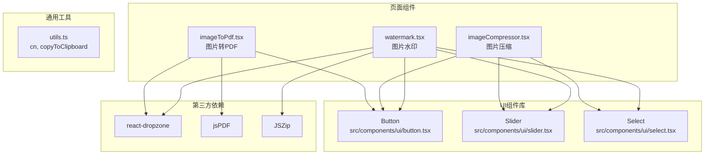
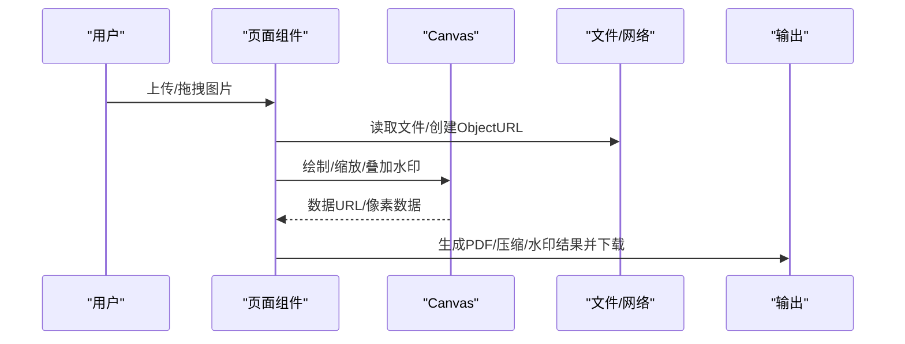
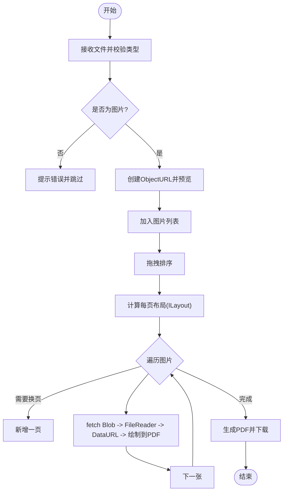
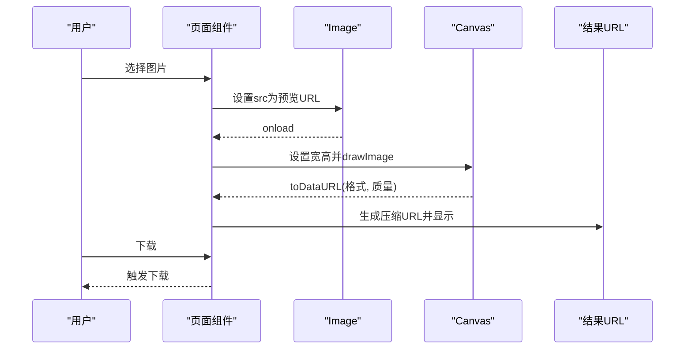
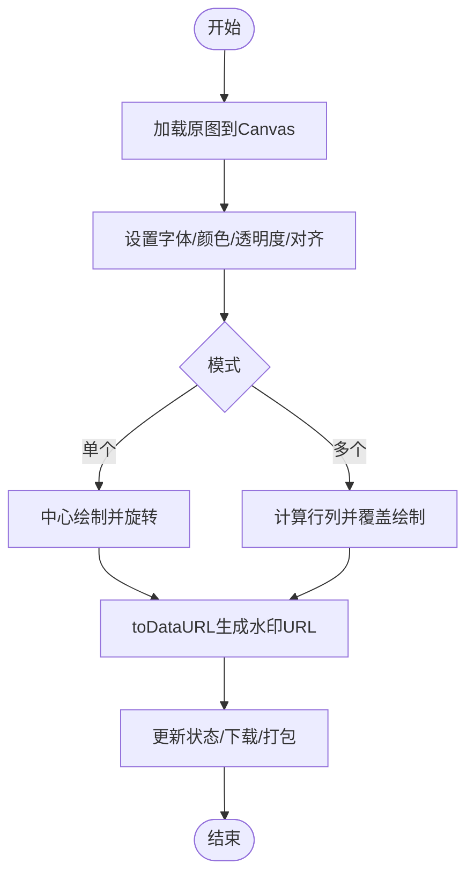
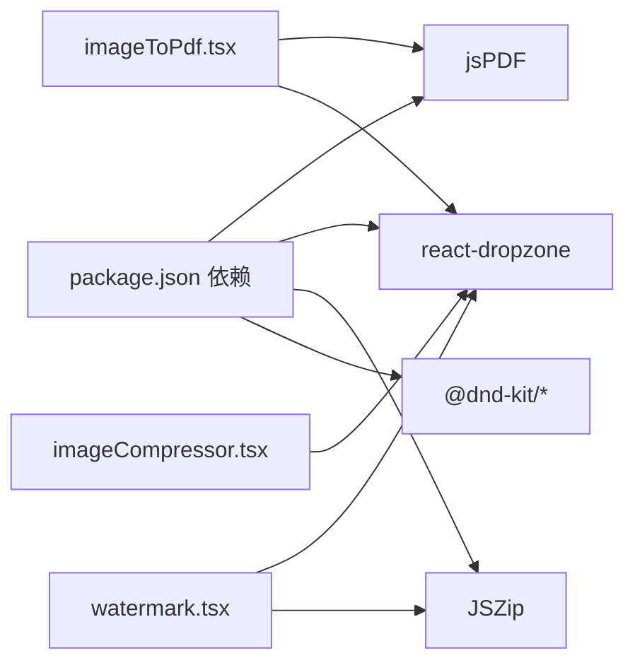

# 图像处理

<cite>
**本文引用的文件**
- [imageToPdf.tsx](file://src/pages/imageToPdf.tsx)
- [imageCompressor.tsx](file://src/pages/imageCompressor.tsx)
- [watermark.tsx](file://src/pages/watermark.tsx)
- [package.json](file://package.json)
- [utils.ts](file://src/lib/utils.ts)
- [button.tsx](file://src/components/ui/button.tsx)
- [slider.tsx](file://src/components/ui/slider.tsx)
- [select.tsx](file://src/components/ui/select.tsx)
</cite>

## 目录
1. [简介](#简介)
2. [项目结构](#项目结构)
3. [核心组件](#核心组件)
4. [架构总览](#架构总览)
5. [详细组件分析](#详细组件分析)
6. [依赖关系分析](#依赖关系分析)
7. [性能考量](#性能考量)
8. [故障排查指南](#故障排查指南)
9. [结论](#结论)
10. [附录](#附录)

## 简介
本技术文档围绕仓库中的三款图像处理工具进行全面说明，涵盖以下能力：
- 图片转PDF：基于浏览器原生API（FileReader、Canvas、Blob）与第三方库（jsPDF）实现图片到PDF的批量生成与布局控制。
- 图片压缩：利用CanvasRenderingContext2D.drawImage()进行缩放，并通过toDataURL()与质量参数实现压缩。
- 图片水印：在Canvas上叠加文字或覆盖式水印，支持透明度、旋转、字体与布局控制，并支持批量处理与打包下载。

文档将从系统架构、数据流、处理逻辑、错误处理、性能优化与用户体验提升等维度展开，并提供可视化图示帮助理解。

## 项目结构
三款图像处理页面位于 src/pages 目录下，分别对应不同的业务场景与技术栈组合：
- imageToPdf.tsx：使用 react-dropzone 进行拖拽上传，使用 jsPDF 生成PDF；Canvas用于预览与尺寸计算。
- imageCompressor.tsx：使用 Canvas 进行缩放与压缩，toDataURL 输出压缩结果。
- watermark.tsx：使用 Canvas 绘制文字水印，支持单图与批量处理，JSZip 打包下载。

图表来源
- [imageToPdf.tsx](file://src/pages/imageToPdf.tsx#L1-L120)
- [imageCompressor.tsx](file://src/pages/imageCompressor.tsx#L1-L120)
- [watermark.tsx](file://src/pages/watermark.tsx#L1-L120)
- [button.tsx](file://src/components/ui/button.tsx#L1-L59)
- [slider.tsx](file://src/components/ui/slider.tsx#L1-L62)
- [select.tsx](file://src/components/ui/select.tsx#L1-L184)
- [utils.ts](file://src/lib/utils.ts#L1-L18)

章节来源
- [imageToPdf.tsx](file://src/pages/imageToPdf.tsx#L1-L120)
- [imageCompressor.tsx](file://src/pages/imageCompressor.tsx#L1-L120)
- [watermark.tsx](file://src/pages/watermark.tsx#L1-L120)

## 核心组件
- 图片转PDF（imageToPdf.tsx）
  - 功能要点：拖拽上传、图片预览与排序、布局算法（每页1-6张）、按比例绘制到PDF、生成并下载PDF。
  - 关键API：react-dropzone、jsPDF、Canvas、FileReader、Blob、URL.createObjectURL。
- 图片压缩（imageCompressor.tsx）
  - 功能要点：上传图片、滑块调节质量与最大宽度、选择输出格式、Canvas缩放与toDataURL输出、下载压缩结果。
  - 关键API：Canvas、ImageData、toDataURL、URL.createObjectURL。
- 图片水印（watermark.tsx）
  - 功能要点：上传多图、设置水印文本/字体/透明度/颜色/旋转、单图或覆盖式批量水印、预览与下载、JSZip打包下载。
  - 关键API：Canvas、fillText、save/restore、toDataURL、JSZip。

章节来源
- [imageToPdf.tsx](file://src/pages/imageToPdf.tsx#L1-L120)
- [imageCompressor.tsx](file://src/pages/imageCompressor.tsx#L1-L120)
- [watermark.tsx](file://src/pages/watermark.tsx#L1-L120)

## 架构总览
三者均采用“上传 -> 预览 -> 处理 -> 导出”的通用流程，差异在于处理阶段所用的API与第三方库不同。

图表来源
- [imageToPdf.tsx](file://src/pages/imageToPdf.tsx#L72-L122)
- [imageCompressor.tsx](file://src/pages/imageCompressor.tsx#L37-L120)
- [watermark.tsx](file://src/pages/watermark.tsx#L38-L120)

## 详细组件分析

### 图片转PDF（imageToPdf.tsx）
- 上传与验证
  - 使用 react-dropzone 接受 image/* 并限制数量与类型，过滤非图片文件并通过 toast 提示。
  - 通过 URL.createObjectURL 生成临时URL，使用 Image 对象校验是否为有效图片。
- 排序与预览
  - 使用 @dnd-kit 实现拖拽排序，支持拖拽预览与视觉反馈。
- 布局算法
  - 根据每页图片数量（1-6）计算可用区域与间距，生成 ILayout 列表，支持水平、网格与特定组合布局。
- PDF生成
  - 使用 jsPDF 创建A4纵向PDF，按布局循环绘制图片；为保证跨域与Blob安全，先 fetch Blob 再 FileReader 转 DataURL，最后调用 addImage 绘制。
  - 绘制时保持图片纵横比，计算居中绘制区域，避免拉伸。
- 文件命名与下载
  - 以时间戳作为文件名后缀，统一命名规则并触发浏览器下载。

图表来源
- [imageToPdf.tsx](file://src/pages/imageToPdf.tsx#L72-L122)
- [imageToPdf.tsx](file://src/pages/imageToPdf.tsx#L145-L245)
- [imageToPdf.tsx](file://src/pages/imageToPdf.tsx#L247-L345)

章节来源
- [imageToPdf.tsx](file://src/pages/imageToPdf.tsx#L72-L122)
- [imageToPdf.tsx](file://src/pages/imageToPdf.tsx#L145-L245)
- [imageToPdf.tsx](file://src/pages/imageToPdf.tsx#L247-L345)

### 图片压缩（imageCompressor.tsx）
- 上传与预览
  - 使用 react-dropzone 接收 PNG/JPG/WEBP，生成预览URL并记录原始大小。
- 参数与策略
  - 质量：1%-100%，通过 Slider 控制。
  - 最大宽度：100-3840px，按比例缩放高度（可选）。
  - 输出格式：jpeg/png/webp。
- 压缩流程
  - 通过 Image 加载预览URL，若宽度超过阈值则按比例缩放至目标宽度，Canvas 宽高同步更新。
  - drawImage 将缩放后的图像绘制到 Canvas，再调用 toDataURL 生成压缩后的 DataURL。
  - 通过 Base64 字符串长度估算压缩后字节数，计算节省空间与压缩比例。
- 下载
  - 以“原文件名_时间戳.格式”命名并触发下载。

图表来源
- [imageCompressor.tsx](file://src/pages/imageCompressor.tsx#L37-L120)
- [imageCompressor.tsx](file://src/pages/imageCompressor.tsx#L121-L149)

章节来源
- [imageCompressor.tsx](file://src/pages/imageCompressor.tsx#L37-L120)
- [imageCompressor.tsx](file://src/pages/imageCompressor.tsx#L121-L149)

### 图片水印（watermark.tsx）
- 上传与管理
  - 支持多图上传，维护 ImageItem 列表，包含原始URL、水印URL、名称等。
  - 清理时统一 revokeObjectURL，避免内存泄漏。
- 水印策略
  - 单个水印：在画布中心绘制，支持旋转与透明度。
  - 多个水印：按对角线覆盖全画布，计算行列数量与间距，逐个绘制。
  - 文字样式：字体粗细、字号、颜色（含透明度）、对齐方式。
- 批量处理与导出
  - 单图应用：更新当前图片的水印URL。
  - 全部应用：循环处理，实时更新状态以显示进度。
  - 下载：当前下载单图；全部下载使用 JSZip 打包为ZIP并下载。

图表来源
- [watermark.tsx](file://src/pages/watermark.tsx#L103-L191)
- [watermark.tsx](file://src/pages/watermark.tsx#L193-L288)
- [watermark.tsx](file://src/pages/watermark.tsx#L290-L362)

章节来源
- [watermark.tsx](file://src/pages/watermark.tsx#L38-L120)
- [watermark.tsx](file://src/pages/watermark.tsx#L103-L191)
- [watermark.tsx](file://src/pages/watermark.tsx#L193-L288)
- [watermark.tsx](file://src/pages/watermark.tsx#L290-L362)

## 依赖关系分析
- 第三方库
  - jsPDF：用于生成PDF。
  - react-dropzone：拖拽上传与文件校验。
  - JSZip：批量下载时打包ZIP。
  - @dnd-kit：拖拽排序。
- 浏览器原生API
  - FileReader：将Blob转为DataURL。
  - Canvas/CanvasRenderingContext2D：缩放、绘制、合成与导出。
  - URL.createObjectURL：生成临时URL供预览与下载。
  - Blob：跨域读取与下载。
- UI组件
  - Button、Slider、Select：参数化控制与交互。

图表来源
- [package.json](file://package.json#L18-L59)
- [imageToPdf.tsx](file://src/pages/imageToPdf.tsx#L1-L30)
- [imageCompressor.tsx](file://src/pages/imageCompressor.tsx#L1-L20)
- [watermark.tsx](file://src/pages/watermark.tsx#L1-L14)

章节来源
- [package.json](file://package.json#L18-L59)

## 性能考量
- 内存与URL释放
  - 三处均使用 URL.createObjectURL 生成临时URL，组件卸载或切换图片时应统一 revokeObjectURL，避免内存泄漏。
  - 建议在 useEffect 的清理函数中集中释放，或在列表变更时及时回收。
- Canvas尺寸与像素
  - 压缩前先按最大宽度缩放，减少后续像素点数量，降低Canvas绘制与toDataURL的内存压力。
  - 水印批量处理时，建议分批处理并在UI中显示进度，避免长时间阻塞主线程。
- 数据URL与Base64
  - toDataURL 会将像素转为Base64字符串，大图时体积膨胀明显；建议优先使用高质量的输出格式（如WebP）并合理设置质量。
- 跨域与Blob
  - PDF绘制前通过 fetch + Blob + FileReader 转DataURL，确保跨域资源可访问；若遇到跨域问题，需服务端允许CORS或改用同源资源。
- 用户体验
  - 提供加载状态与进度提示（如压缩中、打包中），避免用户重复点击。
  - 对于超大图，建议限制最大宽度或提供预估体积提示。

章节来源
- [imageToPdf.tsx](file://src/pages/imageToPdf.tsx#L65-L71)
- [imageCompressor.tsx](file://src/pages/imageCompressor.tsx#L1-L20)
- [watermark.tsx](file://src/pages/watermark.tsx#L394-L404)

## 故障排查指南
- 上传无效文件
  - 现象：非图片文件被拒绝并提示。
  - 排查：确认 accept 类型与文件MIME类型一致。
- 图片无法加载
  - 现象：预览失败或PDF绘制报错。
  - 排查：检查URL是否正确、跨域是否允许、图片是否损坏；必要时重新上传。
- PDF生成失败
  - 现象：生成过程抛错或空白PDF。
  - 排查：确认每页图片数量与布局计算；检查DataURL来源与尺寸；确保未超出浏览器Canvas限制。
- 压缩后体积异常
  - 现象：压缩后体积未下降或过大。
  - 排查：检查质量参数、最大宽度设置、输出格式；尝试WebP或JPEG对比。
- 水印不生效或模糊
  - 现象：水印缺失、透明度过低、文字模糊。
  - 排查：检查字体大小、透明度、颜色拼接（含alpha通道）、旋转角度；确保Canvas尺寸与分辨率匹配。
- 批量下载失败
  - 现象：部分图片下载失败或ZIP为空。
  - 排查：确认每张图片的水印URL已生成；检查fetch与Blob转换是否成功；网络异常时重试。

章节来源
- [imageToPdf.tsx](file://src/pages/imageToPdf.tsx#L72-L122)
- [imageCompressor.tsx](file://src/pages/imageCompressor.tsx#L86-L132)
- [watermark.tsx](file://src/pages/watermark.tsx#L193-L288)

## 结论
本项目通过浏览器原生API与少量第三方库实现了三大图像处理能力：图片转PDF、图片压缩与图片水印。三者均遵循“上传-预览-处理-导出”的统一流程，结合Canvas与DataURL实现高效的前端图像处理。建议在实际部署中关注跨域、内存与性能问题，合理设置参数并提供良好的用户反馈，以获得更佳的使用体验。

## 附录
- 图像格式支持
  - 图片转PDF：JPG、PNG、GIF、WebP、BMP。
  - 图片压缩：PNG、JPG、JPEG、WebP。
  - 图片水印：JPG、PNG、GIF、WebP、BMP。
- 分辨率与内存
  - 压缩前建议限制最大宽度，避免超大图导致内存溢出。
- 用户体验建议
  - 提供进度条、体积对比、预设模板（如“柔和/醒目/对角”）与一键下载。