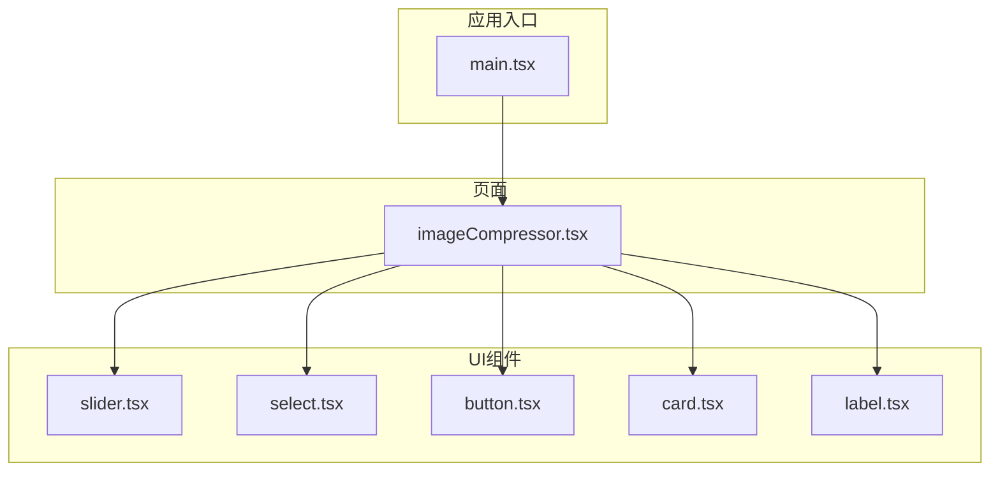
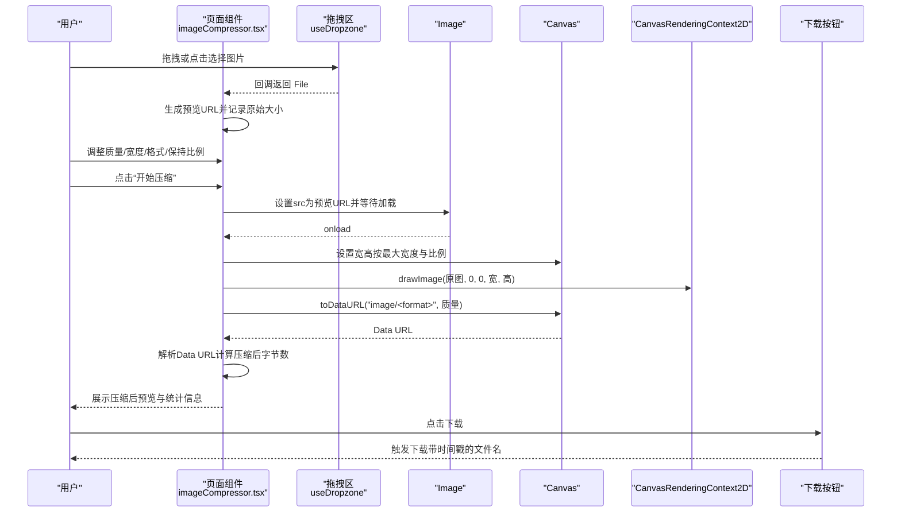
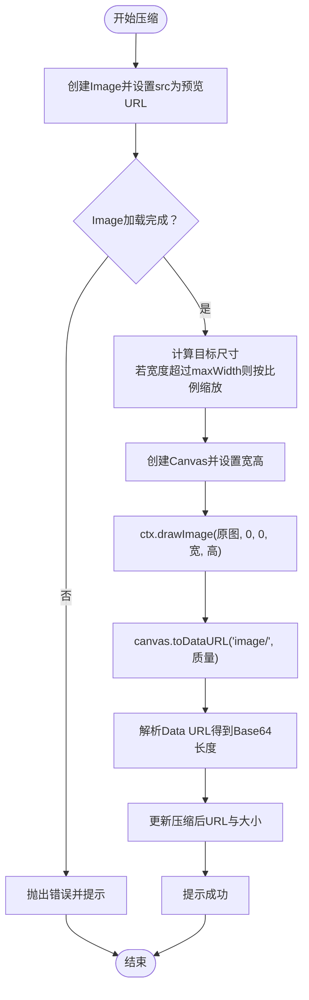
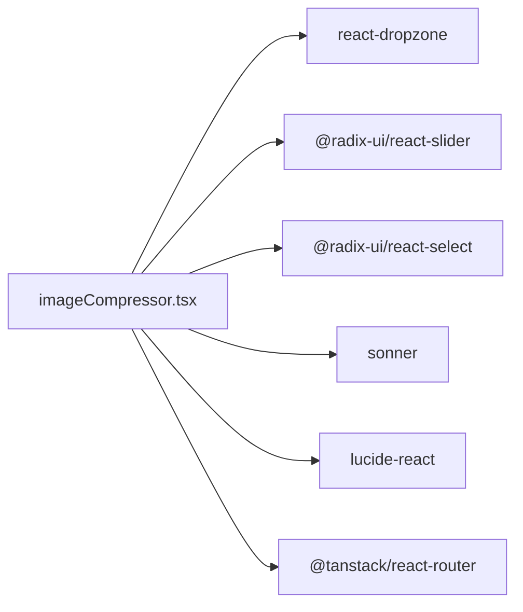

# 图片压缩

<cite>
**本文引用的文件**
- [imageCompressor.tsx](file://src/pages/imageCompressor.tsx)
- [slider.tsx](file://src/components/ui/slider.tsx)
- [select.tsx](file://src/components/ui/select.tsx)
- [button.tsx](file://src/components/ui/button.tsx)
- [card.tsx](file://src/components/ui/card.tsx)
- [label.tsx](file://src/components/ui/label.tsx)
- [main.tsx](file://src/main.tsx)
- [package.json](file://package.json)
- [README.md](file://README.md)
</cite>

## 目录
1. [简介](#简介)
2. [项目结构](#项目结构)
3. [核心组件](#核心组件)
4. [架构总览](#架构总览)
5. [详细组件分析](#详细组件分析)
6. [依赖分析](#依赖分析)
7. [性能考量](#性能考量)
8. [故障排查指南](#故障排查指南)
9. [结论](#结论)

## 简介
本技术文档围绕“图片压缩”功能展开，聚焦于基于 Canvas 的图像压缩实现。该功能通过 FileReader 加载图片，使用 CanvasRenderingContext2D.drawImage() 对图像进行缩放，再通过 toDataURL() 或 toBlob() 实现质量压缩，并支持 JPEG、PNG、WebP 等多种输出格式。文档还涵盖压缩参数配置（质量因子、最大宽度、是否保持宽高比）、压缩前后文件大小计算与展示、以及用户体验优化（进度反馈、压缩比例显示）等要点。本文以 imageCompressor.tsx 为核心，结合 UI 组件与路由配置，提供完整的技术说明与最佳实践建议。

## 项目结构
图片压缩页面位于 src/pages/imageCompressor.tsx，配套 UI 组件来自 src/components/ui。应用入口在 src/main.tsx 中注册全局提示组件 Toaster，用于统一展示成功与失败提示；依赖项在 package.json 中声明，包含 react-dropzone、sonner、@radix-ui/react-slider、@radix-ui/react-select 等。

图表来源
- [imageCompressor.tsx](file://src/pages/imageCompressor.tsx#L1-L335)
- [slider.tsx](file://src/components/ui/slider.tsx#L1-L62)
- [select.tsx](file://src/components/ui/select.tsx#L1-L184)
- [button.tsx](file://src/components/ui/button.tsx)
- [card.tsx](file://src/components/ui/card.tsx)
- [label.tsx](file://src/components/ui/label.tsx)
- [main.tsx](file://src/main.tsx#L1-L18)

章节来源
- [imageCompressor.tsx](file://src/pages/imageCompressor.tsx#L1-L335)
- [main.tsx](file://src/main.tsx#L1-L18)
- [package.json](file://package.json#L1-L89)

## 核心组件
- 页面容器与路由：使用 TanStack Router 的 Route 定义页面路由，页面组件负责状态管理与业务逻辑。
- 文件拖拽与预览：通过 react-dropzone 实现拖拽上传，使用 URL.createObjectURL 生成预览地址。
- 参数配置区：
  - 质量滑块：Slider 组件绑定压缩质量百分比。
  - 最大宽度滑块：Slider 组件绑定最大宽度像素值。
  - 输出格式选择：Select 组件切换 JPEG/PNG/WebP。
  - 是否保持宽高比：布尔选项，影响缩放后高度计算。
- 压缩流程：Image + Canvas + drawImage + toDataURL，生成压缩后的 Data URL 并计算压缩后大小。
- 下载按钮：根据当前格式与时间戳生成下载文件名并触发下载。
- 信息展示：原始大小、压缩后大小、压缩比例、节省空间。

章节来源
- [imageCompressor.tsx](file://src/pages/imageCompressor.tsx#L1-L335)
- [slider.tsx](file://src/components/ui/slider.tsx#L1-L62)
- [select.tsx](file://src/components/ui/select.tsx#L1-L184)

## 架构总览
下图展示了从用户操作到压缩完成的端到端流程，包括参数变更、文件加载、Canvas 缩放与导出、大小计算与下载等关键节点。

图表来源
- [imageCompressor.tsx](file://src/pages/imageCompressor.tsx#L37-L148)

## 详细组件分析

### 页面组件：imageCompressor.tsx
- 状态管理
  - 图片文件、预览URL、压缩后URL、是否压缩中、压缩参数、原始大小、压缩后大小。
- 事件处理
  - onDrop：接收单个图片文件，生成预览URL，记录原始大小，清空压缩结果。
  - compressImage：异步压缩流程，包含 Image 加载、Canvas 缩放、toDataURL 导出、大小计算与提示。
  - downloadCompressedImage：根据当前格式与时间戳生成下载文件名并触发下载。
- 参数配置
  - quality：压缩质量（0~1），由 Slider 控件绑定。
  - maxWidth：最大宽度（像素），由 Slider 控件绑定。
  - format：输出格式（"jpeg"|"png"|"webp"），由 Select 控件绑定。
  - maintainRatio：是否保持宽高比，影响高度计算。
- 数据计算
  - formatFileSize：将字节转换为人类可读的单位（Bytes/KB/MB/GB）。
  - parseFileSize：将人类可读字符串解析回字节，用于计算压缩比例与节省空间。
- UI 交互
  - 使用 Sonner Toaster 统一展示成功/失败提示。
  - 使用 Card/Label/Button/Select/Slider 等 UI 组件构建控制面板与预览区。
  - 压缩中按钮禁用并显示脉冲动画，提升反馈。

图表来源
- [imageCompressor.tsx](file://src/pages/imageCompressor.tsx#L86-L148)

章节来源
- [imageCompressor.tsx](file://src/pages/imageCompressor.tsx#L1-L335)

### UI 组件：Slider（质量/宽度）
- Slider 组件封装 Radix UI 的滑块，支持最小值、最大值、步长与当前值绑定。
- 在图片压缩页面中：
  - 质量滑块：value=[quality*100]，min=1，max=100，step=1。
  - 最大宽度滑块：value=[maxWidth]，min=100，max=3840，step=100。
- 交互行为：onValueChange 更新 compressionOptions 中对应字段。

章节来源
- [slider.tsx](file://src/components/ui/slider.tsx#L1-L62)
- [imageCompressor.tsx](file://src/pages/imageCompressor.tsx#L183-L211)

### UI 组件：Select（输出格式）
- Select 组件提供下拉选择，支持 "jpeg" | "png" | "webp" 三种格式。
- 在图片压缩页面中：
  - value 绑定 compressionOptions.format。
  - onValueChange 更新 compressionOptions.format。

章节来源
- [select.tsx](file://src/components/ui/select.tsx#L1-L184)
- [imageCompressor.tsx](file://src/pages/imageCompressor.tsx#L214-L231)

### UI 组件：Button、Card、Label
- Button：开始压缩按钮与下载按钮，分别触发压缩与下载逻辑。
- Card：页面容器，包含标题、返回首页按钮、左右两栏布局。
- Label：参数标签，配合 Slider/Select 展示当前值。

章节来源
- [button.tsx](file://src/components/ui/button.tsx)
- [card.tsx](file://src/components/ui/card.tsx)
- [label.tsx](file://src/components/ui/label.tsx)
- [imageCompressor.tsx](file://src/pages/imageCompressor.tsx#L150-L335)

### 应用入口与全局提示
- main.tsx 注册 Toaster，使页面内统一使用 Sonner 展示通知。
- 本页面通过 toast.success 与 toast.error 提示压缩结果。

章节来源
- [main.tsx](file://src/main.tsx#L1-L18)
- [imageCompressor.tsx](file://src/pages/imageCompressor.tsx#L126-L132)

## 依赖分析
- react-dropzone：实现拖拽上传，限定 accept 为 image/*，maxFiles=1。
- @radix-ui/react-slider：提供 Slider 组件，用于质量与宽度调节。
- @radix-ui/react-select：提供 Select 组件，用于格式选择。
- sonner：全局 Toaster，统一提示展示。
- lucide-react：图标库，用于上传、下载、返回等图标。
- @tanstack/react-router：页面路由，Route 定义页面路径与组件。

图表来源
- [package.json](file://package.json#L18-L59)
- [imageCompressor.tsx](file://src/pages/imageCompressor.tsx#L1-L30)

章节来源
- [package.json](file://package.json#L18-L59)
- [README.md](file://README.md#L33-L45)

## 性能考量
- Canvas 缩放与 drawImage：在内存中进行像素级绘制，适合中小尺寸图片；对超大图可能导致内存压力与长时间阻塞主线程。
- toDataURL vs toBlob：本实现使用 toDataURL 获取 Data URL，便于直接预览与计算大小；如需进一步降低内存占用与网络传输，可改用 toBlob 并结合 Blob 的二进制处理。
- 质量因子与格式选择：
  - JPEG：适合照片类图片，质量越低体积越小，但失真越大。
  - PNG：无损压缩，适合图标、透明背景等；体积通常大于 JPEG。
  - WebP：现代浏览器支持良好，通常在同等视觉质量下体积更小，推荐优先使用。
- 最大宽度与保持比例：合理设置 maxWidth 与 maintainRatio 可显著减少像素数量，从而降低后续压缩成本。
- 用户体验优化：
  - 压缩中禁用按钮并显示脉冲动画，避免重复触发。
  - 提供压缩比例与节省空间，直观反馈压缩效果。
  - 预览区左右分栏，便于对比原图与压缩后效果。

[本节为通用性能建议，不直接分析具体文件]

## 故障排查指南
- 图片无法加载或预览为空
  - 检查 onDrop 是否正确接收文件并生成预览URL。
  - 确认 accept 类型包含 .png/.jpg/.jpeg/.webp。
- 压缩失败提示
  - compressImage 内部捕获异常并通过 toast.error 提示，检查浏览器控制台错误信息。
- 下载失败
  - downloadCompressedImage 仅在存在 compressedUrl 时可用，确认压缩流程已成功生成 Data URL。
- 大图卡顿
  - 调整 maxWidth 与质量，避免一次性处理超大分辨率图片。
- 格式不支持
  - 确认 Select 中选择了受支持的格式（jpeg/png/webp），并确保浏览器支持相应 MIME 类型。

章节来源
- [imageCompressor.tsx](file://src/pages/imageCompressor.tsx#L37-L148)

## 结论
本功能以 React + Canvas 为核心，结合 UI 组件与路由，实现了简洁高效的图片压缩体验。通过参数化配置（质量、最大宽度、格式、保持比例），用户可在视觉质量与文件大小之间取得平衡。配合预览与统计信息，用户能够直观评估压缩效果。未来可考虑引入 toBlob 与 Web Worker 以进一步优化内存占用与性能，并扩展批量处理能力。