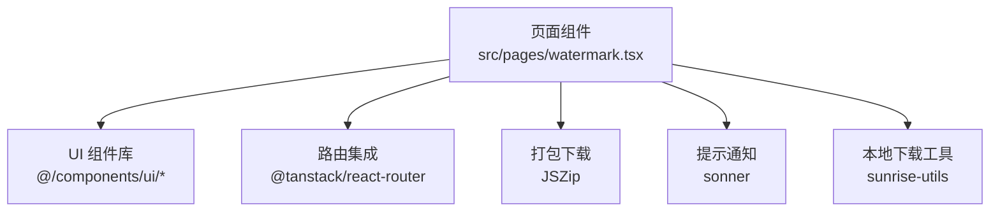
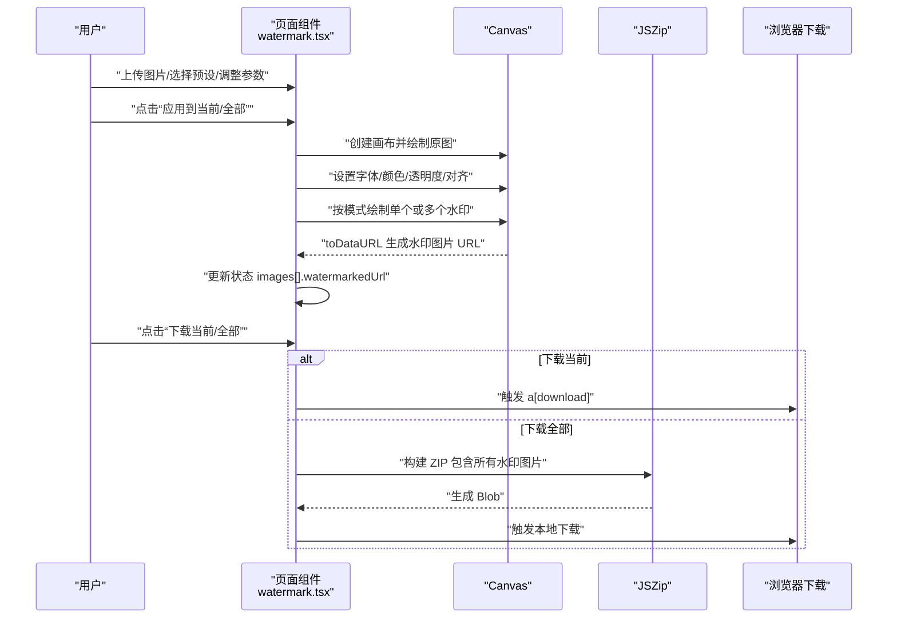
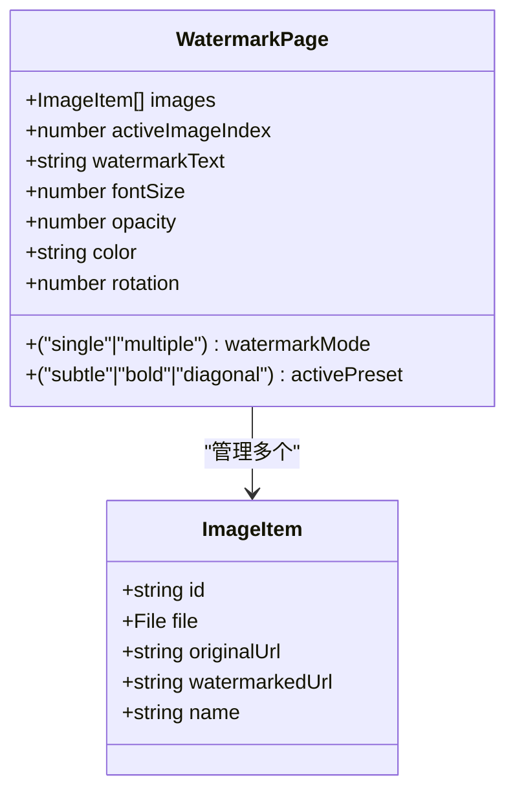
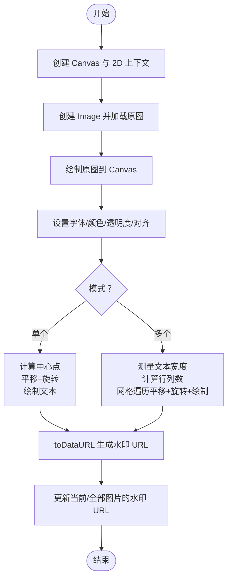
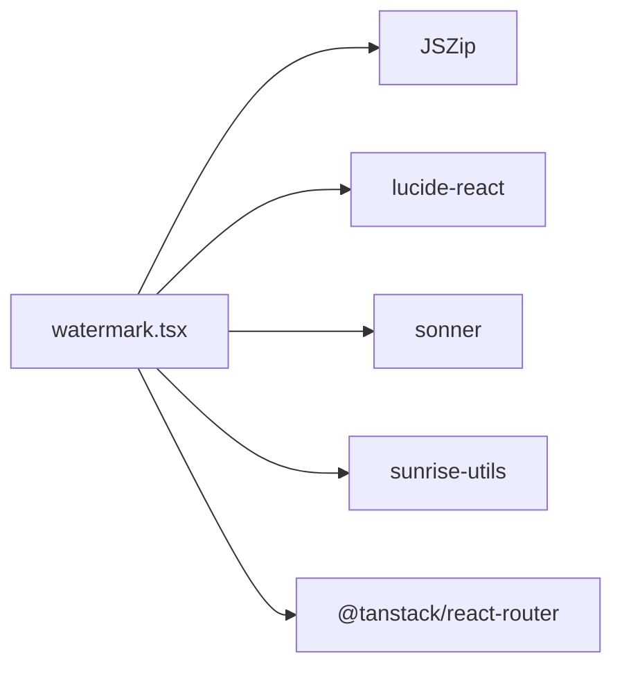

# 图片水印

<cite>
**本文引用的文件**
- [watermark.tsx](file://src/pages/watermark.tsx)
- [package.json](file://package.json)
</cite>

## 目录
1. [简介](#简介)
2. [项目结构](#项目结构)
3. [核心组件](#核心组件)
4. [架构总览](#架构总览)
5. [组件详解](#组件详解)
6. [依赖关系分析](#依赖关系分析)
7. [性能考量](#性能考量)
8. [故障排查指南](#故障排查指南)
9. [结论](#结论)
10. [附录](#附录)

## 简介
本技术文档围绕“图片水印”功能展开，系统讲解在 Canvas 上叠加文字水印的实现机制。重点包括：
- 将原始图片绘制到 Canvas，并使用 fillText() 添加文字水印
- 支持两种模式：单个居中水印与多个倾斜平铺水印
- 水印样式配置：文字内容、字体大小、颜色、透明度、旋转角度
- 预设模板应用（柔和/醒目/对角）
- 多图批量处理、缩略图导航与大图预览
- 结合 watermark.tsx 的状态管理（多图状态、活动索引）、水印绘制逻辑、下载打包（JSZip）及资源释放（revokeObjectURL）

## 项目结构
- 功能入口：src/pages/watermark.tsx
- 依赖声明：package.json 中包含 JSZip、lucide-react、sonner、sunrise-utils 等

图表来源
- [watermark.tsx](file://src/pages/watermark.tsx#L1-L14)
- [package.json](file://package.json#L18-L59)

章节来源
- [watermark.tsx](file://src/pages/watermark.tsx#L1-L14)
- [package.json](file://package.json#L18-L59)

## 核心组件
- 页面容器与布局：卡片式布局，左侧为设置区，右侧为主预览区
- 状态管理：
  - images：图片数组，包含 id、File、原始 URL、水印 URL、文件名
  - activeImageIndex：当前活动图片索引
  - 水印样式：watermarkText、fontSize、opacity、color、rotation、watermarkMode、activePreset
- 关键方法：
  - addWatermarkToCurrent：为当前图片添加水印
  - addWatermarkToAll：批量为所有图片添加水印
  - downloadCurrent/downloadAll：下载当前或全部水印图片
  - applyPreset：应用预设模板
  - 缩略图导航与大图预览：点击缩略图切换活动图片；点击原图/水印图弹出大图模态
  - 资源清理：组件卸载时回收所有对象 URL

章节来源
- [watermark.tsx](file://src/pages/watermark.tsx#L16-L33)
- [watermark.tsx](file://src/pages/watermark.tsx#L103-L191)
- [watermark.tsx](file://src/pages/watermark.tsx#L193-L288)
- [watermark.tsx](file://src/pages/watermark.tsx#L290-L362)
- [watermark.tsx](file://src/pages/watermark.tsx#L364-L392)
- [watermark.tsx](file://src/pages/watermark.tsx#L394-L404)
- [watermark.tsx](file://src/pages/watermark.tsx#L406-L441)

## 架构总览
整体流程：用户上传图片 → 选择水印样式与模式 → 在 Canvas 上绘制原图与水印 → 生成水印图片 URL → 预览与下载。

图表来源
- [watermark.tsx](file://src/pages/watermark.tsx#L103-L191)
- [watermark.tsx](file://src/pages/watermark.tsx#L193-L288)
- [watermark.tsx](file://src/pages/watermark.tsx#L290-L362)

## 组件详解

### 状态与数据模型
- ImageItem 字段：id、file、originalUrl、watermarkedUrl、name
- 多图状态 images 与活动索引 activeImageIndex
- 水印样式状态：watermarkText、fontSize、opacity、color、rotation、watermarkMode、activePreset

图表来源
- [watermark.tsx](file://src/pages/watermark.tsx#L16-L33)

章节来源
- [watermark.tsx](file://src/pages/watermark.tsx#L16-L33)

### Canvas 绘制逻辑（单个/多个水印）
- 原图绘制：创建 Image 并在 onload 后绘制到 Canvas
- 文字样式：font、fillStyle（含透明度）、textAlign、textBaseline
- 角度转换：将度数转为弧度
- 单个水印：以画布中心为锚点，平移+旋转后在原点绘制
- 多个水印：计算对角线长度，估算行列数，按网格平铺绘制

图表来源
- [watermark.tsx](file://src/pages/watermark.tsx#L103-L191)
- [watermark.tsx](file://src/pages/watermark.tsx#L193-L288)

章节来源
- [watermark.tsx](file://src/pages/watermark.tsx#L103-L191)
- [watermark.tsx](file://src/pages/watermark.tsx#L193-L288)

### 预设模板应用
- 提供三种预设：subtle、bold、diagonal
- 应用预设时同步更新 activePreset，并给出提示

章节来源
- [watermark.tsx](file://src/pages/watermark.tsx#L364-L392)

### 多图批量处理
- 逐张读取原图，重复绘制流程，异步推进进度
- 使用 toDataURL 生成每张水印图片 URL，并更新 images 状态

章节来源
- [watermark.tsx](file://src/pages/watermark.tsx#L193-L288)

### 缩略图导航与大图预览
- 缩略图列表：点击切换 activeImageIndex；带水印标记
- 大图预览：点击原图或水印图弹出模态，展示全尺寸图片，点击任意位置关闭

章节来源
- [watermark.tsx](file://src/pages/watermark.tsx#L646-L788)

### 下载与打包
- 单图下载：构造 a[download] 触发下载
- 全部下载：使用 JSZip 创建 ZIP，将每张水印图的 Blob 写入，生成 ZIP 并下载
- 使用 sunrise-utils 的 downloadLocalFile 进行本地下载

章节来源
- [watermark.tsx](file://src/pages/watermark.tsx#L290-L362)
- [package.json](file://package.json#L45-L55)

### 资源释放与内存管理
- 上传图片时使用 URL.createObjectURL 生成临时 URL
- 删除图片或清空列表时调用 URL.revokeObjectURL 释放内存
- 组件卸载时统一回收所有对象 URL

章节来源
- [watermark.tsx](file://src/pages/watermark.tsx#L48-L73)
- [watermark.tsx](file://src/pages/watermark.tsx#L90-L101)
- [watermark.tsx](file://src/pages/watermark.tsx#L394-L404)

## 依赖关系分析
- JSZip：用于将多张水印图片打包为 ZIP 下载
- lucide-react：图标库
- sonner：轻量提示通知
- sunrise-utils：提供本地下载工具函数
- @tanstack/react-router：页面路由与导航

图表来源
- [watermark.tsx](file://src/pages/watermark.tsx#L1-L14)
- [package.json](file://package.json#L18-L59)

章节来源
- [watermark.tsx](file://src/pages/watermark.tsx#L1-L14)
- [package.json](file://package.json#L18-L59)

## 性能考量
- Canvas 绘制：在主线程进行，建议控制图片尺寸与水印密度，避免超大分辨率导致卡顿
- 批量处理：逐张处理，使用异步推进，避免阻塞 UI；可考虑分批并发与进度反馈
- 文本测量：measureText 会触发回流，尽量减少重复测量；必要时缓存文本宽度
- 下载打包：ZIP 生成在内存中进行，图片较多时注意内存占用；可考虑分批打包
- 资源释放：及时 revokeObjectURL，防止内存泄漏

## 故障排查指南
- 无法创建画布上下文
  - 现象：报错“无法创建画布上下文”
  - 排查：确认运行环境支持 Canvas 2D；检查浏览器兼容性
  - 位置参考：[watermark.tsx](file://src/pages/watermark.tsx#L113-L117)
- 添加水印失败
  - 现象：toast 提示失败
  - 排查：检查原图是否加载成功、Canvas 是否创建、toDataURL 是否可用；查看控制台错误
  - 位置参考：[watermark.tsx](file://src/pages/watermark.tsx#L113-L191)
- 下载失败
  - 现象：打包失败或下载失败
  - 排查：确认水印 URL 可访问、fetch 成功、JSZip 正常工作；检查网络与权限
  - 位置参考：[watermark.tsx](file://src/pages/watermark.tsx#L307-L362)
- 内存泄漏
  - 现象：长时间使用后内存占用上升
  - 排查：确保每次删除图片、清空列表、组件卸载时都调用了 revokeObjectURL
  - 位置参考：[watermark.tsx](file://src/pages/watermark.tsx#L65-L101), [watermark.tsx](file://src/pages/watermark.tsx#L394-L404)

章节来源
- [watermark.tsx](file://src/pages/watermark.tsx#L113-L191)
- [watermark.tsx](file://src/pages/watermark.tsx#L307-L362)
- [watermark.tsx](file://src/pages/watermark.tsx#L65-L101)
- [watermark.tsx](file://src/pages/watermark.tsx#L394-L404)

## 结论
本功能通过 Canvas 2D API 实现文字水印叠加，支持单个居中与多个倾斜平铺两种模式，并提供预设模板、批量处理、缩略图导航与大图预览。配合 JSZip 实现多图打包下载，同时在状态管理与资源释放方面具备良好的内存管理实践。建议在高分辨率与大批量场景下关注性能与内存占用，合理优化绘制与打包策略。

## 附录
- 水印样式配置项
  - 文字内容：watermarkText
  - 字体大小：fontSize
  - 透明度：opacity
  - 颜色：color
  - 旋转角度：rotation
  - 模式：watermarkMode（single/multiple）
  - 预设：activePreset（subtle/bold/diagonal）

章节来源
- [watermark.tsx](file://src/pages/watermark.tsx#L27-L33)
- [watermark.tsx](file://src/pages/watermark.tsx#L364-L392)