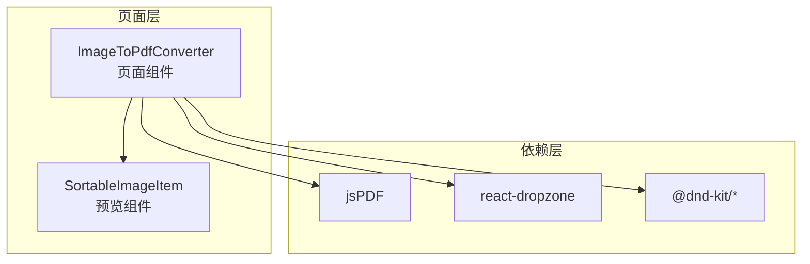
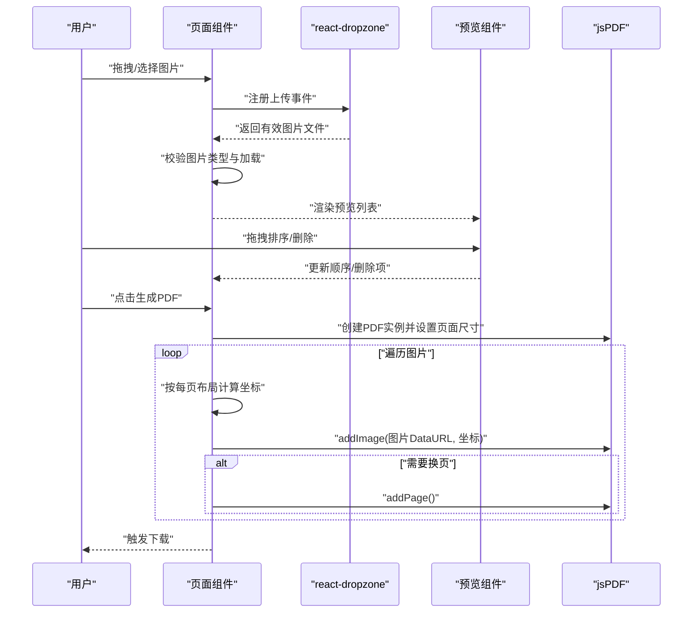
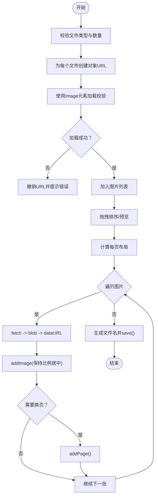
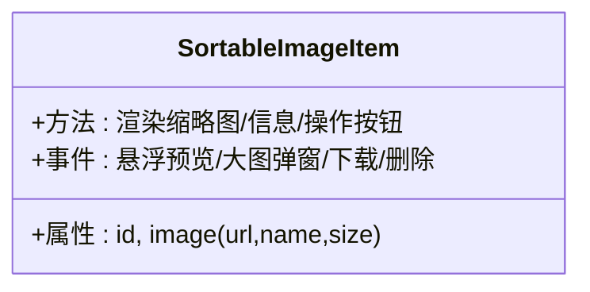
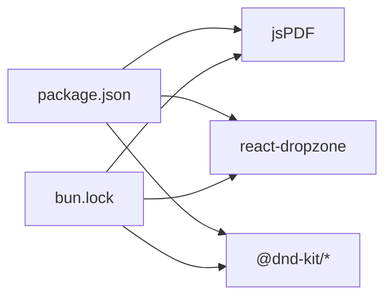

# 图片转PDF

<cite>
**本文引用的文件**
- [src/pages/imageToPdf.tsx](file://src/pages/imageToPdf.tsx)
- [src/components/sortable-item.tsx](file://src/components/sortable-item.tsx)
- [package.json](file://package.json)
- [bun.lock](file://bun.lock)
</cite>

## 目录
1. [简介](#简介)
2. [项目结构](#项目结构)
3. [核心组件](#核心组件)
4. [架构总览](#架构总览)
5. [详细组件分析](#详细组件分析)
6. [依赖关系分析](#依赖关系分析)
7. [性能与内存优化](#性能与内存优化)
8. [故障排查指南](#故障排查指南)
9. [结论](#结论)
10. [附录](#附录)

## 简介
本技术文档围绕“图片转PDF”功能展开，基于现有实现，系统性说明从文件上传、图片预览、拖拽排序、布局计算到PDF生成与下载的完整流程。重点解释如何通过 jsPDF 将浏览器端的图片资源绘制到 PDF 页面，如何进行图片尺寸适配与页面布局设计，以及如何处理多页PDF生成、图片质量控制与内存优化等关键问题。同时，结合代码路径定位，帮助读者快速定位实现细节与扩展点。

## 项目结构
该功能位于页面级组件中，配合可拖拽排序的图片预览组件共同完成用户交互与数据流转：
- 页面组件负责：文件上传、图片校验与预览、拖拽排序、布局计算、PDF生成与下载。
- 预览组件负责：图片缩略图展示、悬浮预览、大图查看与下载、删除操作。
- 依赖管理：通过包管理器安装 jsPDF 与 react-dropzone 等依赖。

图表来源
- [src/pages/imageToPdf.tsx](file://src/pages/imageToPdf.tsx#L1-L626)
- [src/components/sortable-item.tsx](file://src/components/sortable-item.tsx#L1-L221)

章节来源
- [src/pages/imageToPdf.tsx](file://src/pages/imageToPdf.tsx#L1-L626)
- [src/components/sortable-item.tsx](file://src/components/sortable-item.tsx#L1-L221)

## 核心组件
- 页面组件：负责文件上传、图片校验、预览列表、拖拽排序、布局计算、PDF生成与下载。
- 预览组件：负责缩略图渲染、悬浮预览、大图查看、下载与删除。
- 依赖库：jsPDF（PDF生成）、react-dropzone（拖拽上传）、@dnd-kit/*（拖拽排序）。

章节来源
- [src/pages/imageToPdf.tsx](file://src/pages/imageToPdf.tsx#L1-L626)
- [src/components/sortable-item.tsx](file://src/components/sortable-item.tsx#L1-L221)

## 架构总览
整体流程从用户上传图片开始，经过预览与排序，再到布局计算与PDF生成，最终触发浏览器下载。页面组件承担协调者角色，预览组件提供交互入口，依赖库提供能力支撑。

图表来源
- [src/pages/imageToPdf.tsx](file://src/pages/imageToPdf.tsx#L1-L626)

## 详细组件分析

### 页面组件：ImageToPdfConverter
职责与流程要点：
- 文件上传与校验
  - 使用 react-dropzone 接收图片文件，限定类型与数量上限。
  - 对每个文件创建对象URL并用 Image 元素验证是否可加载，避免无效图片进入列表。
- 图片预览与排序
  - 通过 @dnd-kit 实现拖拽排序，支持拖拽手柄、拖拽覆盖层与视觉反馈。
  - 列表项包含序号、缩略图、文件名与大小、删除按钮等。
- 布局计算
  - 根据每页图片数量（1-6）计算布局，支持单图全屏、2-6张不同网格布局。
  - 计算可用区域与间距，生成每张图片的绘制坐标与尺寸。
- PDF生成与下载
  - 使用 jsPDF 创建A4纵向PDF，按布局逐页绘制图片。
  - 通过 fetch + Blob + FileReader 保证图片数据正确加载为DataURL。
  - 绘制前根据图片宽高比与布局宽高比进行等比缩放与居中定位。
  - 自动换页：当当前索引与每页图片数整除为0时新增一页。
  - 生成文件名包含时间戳，调用 save 触发浏览器下载。

关键实现路径
- 文件上传与校验：[onDrop](file://src/pages/imageToPdf.tsx#L73-L112)
- 拖拽排序与预览：[handleDragStart/handleDragEnd](file://src/pages/imageToPdf.tsx#L125-L143)
- 布局计算：[calculateImageLayout](file://src/pages/imageToPdf.tsx#L146-L245)
- PDF生成与下载：[generatePdf](file://src/pages/imageToPdf.tsx#L248-L345)

图表来源
- [src/pages/imageToPdf.tsx](file://src/pages/imageToPdf.tsx#L73-L345)

章节来源
- [src/pages/imageToPdf.tsx](file://src/pages/imageToPdf.tsx#L1-L626)

### 预览组件：SortableImageItem
职责与交互要点：
- 渲染缩略图、文件名、文件大小。
- 鼠标悬停显示悬浮预览框，支持自动避障（右侧/底部空间不足时调整位置）。
- 点击缩略图打开大图弹窗，支持下载原图与关闭。
- 提供删除按钮，回调通知父组件移除该项。

关键实现路径
- 悬浮预览与大图弹窗：[悬浮预览与大图弹窗逻辑](file://src/components/sortable-item.tsx#L90-L216)
- 删除回调：[onDelete](file://src/components/sortable-item.tsx#L138-L146)

图表来源
- [src/components/sortable-item.tsx](file://src/components/sortable-item.tsx#L1-L221)

章节来源
- [src/components/sortable-item.tsx](file://src/components/sortable-item.tsx#L1-L221)

### 布局算法与尺寸适配
- 布局策略
  - 支持1-6张图片/页，提供单图全屏、2-6张网格布局方案。
  - 通过计算可用宽度与高度、边距与间距，生成每张图片的绘制矩形。
- 尺寸适配
  - 保持图片纵横比，优先以布局宽高比为基准进行等比缩放。
  - 缩放后按中心对齐，确保图片在布局区域内居中显示。
- 多页生成
  - 当当前索引与每页图片数整除为0时，调用 addPage 新增一页。
  - 通过循环遍历图片列表，按布局顺序绘制，自然形成多页PDF。

章节来源
- [src/pages/imageToPdf.tsx](file://src/pages/imageToPdf.tsx#L146-L245)
- [src/pages/imageToPdf.tsx](file://src/pages/imageToPdf.tsx#L248-L345)

### 文件下载机制
- 生成文件名包含时间戳，避免重复覆盖。
- 调用 jsPDF 的 save 方法触发浏览器下载。
- 该实现采用客户端生成与下载，无需服务端参与。

章节来源
- [src/pages/imageToPdf.tsx](file://src/pages/imageToPdf.tsx#L336-L345)

## 依赖关系分析
- jsPDF：用于创建PDF、设置页面尺寸、绘制图片与换页。
- react-dropzone：提供拖拽上传能力，限制文件类型与数量。
- @dnd-kit：提供拖拽排序与拖拽覆盖层，改善用户体验。
- 包管理与版本
  - 项目中声明了 jsPDF 与 pdf-lib 等依赖；当前页面实现使用的是 jsPDF 进行PDF生成。
  - pdf-lib 在其他页面（如 PDF 合并）中使用，本页面未直接引入。

图表来源
- [package.json](file://package.json#L18-L59)
- [bun.lock](file://bun.lock#L1047-L1047)

章节来源
- [package.json](file://package.json#L18-L59)
- [bun.lock](file://bun.lock#L1047-L1047)

## 性能与内存优化
- 内存与URL管理
  - 在组件卸载时统一撤销所有对象URL，避免内存泄漏。
  - 仅在卸载时清理，减少不必要的URL撤销操作。
- 数据加载与缓存
  - 使用 fetch + Blob + FileReader 将图片数据转换为DataURL，确保跨域与本地URL场景下的兼容性。
- 布局与绘制
  - 布局计算在生成前完成，避免运行时重复计算。
  - 绘制时按比例缩放与居中，减少额外裁剪逻辑。
- 并发与容错
  - 图片校验采用 Promise.all 并行处理，提升上传体验。
  - 每张图片绘制过程独立try/catch，出现异常不影响其他图片生成。

章节来源
- [src/pages/imageToPdf.tsx](file://src/pages/imageToPdf.tsx#L65-L71)
- [src/pages/imageToPdf.tsx](file://src/pages/imageToPdf.tsx#L73-L112)
- [src/pages/imageToPdf.tsx](file://src/pages/imageToPdf.tsx#L248-L345)

## 故障排查指南
- 上传非图片文件
  - 现象：提示文件类型无效。
  - 处理：过滤非image/*类型文件，不加入列表。
  - 参考路径：[onDrop类型校验](file://src/pages/imageToPdf.tsx#L73-L80)
- 图片无法加载
  - 现象：提示无法识别为图片，撤销对象URL。
  - 处理：检查文件是否损坏或格式不受支持。
  - 参考路径：[onload/onerror分支](file://src/pages/imageToPdf.tsx#L83-L102)
- 生成PDF失败
  - 现象：控制台报错，toast提示失败。
  - 处理：检查网络环境、图片URL有效性与浏览器安全策略。
  - 参考路径：[generatePdf异常捕获](file://src/pages/imageToPdf.tsx#L336-L345)
- 拖拽排序异常
  - 现象：排序后顺序不正确或视觉反馈异常。
  - 处理：确认@dnd-kit传感器与策略配置正确。
  - 参考路径：[拖拽传感器与策略](file://src/pages/imageToPdf.tsx#L56-L64)
- 预览悬浮框遮挡
  - 现象：悬浮预览超出视窗边界。
  - 处理：组件内部已做避障逻辑，若仍异常，检查窗口尺寸与样式。
  - 参考路径：[悬浮预览位置计算](file://src/components/sortable-item.tsx#L73-L96)

章节来源
- [src/pages/imageToPdf.tsx](file://src/pages/imageToPdf.tsx#L56-L64)
- [src/pages/imageToPdf.tsx](file://src/pages/imageToPdf.tsx#L73-L112)
- [src/pages/imageToPdf.tsx](file://src/pages/imageToPdf.tsx#L248-L345)
- [src/components/sortable-item.tsx](file://src/components/sortable-item.tsx#L73-L96)

## 结论
本实现以 jsPDF 为核心，结合 react-dropzone 与 @dnd-kit，构建了完整的“图片转PDF”流程：从上传校验、预览排序，到布局计算与PDF绘制，最后触发下载。通过对象URL生命周期管理与并发校验，兼顾了易用性与性能。对于多页PDF生成、图片比例适配与内存优化均有明确策略。若需进一步增强（如支持pdf-lib、批量压缩、服务端渲染等），可在现有基础上扩展。

## 附录
- 代码路径定位
  - 页面组件：[src/pages/imageToPdf.tsx](file://src/pages/imageToPdf.tsx#L1-L626)
  - 预览组件：[src/components/sortable-item.tsx](file://src/components/sortable-item.tsx#L1-L221)
  - 依赖声明：[package.json](file://package.json#L18-L59)
  - 依赖锁定：[bun.lock](file://bun.lock#L1047-L1047)