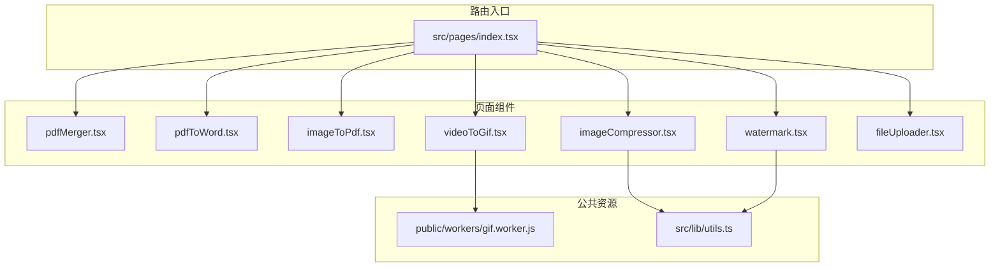
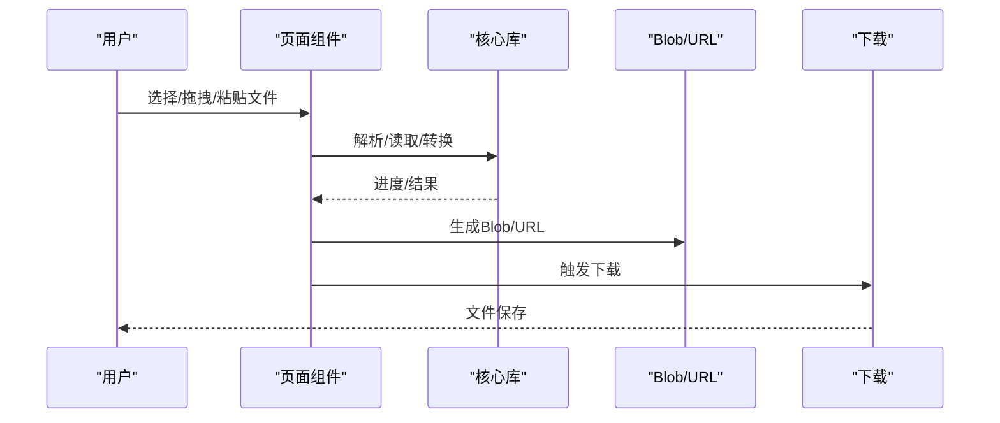
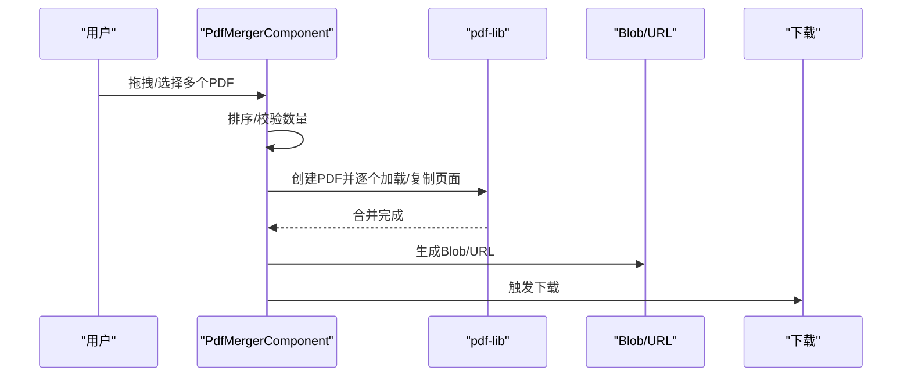
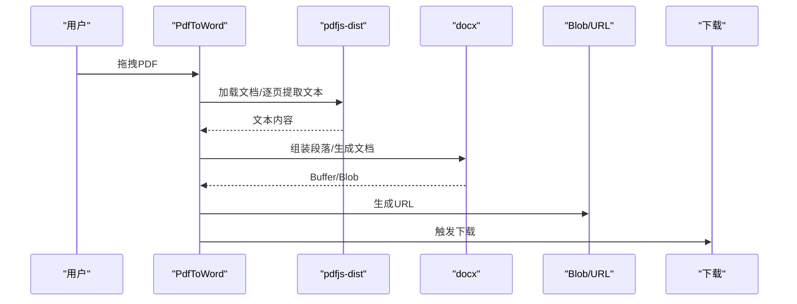
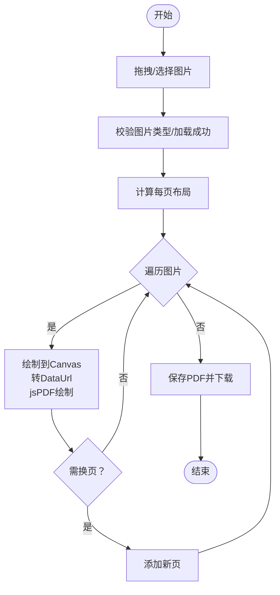
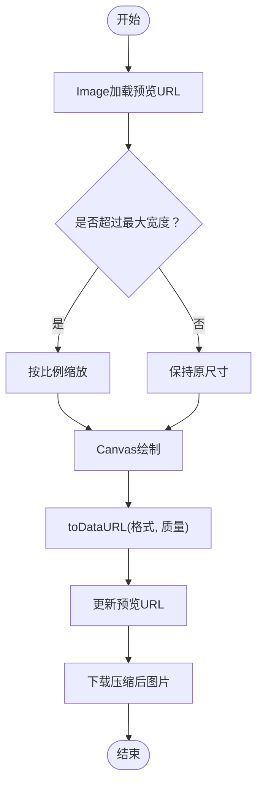
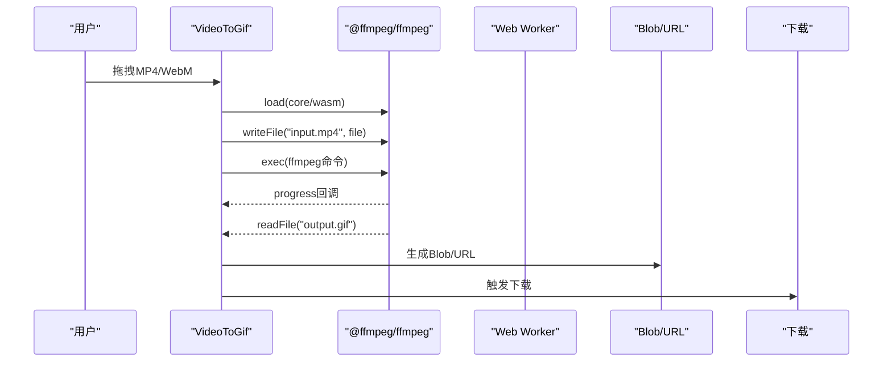
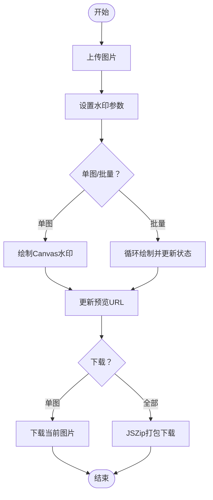
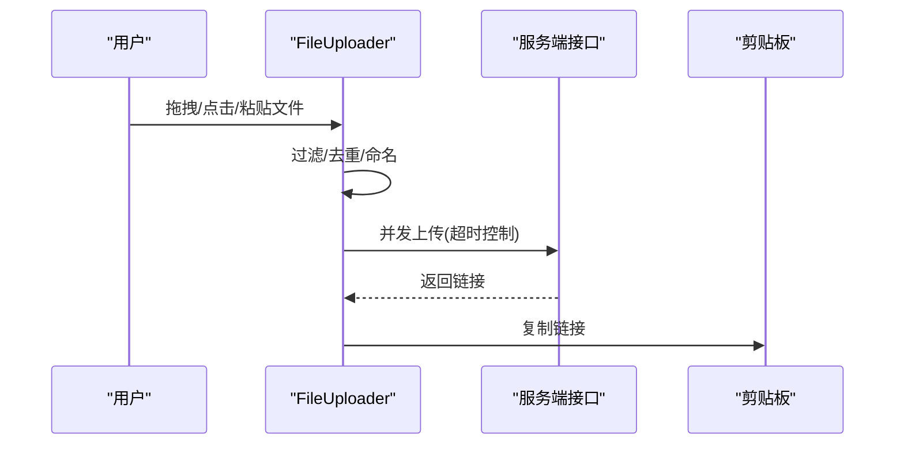
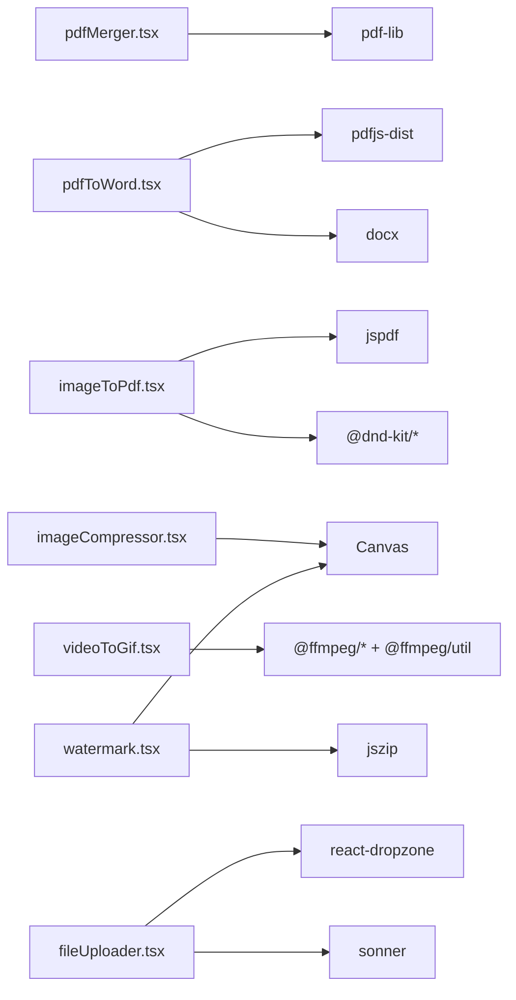

# 文件处理工具

<cite>
**本文引用的文件**
- [src/pages/pdfMerger.tsx](file://src/pages/pdfMerger.tsx)
- [src/pages/pdfToWord.tsx](file://src/pages/pdfToWord.tsx)
- [src/pages/imageToPdf.tsx](file://src/pages/imageToPdf.tsx)
- [src/pages/imageCompressor.tsx](file://src/pages/imageCompressor.tsx)
- [src/pages/videoToGif.tsx](file://src/pages/videoToGif.tsx)
- [src/pages/watermark.tsx](file://src/pages/watermark.tsx)
- [src/pages/fileUploader.tsx](file://src/pages/fileUploader.tsx)
- [public/workers/gif.worker.js](file://public/workers/gif.worker.js)
- [src/pages/index.tsx](file://src/pages/index.tsx)
- [src/lib/utils.ts](file://src/lib/utils.ts)
- [package.json](file://package.json)
- [src/pages/jsonToTs.lazy.tsx](file://src/pages/jsonToTs.lazy.tsx)
- [src/pages/signature.lazy.tsx](file://src/pages/signature.lazy.tsx)
</cite>

## 目录
1. [简介](#简介)
2. [项目结构](#项目结构)
3. [核心组件](#核心组件)
4. [架构总览](#架构总览)
5. [详细组件分析](#详细组件分析)
6. [依赖关系分析](#依赖关系分析)
7. [性能考量](#性能考量)
8. [故障排查指南](#故障排查指南)
9. [结论](#结论)
10. [附录](#附录)

## 简介
本文件聚焦于“文件处理工具”模块，覆盖以下核心能力：
- PDF合并：基于浏览器端pdf-lib，支持多文件拖拽、排序、加密忽略与合并下载。
- PDF转Word：基于pdfjs-dist提取文本，再用docx生成docx文档，支持下载。
- 图片转PDF：基于jsPDF，支持多图布局、拖拽排序、按页数布局与比例适配。
- 图片压缩：基于Canvas与Image，支持质量、最大宽度、格式切换与实时预览。
- 视频转GIF：基于@ffmpeg/ffmpeg与Web Worker（public/workers/gif.worker.js），支持截取片段、帧率与缩放参数。
- 图片水印：基于Canvas绘制文字水印，支持单图/批量、预设与打包下载。

同时，文档解释浏览器端Blob生成与下载、状态管理、文件上传处理（fileUploader.tsx）、懒加载（.lazy.tsx）对性能的影响，以及大文件处理的内存管理与错误处理策略，并提供扩展新工具的最佳实践。

## 项目结构
文件处理工具位于src/pages目录下，采用按功能模块划分的页面组件组织方式；公共依赖通过package.json统一管理；部分工具使用Web Worker或浏览器原生API进行高性能处理。

图表来源
- [src/pages/index.tsx](file://src/pages/index.tsx#L70-L120)
- [src/pages/pdfMerger.tsx](file://src/pages/pdfMerger.tsx#L1-L183)
- [src/pages/pdfToWord.tsx](file://src/pages/pdfToWord.tsx#L1-L267)
- [src/pages/imageToPdf.tsx](file://src/pages/imageToPdf.tsx#L1-L626)
- [src/pages/imageCompressor.tsx](file://src/pages/imageCompressor.tsx#L1-L335)
- [src/pages/videoToGif.tsx](file://src/pages/videoToGif.tsx#L1-L375)
- [src/pages/watermark.tsx](file://src/pages/watermark.tsx#L1-L791)
- [src/pages/fileUploader.tsx](file://src/pages/fileUploader.tsx#L1-L272)
- [public/workers/gif.worker.js](file://public/workers/gif.worker.js#L1-L32)

章节来源
- [src/pages/index.tsx](file://src/pages/index.tsx#L70-L120)

## 核心组件
- PDF合并：多文件拖拽、排序、逐页复制与合并、Blob下载。
- PDF转Word：文本提取与docx生成、Blob下载。
- 图片转PDF：拖拽排序、布局算法、Canvas绘制与jsPDF保存。
- 图片压缩：Canvas绘制、toDataURL、预览与下载。
- 视频转GIF：FFmpeg加载、命令执行、进度回调、Blob生成与下载。
- 图片水印：Canvas绘制、多图批量处理、JSZip打包下载。
- 文件上传：拖拽/粘贴上传、超时控制、批量上传与链接复制。

章节来源
- [src/pages/pdfMerger.tsx](file://src/pages/pdfMerger.tsx#L14-L82)
- [src/pages/pdfToWord.tsx](file://src/pages/pdfToWord.tsx#L15-L142)
- [src/pages/imageToPdf.tsx](file://src/pages/imageToPdf.tsx#L48-L345)
- [src/pages/imageCompressor.tsx](file://src/pages/imageCompressor.tsx#L22-L149)
- [src/pages/videoToGif.tsx](file://src/pages/videoToGif.tsx#L17-L147)
- [src/pages/watermark.tsx](file://src/pages/watermark.tsx#L24-L191)
- [src/pages/fileUploader.tsx](file://src/pages/fileUploader.tsx#L14-L84)

## 架构总览
浏览器端处理链路概览：
- 输入层：Dropzone/粘贴/选择文件
- 处理层：pdf-lib/docx/jsPDF/html2canvas/@ffmpeg/Canvas
- 输出层：Blob生成、URL对象、自动下载
- 交互层：状态管理、进度条、提示与错误反馈

图表来源
- [src/pages/pdfMerger.tsx](file://src/pages/pdfMerger.tsx#L44-L82)
- [src/pages/pdfToWord.tsx](file://src/pages/pdfToWord.tsx#L47-L142)
- [src/pages/imageToPdf.tsx](file://src/pages/imageToPdf.tsx#L248-L345)
- [src/pages/imageCompressor.tsx](file://src/pages/imageCompressor.tsx#L86-L149)
- [src/pages/videoToGif.tsx](file://src/pages/videoToGif.tsx#L102-L147)
- [src/pages/watermark.tsx](file://src/pages/watermark.tsx#L103-L191)

## 详细组件分析

### PDF合并（pdf-lib）
- 设计目标：在浏览器内合并多个PDF，支持拖拽排序与一键下载。
- 用户交互：拖拽区、列表、上下移动、清空、合并下载。
- 关键实现要点：
  - 使用pdf-lib创建新PDF，逐个读取源文件并复制页面至合并PDF。
  - 通过ignoreEncryption选项兼容加密PDF。
  - 生成Blob并通过URL.createObjectURL触发下载。
- 错误处理：捕获异常并提示，finally中重置处理状态。

图表来源
- [src/pages/pdfMerger.tsx](file://src/pages/pdfMerger.tsx#L19-L82)

章节来源
- [src/pages/pdfMerger.tsx](file://src/pages/pdfMerger.tsx#L19-L82)

### PDF转Word（pdfjs-dist + docx）
- 设计目标：将PDF文本提取并生成docx文档，便于后续编辑。
- 用户交互：拖拽选择PDF、开始转换、下载docx。
- 关键实现要点：
  - 使用pdfjs-dist获取文档页数与文本内容。
  - 将每页文本封装为Paragraph/TextRun，最终生成Document并转为Buffer/Blob。
  - 通过URL.createObjectURL与a标签下载。
- 错误处理：转换失败时提示并记录日志。

图表来源
- [src/pages/pdfToWord.tsx](file://src/pages/pdfToWord.tsx#L30-L142)

章节来源
- [src/pages/pdfToWord.tsx](file://src/pages/pdfToWord.tsx#L30-L142)

### 图片转PDF（jsPDF + 拖拽排序）
- 设计目标：将多张图片按指定布局生成PDF，支持拖拽排序与预览。
- 用户交互：拖拽上传、设置每页图片数量、生成PDF并下载。
- 关键实现要点：
  - 使用@drag-and-drop库实现拖拽排序，避免重复渲染URL。
  - 计算布局（1/2/3/4/5/6张），保持图片纵横比并居中绘制。
  - 通过fetch + FileReader确保图片数据正确加载，再绘制到Canvas并转为DataUrl，最后由jsPDF绘制。
- 内存管理：组件卸载时统一回收ObjectURL；生成前对图片数量做上限控制。

图表来源
- [src/pages/imageToPdf.tsx](file://src/pages/imageToPdf.tsx#L114-L345)

章节来源
- [src/pages/imageToPdf.tsx](file://src/pages/imageToPdf.tsx#L114-L345)

### 图片压缩（Canvas + Image）
- 设计目标：在浏览器内对图片进行质量、尺寸与格式的压缩与预览。
- 用户交互：拖拽选择图片、滑块调节质量/宽度、选择格式、预览与下载。
- 关键实现要点：
  - 使用Image加载预览URL，Canvas绘制到目标尺寸，toDataURL生成压缩后的DataUrl。
  - 通过Base64长度估算压缩后大小，计算节省空间与压缩比例。
  - 下载时根据所选格式命名文件。

图表来源
- [src/pages/imageCompressor.tsx](file://src/pages/imageCompressor.tsx#L86-L149)

章节来源
- [src/pages/imageCompressor.tsx](file://src/pages/imageCompressor.tsx#L86-L149)

### 视频转GIF（@ffmpeg/ffmpeg + Web Worker）
- 设计目标：在浏览器内将视频片段转换为GIF，支持帧率、缩放与进度显示。
- 用户交互：拖拽选择视频、设置起止时间、帧率与缩放宽度、生成GIF并下载。
- 关键实现要点：
  - 初始化FFmpeg，动态加载core与wasm，写入输入文件到虚拟文件系统。
  - 执行ffmpeg命令（包含fps、scale、palette生成与使用），读取输出文件生成Blob并下载。
  - 使用Web Worker（public/workers/gif.worker.js）进行gif.js的worker脚本加载与帧处理（该Worker用于gif.js场景，本项目主要使用@ffmpeg/ffmpeg）。
  - 进度通过ffmpeg.on("progress")回调更新UI。
- 性能与内存：组件卸载时回收ObjectURL；生成前对视频尺寸与范围做合理限制。

图表来源
- [src/pages/videoToGif.tsx](file://src/pages/videoToGif.tsx#L49-L147)
- [public/workers/gif.worker.js](file://public/workers/gif.worker.js#L1-L32)

章节来源
- [src/pages/videoToGif.tsx](file://src/pages/videoToGif.tsx#L49-L147)
- [public/workers/gif.worker.js](file://public/workers/gif.worker.js#L1-L32)

### 图片水印（Canvas + JSZip）
- 设计目标：为单张或多张图片添加文字水印，支持预设与批量下载。
- 用户交互：上传图片、设置水印参数（文字、字号、透明度、颜色、旋转）、单图/批量应用、预览与下载。
- 关键实现要点：
  - 使用Canvas绘制文字，支持单个中心水印与覆盖式多水印。
  - 通过URL.createObjectURL生成预览，应用后更新状态。
  - 批量处理时逐张生成水印URL并更新状态；支持JSZip打包下载。
- 内存管理：组件卸载时统一回收原始与水印URL。

图表来源
- [src/pages/watermark.tsx](file://src/pages/watermark.tsx#L103-L191)
- [src/pages/watermark.tsx](file://src/pages/watermark.tsx#L193-L288)

章节来源
- [src/pages/watermark.tsx](file://src/pages/watermark.tsx#L103-L191)
- [src/pages/watermark.tsx](file://src/pages/watermark.tsx#L193-L288)

### 文件上传（fileUploader.tsx）
- 设计目标：提供通用文件上传入口，支持拖拽、点击与粘贴上传，生成可分享链接并复制。
- 用户交互：拖拽/点击选择文件、粘贴上传、开始上传、复制链接。
- 关键实现要点：
  - 使用FormData上传至服务端接口，支持超时控制（AbortController）。
  - 仅对未有URL的文件发起上传，Promise.all并发处理并更新状态。
  - 粘贴事件监听，自动重命名并加入队列。

图表来源
- [src/pages/fileUploader.tsx](file://src/pages/fileUploader.tsx#L14-L84)
- [src/pages/fileUploader.tsx](file://src/pages/fileUploader.tsx#L86-L175)

章节来源
- [src/pages/fileUploader.tsx](file://src/pages/fileUploader.tsx#L14-L84)
- [src/pages/fileUploader.tsx](file://src/pages/fileUploader.tsx#L86-L175)

## 依赖关系分析
- pdf-lib：用于PDF合并与页面复制。
- pdfjs-dist：用于PDF文本提取。
- docx：用于生成Word文档。
- jspdf：用于图片转PDF。
- html2canvas：用于截图（本仓库未直接使用，但存在依赖）。
- @ffmpeg/ffmpeg + @ffmpeg/util：用于视频转GIF。
- jszip：用于图片水印批量打包下载。
- react-dropzone：用于拖拽上传。
- sonner：用于Toast提示。
- @dnd-kit：用于图片排序。

图表来源
- [package.json](file://package.json#L18-L59)
- [src/pages/pdfMerger.tsx](file://src/pages/pdfMerger.tsx#L1-L20)
- [src/pages/pdfToWord.tsx](file://src/pages/pdfToWord.tsx#L1-L10)
- [src/pages/imageToPdf.tsx](file://src/pages/imageToPdf.tsx#L1-L26)
- [src/pages/imageCompressor.tsx](file://src/pages/imageCompressor.tsx#L1-L17)
- [src/pages/videoToGif.tsx](file://src/pages/videoToGif.tsx#L1-L12)
- [src/pages/watermark.tsx](file://src/pages/watermark.tsx#L1-L12)
- [src/pages/fileUploader.tsx](file://src/pages/fileUploader.tsx#L1-L12)

章节来源
- [package.json](file://package.json#L18-L59)

## 性能考量
- 懒加载（.lazy.tsx）：通过createLazyFileRoute按需加载路由组件，减少首屏体积与初次渲染压力。例如jsonToTs.lazy.tsx与signature.lazy.tsx展示了懒加载的典型模式。
- 大文件处理：
  - 使用URL.createObjectURL缓存预览，组件卸载时统一回收，避免内存泄漏。
  - 对图片转PDF与图片压缩，限制每页图片数量与最大宽度，降低Canvas绘制与Blob体积。
  - 视频转GIF时，合理设置帧率与缩放宽度，避免过高的CPU/GPU占用。
- 并发与超时：文件上传使用Promise.all并发处理，并设置超时控制，提升吞吐同时保证稳定性。
- 进度反馈：视频转GIF通过ffmpeg进度回调实时更新UI，改善用户体验。

章节来源
- [src/pages/jsonToTs.lazy.tsx](file://src/pages/jsonToTs.lazy.tsx#L1-L10)
- [src/pages/signature.lazy.tsx](file://src/pages/signature.lazy.tsx#L1-L10)
- [src/pages/imageToPdf.tsx](file://src/pages/imageToPdf.tsx#L65-L71)
- [src/pages/videoToGif.tsx](file://src/pages/videoToGif.tsx#L49-L67)
- [src/pages/fileUploader.tsx](file://src/pages/fileUploader.tsx#L20-L40)

## 故障排查指南
- PDF合并失败：
  - 检查文件数量与类型；确认ignoreEncryption选项是否生效；查看错误提示并重试。
- PDF转Word失败：
  - 确认PDF文本可提取；检查生成的段落数量与格式；查看错误日志。
- 图片转PDF空白或比例异常：
  - 确认图片加载成功；检查布局计算与Canvas绘制逻辑；验证每页图片数量。
- 图片压缩无响应：
  - 检查Image.onload/onerror回调；确认Canvas上下文可用；核对toDataURL参数。
- 视频转GIF卡住：
  - 确认FFmpeg已成功load；检查命令参数（fps/scale）；查看进度回调是否触发。
- 图片水印未显示：
  - 确认Canvas上下文与字体加载；检查透明度与颜色十六进制拼接；核对旋转角度。
- 文件上传超时/失败：
  - 查看超时控制与错误分支；确认服务端返回码与消息；检查剪贴板复制权限。

章节来源
- [src/pages/pdfMerger.tsx](file://src/pages/pdfMerger.tsx#L44-L82)
- [src/pages/pdfToWord.tsx](file://src/pages/pdfToWord.tsx#L118-L142)
- [src/pages/imageToPdf.tsx](file://src/pages/imageToPdf.tsx#L248-L345)
- [src/pages/imageCompressor.tsx](file://src/pages/imageCompressor.tsx#L86-L149)
- [src/pages/videoToGif.tsx](file://src/pages/videoToGif.tsx#L102-L147)
- [src/pages/watermark.tsx](file://src/pages/watermark.tsx#L103-L191)
- [src/pages/fileUploader.tsx](file://src/pages/fileUploader.tsx#L20-L40)

## 结论
本模块以浏览器端为核心，结合多种库实现多样化的文件处理能力。通过合理的状态管理、进度反馈与内存回收策略，能够在不依赖后端的情况下提供流畅的用户体验。建议在扩展新工具时遵循现有模式：明确输入/处理/输出链路、做好错误处理与进度反馈、注意大文件的内存与性能问题，并利用懒加载优化首屏体验。

## 附录
- 最佳实践指南（扩展新工具）：
  - 明确功能边界与用户路径，设计清晰的拖拽/上传/预览/下载流程。
  - 使用useState/useEffect管理状态与副作用，组件卸载时统一回收URL与取消订阅。
  - 对大文件与高耗时操作，提供进度反馈与节流/限流策略。
  - 使用Toast统一提示，区分成功/警告/错误三类信息。
  - 优先采用浏览器原生API与轻量级库，必要时引入Web Worker或懒加载。
  - 为每个页面组件提供最小可运行示例与错误回退逻辑，便于维护与测试。