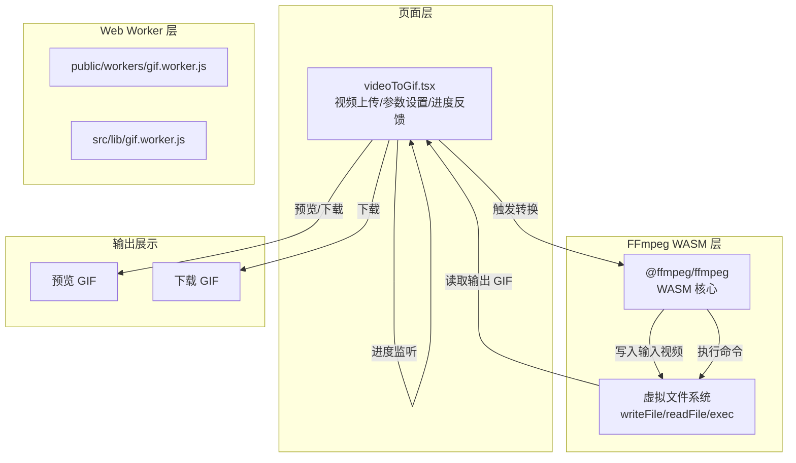
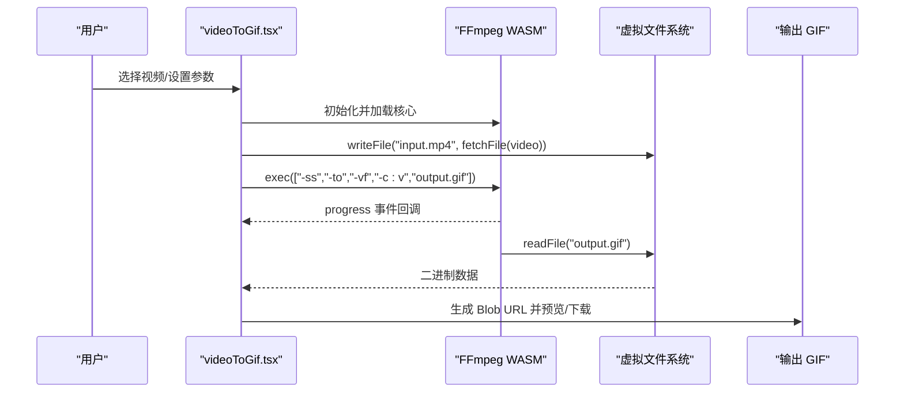
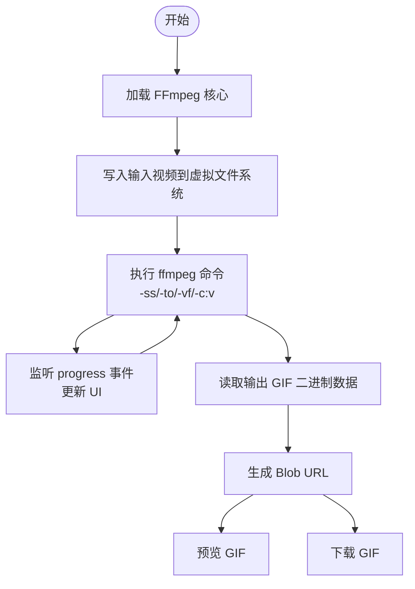
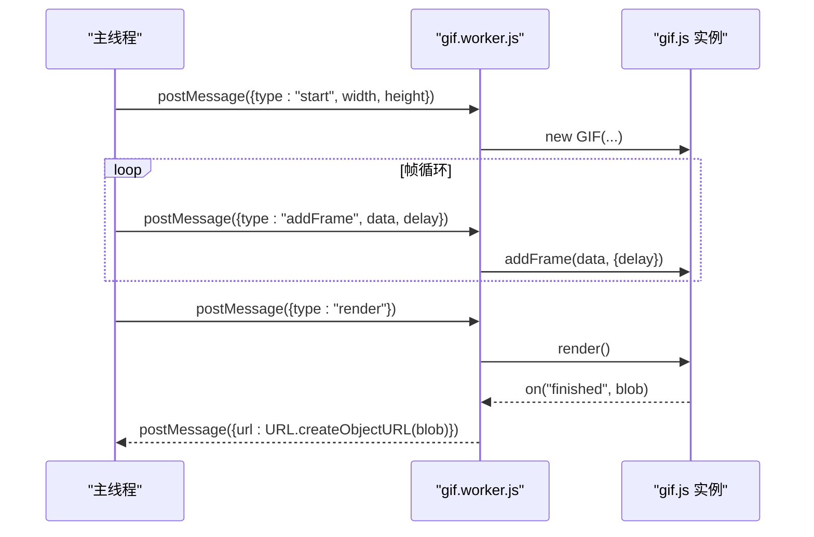
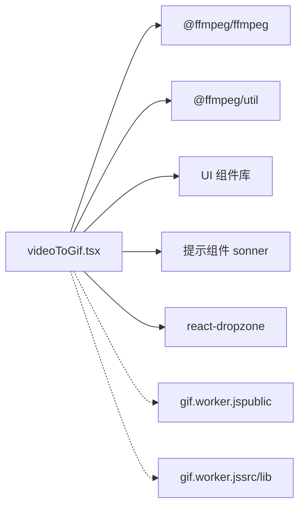

# 视频转GIF

<cite>
**本文引用的文件**
- [videoToGif.tsx](file://src/pages/videoToGif.tsx)
- [gif.worker.js（public）](file://public/workers/gif.worker.js)
- [gif.worker.js（src/lib）](file://src/lib/gif.worker.js)
- [utils.ts](file://src/lib/utils.ts)
- [package.json](file://package.json)
- [README.md](file://README.md)
</cite>

## 目录
1. [简介](#简介)
2. [项目结构](#项目结构)
3. [核心组件](#核心组件)
4. [架构总览](#架构总览)
5. [详细组件分析](#详细组件分析)
6. [依赖分析](#依赖分析)
7. [性能考虑](#性能考虑)
8. [故障排查指南](#故障排查指南)
9. [结论](#结论)
10. [附录](#附录)

## 简介
本技术文档围绕“视频转GIF”功能展开，聚焦于浏览器端视频处理架构，重点解析以下方面：
- 基于 @ffmpeg/ffmpeg 与 Web Worker 的双通道处理思路
- videoToGif.tsx 中如何使用 FFmpeg WASM 在客户端执行视频剪辑与格式转换，包括 fetchFile 加载视频文件、FFmpeg.writeFile 写入虚拟文件系统、exec 执行 ffmpeg 命令（-ss、-to、-vf fps/scale/palette 等参数）以及 readFile 读取输出 GIF 二进制数据的完整流程
- 如何通过 FFmpeg 的 progress 事件实现处理进度反馈
- public/workers/gif.worker.js 与 src/lib/gif.worker.js 中基于 gif.js 的 Web Worker 实现机制，包括 onmessage 消息处理、GIF 实例创建、addFrame 帧添加与 render 渲染完成后的 Blob URL 生成
- 性能优化、错误处理、大视频内存管理及用户体验改进的最佳实践

## 项目结构
该功能位于 src/pages/videoToGif.tsx，配套的 Web Worker 位于 public/workers/gif.worker.js 与 src/lib/gif.worker.js。二者均基于 gif.js 的 Web Worker 实现 GIF 帧合成与渲染。

图表来源
- [videoToGif.tsx](file://src/pages/videoToGif.tsx#L49-L147)
- [gif.worker.js（public）](file://public/workers/gif.worker.js#L1-L32)
- [gif.worker.js（src/lib）](file://src/lib/gif.worker.js#L1-L30)

章节来源
- [videoToGif.tsx](file://src/pages/videoToGif.tsx#L1-L375)
- [README.md](file://README.md#L33-L75)

## 核心组件
- 视频上传与参数控制：拖拽上传、时长截取区间、帧率与缩放宽高参数
- FFmpeg WASM 初始化与命令执行：加载核心、写入输入、执行转换、读取输出
- 进度反馈：监听 FFmpeg progress 事件，实时更新 UI
- 输出展示：将二进制数据封装为 Blob 并生成 URL 用于预览与下载

章节来源
- [videoToGif.tsx](file://src/pages/videoToGif.tsx#L17-L147)

## 架构总览
整体处理链路分为两条主线：
- FFmpeg WASM 主线：在浏览器端执行视频解码、滤镜处理（fps/scale/palette）、编码为 GIF
- Web Worker 辅助线：若未来扩展为逐帧合成（非本仓库现有实现），可通过 gif.js Web Worker 进行帧合成与渲染

图表来源
- [videoToGif.tsx](file://src/pages/videoToGif.tsx#L49-L147)

## 详细组件分析

### FFmpeg WASM 处理流程（videoToGif.tsx）
- 初始化与加载
  - 通过 toBlobURL 加载 @ffmpeg/core 的 JS/WASM 资源，调用 ffmpeg.load 完成 WASM 核心初始化
- 输入与参数
  - 使用 fetchFile 将 File 对象转换为二进制数据，再通过 writeFile 写入虚拟文件系统
  - 参数包括：起始时间 -ss、结束时间 -to、滤镜 -vf（fps、scale、palette 生成与使用）、输出格式 -c:v gif
- 执行与进度
  - 调用 exec 执行 ffmpeg 命令；订阅 progress 事件以更新 UI 百分比
- 输出与展示
  - readFile 读取输出 GIF 的二进制数据，封装为 Blob 并生成 URL，用于 img 预览与 a 下载

图表来源
- [videoToGif.tsx](file://src/pages/videoToGif.tsx#L49-L147)

章节来源
- [videoToGif.tsx](file://src/pages/videoToGif.tsx#L49-L147)

### Web Worker GIF 合成机制（public/workers/gif.worker.js 与 src/lib/gif.worker.js）
- 消息协议
  - start：创建 GIF 实例，指定 workers 数量、quality、width、height、workerScript
  - addFrame：向 GIF 实例添加帧，携带延迟参数
  - render：启动渲染，完成后通过 finished 事件回传 Blob URL
- 生命周期
  - finished 回调中生成 Blob URL 并 postMessage 回主线程，随后清空实例以释放内存

图表来源
- [gif.worker.js（public）](file://public/workers/gif.worker.js#L1-L32)
- [gif.worker.js（src/lib）](file://src/lib/gif.worker.js#L1-L30)

章节来源
- [gif.worker.js（public）](file://public/workers/gif.worker.js#L1-L32)
- [gif.worker.js（src/lib）](file://src/lib/gif.worker.js#L1-L30)

### UI 与交互（videoToGif.tsx）
- 视频上传：使用 react-dropzone 接受视频文件，校验类型并生成预览 URL
- 参数调节：滑块控制截取区间，输入框控制帧率与缩放宽
- 进度条：根据 FFmpeg progress 更新百分比
- 预览与下载：将输出 GIF 的 Blob URL 绑定到 img 与 a 标签

章节来源
- [videoToGif.tsx](file://src/pages/videoToGif.tsx#L170-L375)

## 依赖分析
- @ffmpeg/ffmpeg、@ffmpeg/core、@ffmpeg/util：提供 FFmpeg WASM 核心与工具函数（toBlobURL、fetchFile）
- gif.js Web Worker：用于 GIF 帧合成与渲染（public/workers 与 src/lib 两份同构实现）
- UI 与工具：react-dropzone、sonner、Tailwind CSS、shadcn/ui 组件库

图表来源
- [package.json](file://package.json#L18-L59)
- [videoToGif.tsx](file://src/pages/videoToGif.tsx#L1-L30)

章节来源
- [package.json](file://package.json#L18-L59)

## 性能考虑
- FFmpeg 命令优化
  - 使用 -ss/-to 精确截取，减少处理时长
  - 合理设置 fps 与 scale，避免过高分辨率导致内存与 CPU 压力过大
  - palette 生成与使用（palettegen/paletteuse）可降低色彩带宽，提高压缩效率
- 内存管理
  - 生成 Blob URL 后及时 revokeObjectURL，避免内存泄漏
  - 处理完成后清理 ffmpeg 实例引用，必要时重建实例
- 进度反馈
  - 利用 progress 事件驱动 UI 更新，避免阻塞主线程
- 大文件策略
  - 分段处理或降低分辨率/帧率
  - 限制最大时长与尺寸，防止浏览器卡顿
- Web Worker 选择
  - public/workers 与 src/lib 的 gif.worker.js 功能一致，建议统一使用一份并在构建时放置到合适位置，避免重复加载

章节来源
- [videoToGif.tsx](file://src/pages/videoToGif.tsx#L49-L147)
- [gif.worker.js（public）](file://public/workers/gif.worker.js#L1-L32)
- [gif.worker.js（src/lib）](file://src/lib/gif.worker.js#L1-L30)

## 故障排查指南
- FFmpeg 未加载成功
  - 确认 toBlobURL 的 coreURL/wasmURL 路径可用，网络可达
  - 检查浏览器对 WASM 的支持与跨域策略
- 视频文件无法写入
  - 确认 fetchFile 返回的数据有效，且 MIME 类型为 video/*
  - 检查 writeFile 的文件名与虚拟路径是否正确
- 命令执行失败
  - 校验 -ss/-to 范围合法，-vf 参数语法正确
  - 确认输出路径与格式匹配（gif）
- 进度不更新
  - 确认订阅了 progress 事件并正确更新状态
- 输出为空或无法预览
  - 检查 readFile 是否返回二进制数据
  - 确认 Blob 构造与 URL 生成无误
- Web Worker 无法合成 GIF
  - 确认 workerScript 路径正确，start/addFrame/render 消息顺序正确
  - 检查 finished 回调是否收到 Blob 并生成 URL

章节来源
- [videoToGif.tsx](file://src/pages/videoToGif.tsx#L101-L147)
- [gif.worker.js（public）](file://public/workers/gif.worker.js#L1-L32)
- [gif.worker.js（src/lib）](file://src/lib/gif.worker.js#L1-L30)

## 结论
本功能通过 @ffmpeg/ffmpeg 的 WASM 实现浏览器端视频转 GIF，具备良好的交互性与可扩展性。videoToGif.tsx 完整展示了从文件上传、参数配置、FFmpeg 命令执行到输出展示的全流程；public/workers 与 src/lib 的 gif.worker.js 则提供了基于 gif.js 的 Web Worker 合成能力。结合合理的性能优化与错误处理策略，可在保证用户体验的同时稳定处理各类视频文件。

## 附录
- 术语
  - WASM：WebAssembly，浏览器中的高性能二进制指令格式
  - 虚拟文件系统：FFmpeg 在内存中的文件系统抽象
  - Blob URL：浏览器生成的临时资源地址，便于预览与下载
- 最佳实践清单
  - 控制截取时长与分辨率，优先使用 -ss/-to
  - 合理设置 fps 与 scale，平衡画质与性能
  - 使用 progress 事件提供即时反馈
  - 及时清理 Blob URL 与实例引用
  - 统一管理 Web Worker 资源，避免重复加载