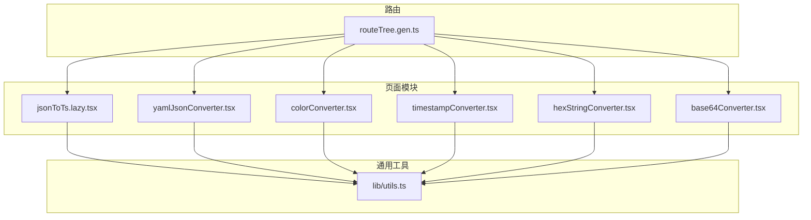
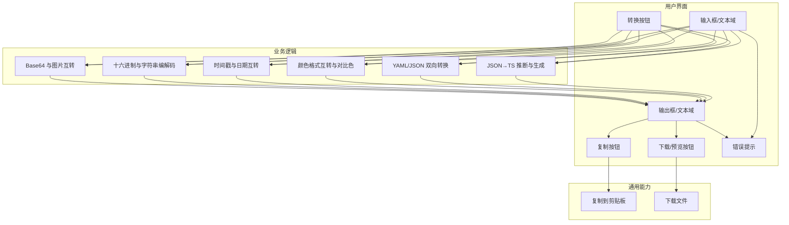
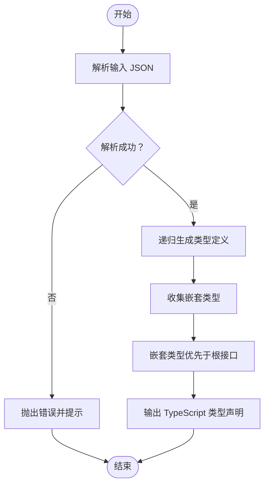
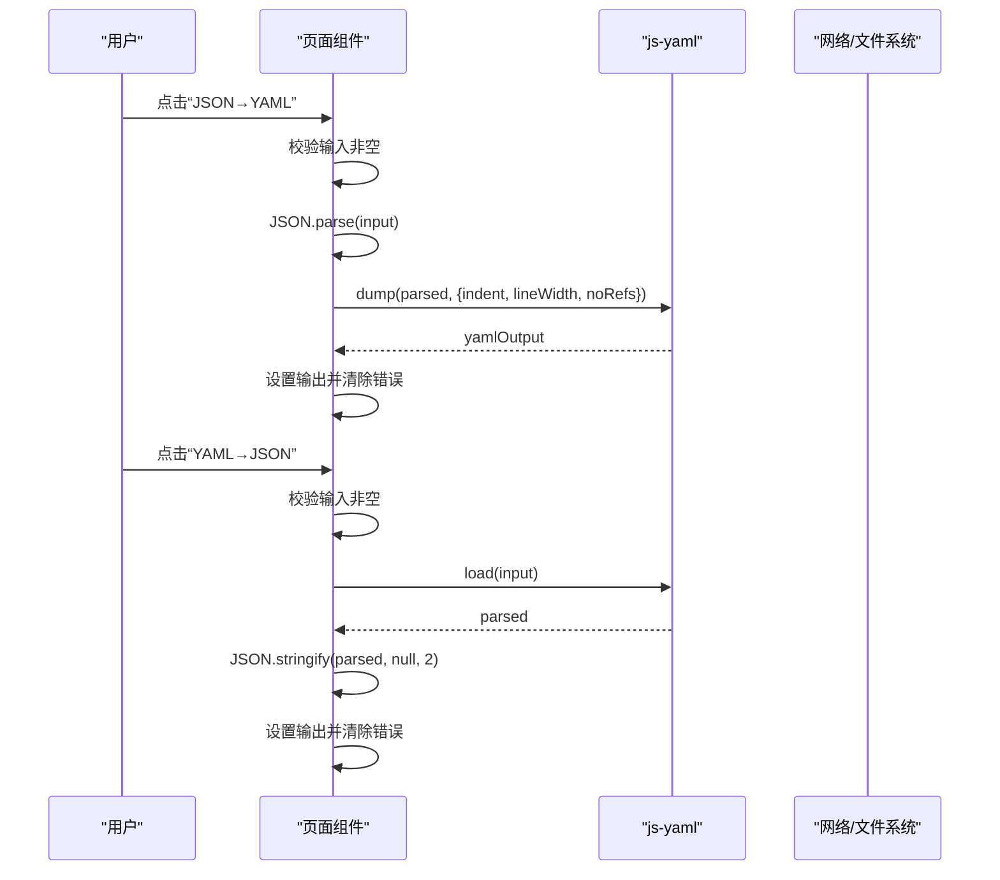
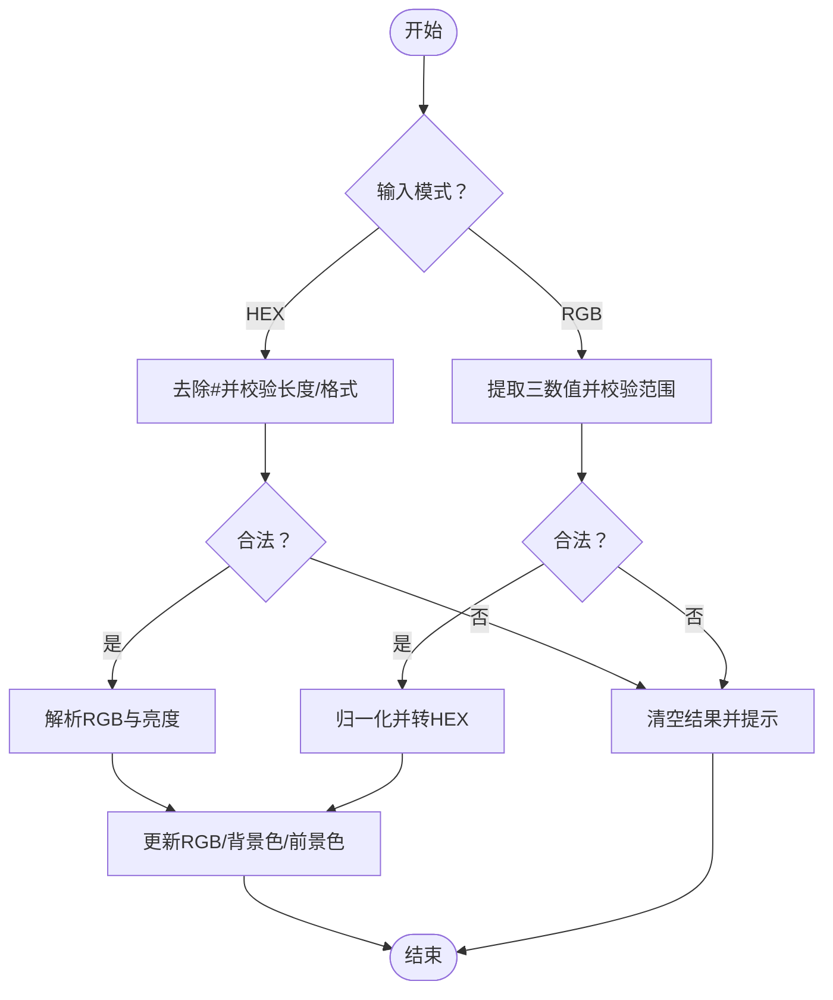
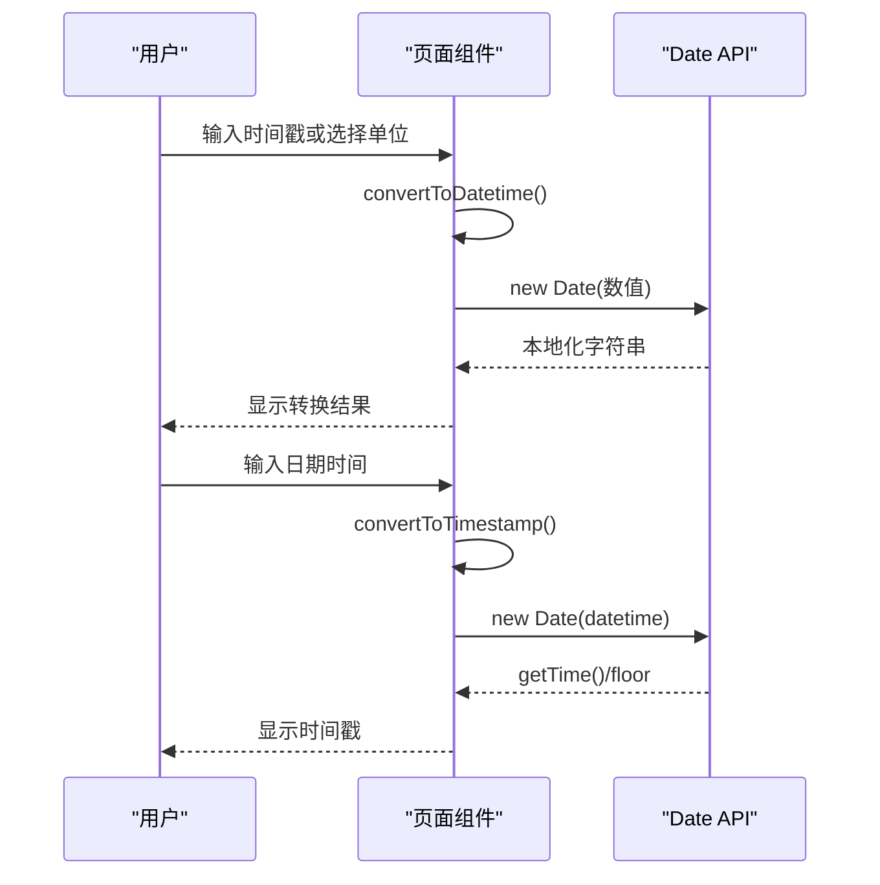
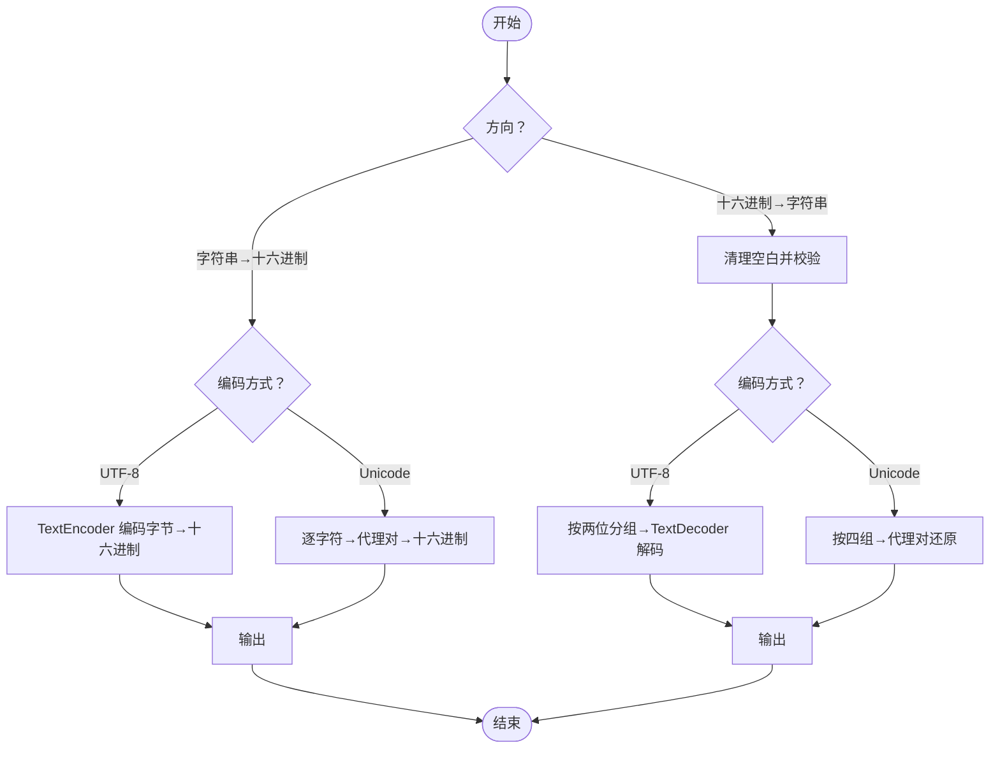
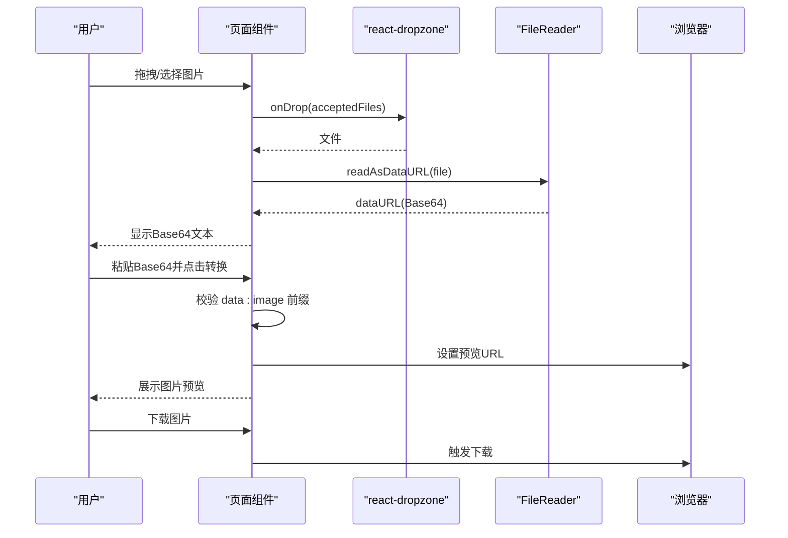
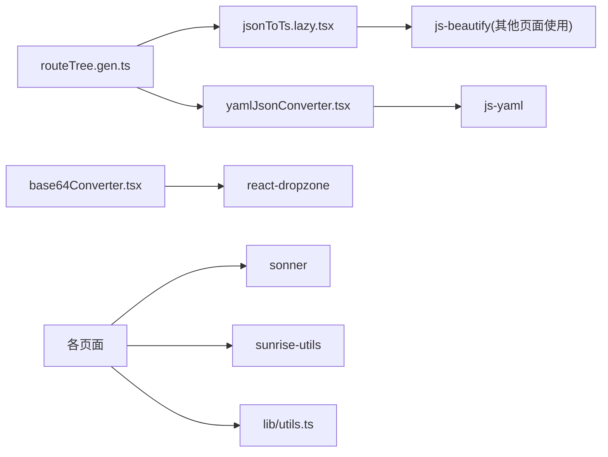

# 编码转换工具

<cite>
**本文引用的文件**
- [jsonToTs.lazy.tsx](file://src/pages/jsonToTs.lazy.tsx)
- [yamlJsonConverter.tsx](file://src/pages/yamlJsonConverter.tsx)
- [colorConverter.tsx](file://src/pages/colorConverter.tsx)
- [timestampConverter.tsx](file://src/pages/timestampConverter.tsx)
- [hexStringConverter.tsx](file://src/pages/hexStringConverter.tsx)
- [base64Converter.tsx](file://src/pages/base64Converter.tsx)
- [utils.ts](file://src/lib/utils.ts)
- [routeTree.gen.ts](file://src/routeTree.gen.ts)
</cite>

## 目录
1. [简介](#简介)
2. [项目结构](#项目结构)
3. [核心组件](#核心组件)
4. [架构总览](#架构总览)
5. [详细组件分析](#详细组件分析)
6. [依赖关系分析](#依赖关系分析)
7. [性能考量](#性能考量)
8. [故障排查指南](#故障排查指南)
9. [结论](#结论)

## 简介
本文件系统性梳理仓库中“编码转换工具”系列页面的实现机制，覆盖以下能力：
- JSON 转 TypeScript 类型声明（含类型推断与嵌套接口生成）
- YAML 与 JSON 互转（基于 js-yaml 的双向转换）
- 颜色格式转换（HEX/RGB 互转与亮度对比色建议）
- 时间戳转换（秒/毫秒与本地日期互转）
- 十六进制与字符串互转（UTF-8/Unicode 编解码）
- Base64 与图片互转（拖拽上传、预览与下载）

同时，结合表单输入、实时预览与一键复制等交互设计，说明如何通过边界校验与错误提示提升用户体验，并给出性能优化建议与可复用逻辑路径。

## 项目结构
这些工具页面均位于 src/pages 下，采用按需懒加载路由组织，入口路由由自动生成的 routeTree.gen.ts 维护。

图表来源
- [routeTree.gen.ts](file://src/routeTree.gen.ts#L46-L85)
- [jsonToTs.lazy.tsx](file://src/pages/jsonToTs.lazy.tsx#L1-L167)
- [yamlJsonConverter.tsx](file://src/pages/yamlJsonConverter.tsx#L1-L178)
- [colorConverter.tsx](file://src/pages/colorConverter.tsx#L1-L251)
- [timestampConverter.tsx](file://src/pages/timestampConverter.tsx#L1-L186)
- [hexStringConverter.tsx](file://src/pages/hexStringConverter.tsx#L1-L204)
- [base64Converter.tsx](file://src/pages/base64Converter.tsx#L1-L164)
- [utils.ts](file://src/lib/utils.ts#L1-L18)

章节来源
- [routeTree.gen.ts](file://src/routeTree.gen.ts#L46-L85)

## 核心组件
- JSON 转 TypeScript：基于递归类型推断与嵌套接口生成，支持空数组降级为 any[]，并确保嵌套类型先于根接口定义。
- YAML/JSON 互转：使用 js-yaml 的 dump/load，双向转换并提供下载与复制能力。
- 颜色转换：HEX/RGB 互转与亮度对比色建议；支持颜色拾取器联动。
- 时间戳转换：秒/毫秒与本地日期互转，支持自动刷新与复制当前值。
- 十六进制与字符串互转：UTF-8/Unicode 编解码，支持紧凑/空格格式。
- Base64 与图片互转：拖拽上传图片生成 Base64，支持预览与下载。

章节来源
- [jsonToTs.lazy.tsx](file://src/pages/jsonToTs.lazy.tsx#L1-L167)
- [yamlJsonConverter.tsx](file://src/pages/yamlJsonConverter.tsx#L1-L178)
- [colorConverter.tsx](file://src/pages/colorConverter.tsx#L1-L251)
- [timestampConverter.tsx](file://src/pages/timestampConverter.tsx#L1-L186)
- [hexStringConverter.tsx](file://src/pages/hexStringConverter.tsx#L1-L204)
- [base64Converter.tsx](file://src/pages/base64Converter.tsx#L1-L164)

## 架构总览
各工具页面遵循统一的交互模式：左侧输入区、右侧输出区、操作按钮（转换/复制/下载/清空）、错误提示与状态反馈。通用工具库提供复制到剪贴板与下载能力。

图表来源
- [jsonToTs.lazy.tsx](file://src/pages/jsonToTs.lazy.tsx#L92-L166)
- [yamlJsonConverter.tsx](file://src/pages/yamlJsonConverter.tsx#L22-L177)
- [colorConverter.tsx](file://src/pages/colorConverter.tsx#L73-L248)
- [timestampConverter.tsx](file://src/pages/timestampConverter.tsx#L48-L185)
- [hexStringConverter.tsx](file://src/pages/hexStringConverter.tsx#L31-L121)
- [base64Converter.tsx](file://src/pages/base64Converter.tsx#L13-L163)
- [utils.ts](file://src/lib/utils.ts#L9-L17)

## 详细组件分析

### JSON 转 TypeScript（jsonToTs.lazy.tsx）
- 类型推断与生成
  - 定义 JSON 值联合类型与对象接口，支持 null、undefined、数组与嵌套对象。
  - 递归遍历对象键值，根据类型选择 string/number/boolean/any[] 或生成嵌套接口名。
  - 对空数组降级为 any[]，避免无法推断元素类型。
  - 嵌套类型先于根接口定义，保证 TS 编译顺序正确。
- 边界与错误处理
  - JSON.parse 失败抛出异常并提示无效 JSON。
  - 使用 toast 提示转换错误。
- 交互与体验
  - 输入区与输出区并列展示，一键复制输出。
  - 清空按钮重置输入与输出。

图表来源
- [jsonToTs.lazy.tsx](file://src/pages/jsonToTs.lazy.tsx#L31-L91)
- [jsonToTs.lazy.tsx](file://src/pages/jsonToTs.lazy.tsx#L92-L166)

章节来源
- [jsonToTs.lazy.tsx](file://src/pages/jsonToTs.lazy.tsx#L1-L167)

### YAML 与 JSON 互转（yamlJsonConverter.tsx）
- 双向转换流程
  - JSON→YAML：先尝试 JSON.parse，再使用 js-yaml.dump 输出带缩进的 YAML。
  - YAML→JSON：使用 js-yaml.load 解析，再用 JSON.stringify 格式化输出。
- 边界与错误处理
  - 输入为空时清空输出并清除错误。
  - 解析失败时设置错误消息并清空输出。
- 交互与体验
  - 提供 JSON→YAML 与 YAML→JSON 两个按钮。
  - 支持复制与下载（根据输出内容自动判断扩展名）。

图表来源
- [yamlJsonConverter.tsx](file://src/pages/yamlJsonConverter.tsx#L22-L66)
- [yamlJsonConverter.tsx](file://src/pages/yamlJsonConverter.tsx#L68-L177)

章节来源
- [yamlJsonConverter.tsx](file://src/pages/yamlJsonConverter.tsx#L1-L178)

### 颜色格式转换（HEX/RGB）（colorConverter.tsx）
- HEX→RGB
  - 支持 #RGB 与 #RRGGBB 两种形式，短格式自动扩展。
  - 校验十六进制合法性，非法输入抛错并清空结果。
  - 计算亮度用于决定前景文字颜色（深浅对比）。
- RGB→HEX
  - 校验 r,g,b 数值范围与数量，非法输入抛错并清空结果。
  - 归一化到 0~255 并转为大写十六进制。
- 交互与体验
  - 集成浏览器颜色拾取器，联动 HEX/RGB 输入与结果展示。
  - 结果区域点击可复制对应值，支持一键复制。

图表来源
- [colorConverter.tsx](file://src/pages/colorConverter.tsx#L47-L110)
- [colorConverter.tsx](file://src/pages/colorConverter.tsx#L112-L133)
- [colorConverter.tsx](file://src/pages/colorConverter.tsx#L134-L248)

章节来源
- [colorConverter.tsx](file://src/pages/colorConverter.tsx#L1-L251)

### 时间戳转换（timestampConverter.tsx）
- 功能点
  - 支持秒/毫秒单位切换与自动刷新当前时间戳。
  - 时间戳→日期：按中国时区格式化为完整日期时间。
  - 日期→时间戳：按单位返回整秒或毫秒。
- 交互与体验
  - 提供“当前”快捷填充与“复制”按钮。
  - 自动更新开关，便于持续观察。

图表来源
- [timestampConverter.tsx](file://src/pages/timestampConverter.tsx#L48-L75)
- [timestampConverter.tsx](file://src/pages/timestampConverter.tsx#L77-L185)

章节来源
- [timestampConverter.tsx](file://src/pages/timestampConverter.tsx#L1-L186)

### 十六进制与字符串互转（hexStringConverter.tsx）
- 字符串→十六进制
  - UTF-8：使用 TextEncoder 编码字节序列，转为两位十六进制并按格式连接。
  - Unicode：按 4 位一组处理代理对，支持空格/紧凑格式。
- 十六进制→字符串
  - 清理空白后校验十六进制合法性。
  - Unicode：要求长度为 4 的倍数，按代理对还原字符。
  - UTF-8：按两位一组解码为字节并使用 TextDecoder 解码。
- 交互与体验
  - 选择编码方式与格式，一键转换与复制。

图表来源
- [hexStringConverter.tsx](file://src/pages/hexStringConverter.tsx#L31-L98)
- [hexStringConverter.tsx](file://src/pages/hexStringConverter.tsx#L100-L121)
- [hexStringConverter.tsx](file://src/pages/hexStringConverter.tsx#L122-L203)

章节来源
- [hexStringConverter.tsx](file://src/pages/hexStringConverter.tsx#L1-L204)

### Base64 与图片互转（base64Converter.tsx）
- 图片→Base64
  - 使用 react-dropzone 接受图片文件，FileReader.readAsDataURL 生成 Base64。
- Base64→图片
  - 校验 data:image 前缀，生成预览 URL。
- 交互与体验
  - 支持复制 Base64 文本、下载图片、拖拽上传。

图表来源
- [base64Converter.tsx](file://src/pages/base64Converter.tsx#L13-L58)
- [base64Converter.tsx](file://src/pages/base64Converter.tsx#L59-L163)

章节来源
- [base64Converter.tsx](file://src/pages/base64Converter.tsx#L1-L164)

## 依赖关系分析
- 路由懒加载
  - routeTree.gen.ts 中为 jsonToTs.lazy.tsx 与 yamlJsonConverter.tsx 注册懒加载路由，其他页面采用常规路由。
- 外部库
  - js-yaml：YAML/JSON 双向转换。
  - js-beautify：在其他格式化工具中使用（本仓库未直接在上述页面中使用）。
  - react-dropzone：Base64 页面的拖拽上传能力。
  - sonner：全局 toast 提示。
  - sunrise-utils：文件下载辅助。
- 通用工具
  - utils.ts 提供 copyToClipboard 与下载封装，被多个页面复用。

图表来源
- [routeTree.gen.ts](file://src/routeTree.gen.ts#L46-L85)
- [yamlJsonConverter.tsx](file://src/pages/yamlJsonConverter.tsx#L1-L178)
- [base64Converter.tsx](file://src/pages/base64Converter.tsx#L1-L164)
- [utils.ts](file://src/lib/utils.ts#L1-L18)

章节来源
- [routeTree.gen.ts](file://src/routeTree.gen.ts#L46-L85)
- [yamlJsonConverter.tsx](file://src/pages/yamlJsonConverter.tsx#L1-L178)
- [base64Converter.tsx](file://src/pages/base64Converter.tsx#L1-L164)
- [utils.ts](file://src/lib/utils.ts#L1-L18)

## 性能考量
- JSON→TS 类型生成
  - 递归深度与对象规模直接影响生成字符串长度，建议对超大对象分批处理或限制层级。
  - 嵌套类型先定义策略避免循环引用问题，但过多嵌套仍可能影响可读性。
- YAML/JSON 转换
  - js-yaml.dump/load 在复杂结构上开销较大，建议对超大文档采用流式处理或分块转换。
- 颜色转换
  - 计算亮度与颜色对比仅涉及少量数值运算，性能开销极低。
- 时间戳转换
  - Date 构造与格式化为纯前端操作，性能稳定；自动刷新应按需开启。
- 十六进制与字符串互转
  - UTF-8/Unicode 编解码涉及字符串拆分与映射，建议对超长字符串分段处理。
- Base64 与图片互转
  - FileReader 读取大图时可能阻塞 UI，建议在后台线程或分块读取（若可行）。

[本节为通用性能建议，不直接分析具体文件]

## 故障排查指南
- JSON→TS
  - 症状：转换报错或输出为空。
  - 排查：确认输入为合法 JSON；查看控制台错误；检查空数组与嵌套对象的类型推断。
- YAML/JSON
  - 症状：提示“格式无效”。
  - 排查：检查输入是否符合 YAML/JSON 语法；确认缩进与键值对格式。
- 颜色转换
  - 症状：提示“无效的颜色代码”。
  - 排查：HEX 必须为 #RRGGBB 或 #RGB；RGB 数值应在 0~255 且为三个数字。
- 时间戳转换
  - 症状：显示“无效时间戳/日期格式”。
  - 排查：确认单位切换正确；输入值为有效数值或合法日期时间字符串。
- 十六进制与字符串
  - 症状：提示“无效的十六进制格式/Unicode格式需要4位一组”。
  - 排查：清理多余空白；UTF-8 十六进制必须为偶数长度；Unicode 必须为 4 的倍数。
- Base64 与图片
  - 症状：转换失败或无法预览。
  - 排查：确认 Base64 以 data:image 开头；图片格式受支持；网络环境正常。

章节来源
- [jsonToTs.lazy.tsx](file://src/pages/jsonToTs.lazy.tsx#L92-L101)
- [yamlJsonConverter.tsx](file://src/pages/yamlJsonConverter.tsx#L22-L66)
- [colorConverter.tsx](file://src/pages/colorConverter.tsx#L73-L110)
- [timestampConverter.tsx](file://src/pages/timestampConverter.tsx#L48-L75)
- [hexStringConverter.tsx](file://src/pages/hexStringConverter.tsx#L60-L98)
- [base64Converter.tsx](file://src/pages/base64Converter.tsx#L38-L49)

## 结论
上述编码转换工具通过清晰的输入/输出与操作按钮设计，结合错误提示与一键复制/下载，显著提升了易用性与效率。核心算法围绕类型推断、格式解析与标准 API 运算展开，具备良好的可维护性与扩展性。建议在处理大规模数据时引入分块与节流策略，并在必要场景下提供导出与缓存机制，以进一步优化用户体验。