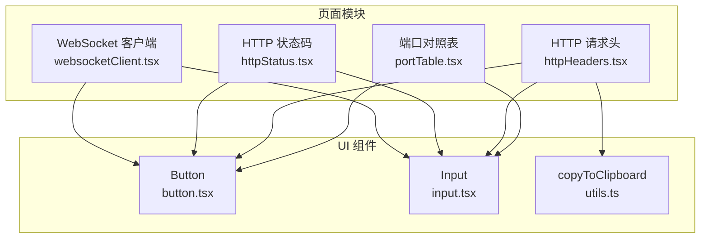
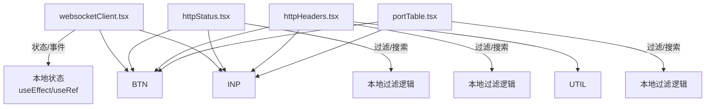
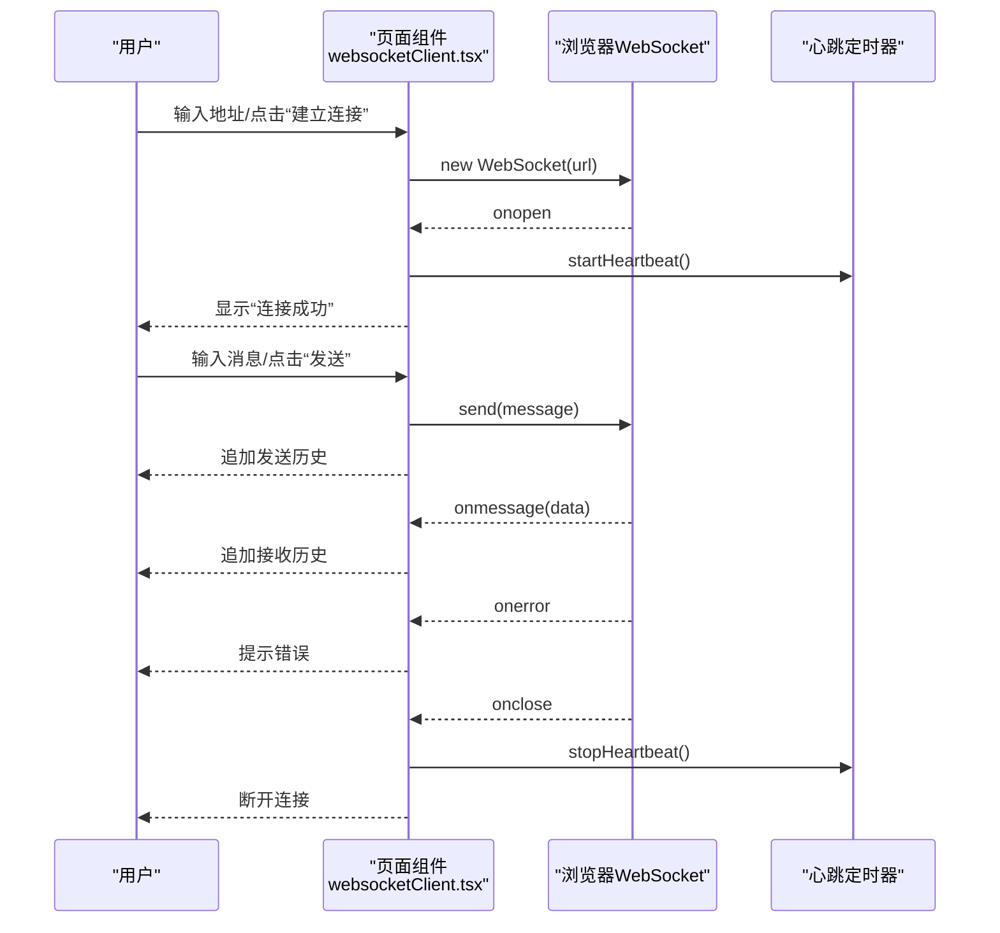
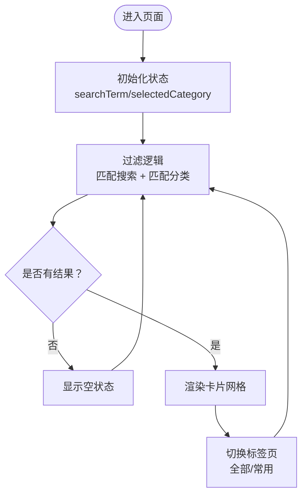
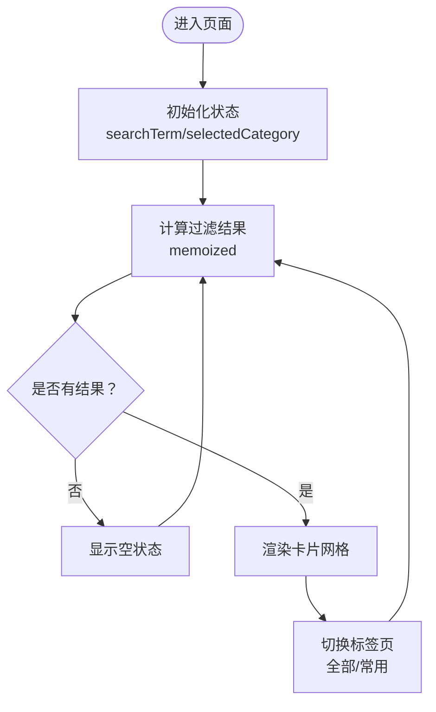
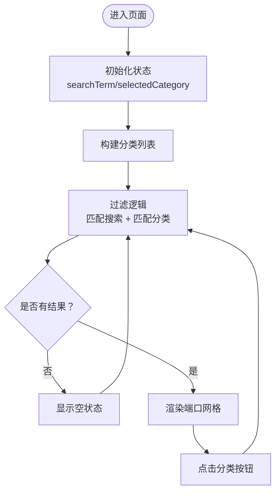
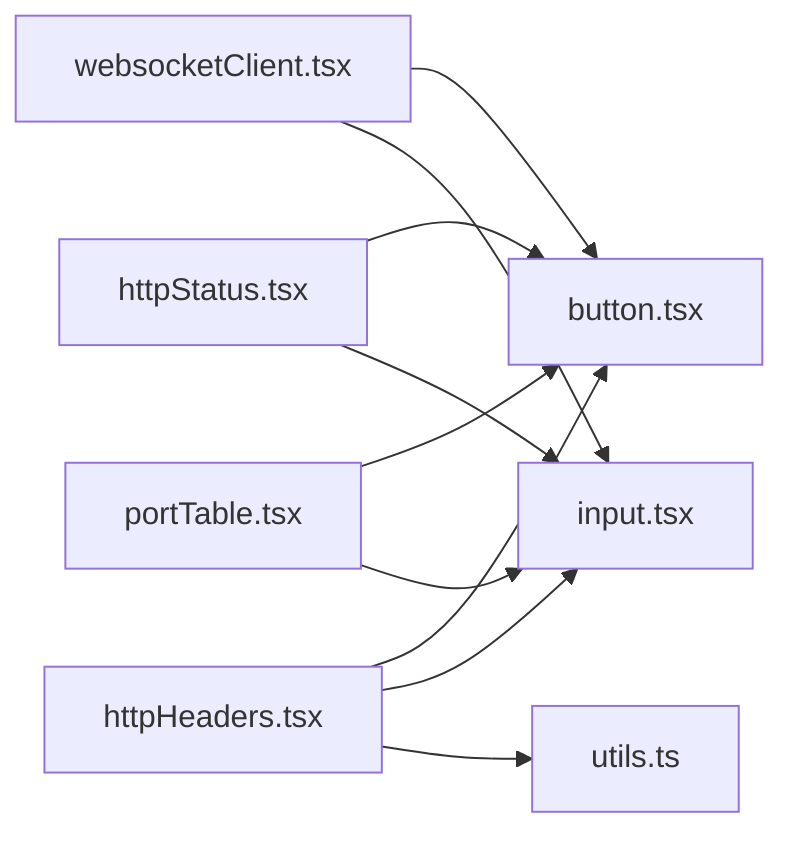

# 网络工具

<cite>
**本文引用的文件**
- [websocketClient.tsx](file://src/pages/websocketClient.tsx)
- [httpStatus.tsx](file://src/pages/httpStatus.tsx)
- [httpHeaders.tsx](file://src/pages/httpHeaders.tsx)
- [portTable.tsx](file://src/pages/portTable.tsx)
- [utils.ts](file://src/lib/utils.ts)
- [button.tsx](file://src/components/ui/button.tsx)
- [input.tsx](file://src/components/ui/input.tsx)
- [README.md](file://README.md)
</cite>

## 目录
1. [简介](#简介)
2. [项目结构](#项目结构)
3. [核心组件](#核心组件)
4. [架构总览](#架构总览)
5. [详细组件分析](#详细组件分析)
6. [依赖分析](#依赖分析)
7. [性能考虑](#性能考虑)
8. [故障排查指南](#故障排查指南)
9. [结论](#结论)
10. [附录](#附录)

## 简介
本文件系统性记录网络工具模块的技术设计与使用方式，覆盖以下页面：
- WebSocket 客户端：浏览器 WebSocket API 的连接、消息收发、事件循环与错误处理、心跳机制、UI 状态同步与消息历史管理。
- HTTP 状态码查询：静态数据组织、分类与搜索功能实现。
- HTTP 请求头说明：静态数据组织、分类与搜索功能实现。
- 端口信息表：常见网络端口的分类展示与搜索过滤。

同时给出集成自定义网络调试功能的接口设计建议与安全注意事项（跨域限制、输入验证等）。

## 项目结构
网络工具模块位于 src/pages 下，每个页面为独立功能模块，使用 shadcn/ui 组件与 Tailwind CSS 构建 UI，配合 TanStack Router 提供路由能力。

图表来源
- [websocketClient.tsx](file://src/pages/websocketClient.tsx#L1-L268)
- [httpStatus.tsx](file://src/pages/httpStatus.tsx#L1-L444)
- [httpHeaders.tsx](file://src/pages/httpHeaders.tsx#L1-L607)
- [portTable.tsx](file://src/pages/portTable.tsx#L1-L171)
- [button.tsx](file://src/components/ui/button.tsx#L1-L59)
- [input.tsx](file://src/components/ui/input.tsx#L1-L22)
- [utils.ts](file://src/lib/utils.ts#L1-L18)

章节来源
- [README.md](file://README.md#L53-L71)

## 核心组件
- WebSocket 客户端：负责建立连接、发送消息、接收消息、心跳维持、错误处理与 UI 状态同步。
- HTTP 状态码：维护状态码数据集合，提供搜索与分类筛选，支持“全部/常用”标签页。
- HTTP 请求头：维护请求头数据集合，提供搜索与分类筛选，支持“全部/常用”标签页。
- 端口对照表：维护端口数据集合，提供搜索与分类筛选，支持协议颜色区分。

章节来源
- [websocketClient.tsx](file://src/pages/websocketClient.tsx#L1-L268)
- [httpStatus.tsx](file://src/pages/httpStatus.tsx#L1-L444)
- [httpHeaders.tsx](file://src/pages/httpHeaders.tsx#L1-L607)
- [portTable.tsx](file://src/pages/portTable.tsx#L1-L171)

## 架构总览
四个页面均采用函数式组件 + hooks 的模式，使用本地状态管理 UI 与业务数据；页面间通过路由跳转关联，UI 组件统一来自 shadcn/ui。

图表来源
- [websocketClient.tsx](file://src/pages/websocketClient.tsx#L1-L268)
- [httpStatus.tsx](file://src/pages/httpStatus.tsx#L1-L444)
- [httpHeaders.tsx](file://src/pages/httpHeaders.tsx#L1-L607)
- [portTable.tsx](file://src/pages/portTable.tsx#L1-L171)
- [button.tsx](file://src/components/ui/button.tsx#L1-L59)
- [input.tsx](file://src/components/ui/input.tsx#L1-L22)
- [utils.ts](file://src/lib/utils.ts#L1-L18)

## 详细组件分析

### WebSocket 客户端（websocketClient.tsx）
- 连接管理
  - 使用浏览器原生 WebSocket API 建立连接，监听 open、message、error、close 事件。
  - 连接成功后启动心跳定时器，周期性发送心跳消息；断开连接时停止心跳。
  - 错误时弹出提示并记录日志；清理阶段关闭连接并停止心跳。
- 消息处理
  - 支持字符串、Blob、二进制对象等多种数据类型，统一转为文本后追加到消息历史。
  - 发送消息后立即写入发送历史，清空输入框。
- UI 状态与历史
  - 通过本地状态维护连接状态、消息列表、输入框、心跳参数。
  - 历史列表按时间倒序展示，支持清空。
- 事件循环与错误重连
  - 当前实现未包含自动重连逻辑；若需增强，可在 onclose 中增加指数退避重连策略与最大重试次数。

图表来源
- [websocketClient.tsx](file://src/pages/websocketClient.tsx#L1-L268)

章节来源
- [websocketClient.tsx](file://src/pages/websocketClient.tsx#L1-L268)

### HTTP 状态码（httpStatus.tsx）
- 数据组织
  - 静态数组维护状态码、消息、描述、分类、颜色与图标等字段。
  - 分类常量包含“所有/信息响应/成功响应/重定向/客户端错误/服务器错误”。
- 搜索与筛选
  - 本地过滤：支持按状态码、消息、描述模糊匹配；支持按分类筛选。
  - “常用状态码”标签页展示高频状态码集合。
- UI 展示
  - 使用卡片布局展示状态码信息，包含颜色主题、分类徽章与图标。
  - 提供“全部/常用”标签页切换。

图表来源
- [httpStatus.tsx](file://src/pages/httpStatus.tsx#L1-L444)

章节来源
- [httpStatus.tsx](file://src/pages/httpStatus.tsx#L1-L444)

### HTTP 请求头（httpHeaders.tsx）
- 数据组织
  - 静态数组维护请求头名称、描述、示例与分类（通用头/请求头/响应头/实体头）。
  - 分类常量包含“所有/通用头/请求头/响应头/实体头”。
- 搜索与筛选
  - 本地过滤：支持按名称、描述、示例模糊匹配；支持按分类筛选。
  - “常用请求头”标签页展示高频头部集合。
- UI 展示
  - 使用卡片布局展示请求头信息，包含颜色主题、分类徽章与示例文本。
  - 提供复制按钮，调用工具函数将名称或示例复制到剪贴板。

图表来源
- [httpHeaders.tsx](file://src/pages/httpHeaders.tsx#L1-L607)
- [utils.ts](file://src/lib/utils.ts#L1-L18)

章节来源
- [httpHeaders.tsx](file://src/pages/httpHeaders.tsx#L1-L607)
- [utils.ts](file://src/lib/utils.ts#L1-L18)

### 端口对照表（portTable.tsx）
- 数据组织
  - 静态数组维护端口、协议（TCP/UDP/TCP/UDP）、服务、描述与分类。
- 搜索与筛选
  - 本地过滤：支持按端口、协议、服务、描述、分类模糊匹配；支持按分类按钮筛选。
- UI 展示
  - 使用网格布局展示端口信息，协议以颜色区分，支持分类按钮切换。

图表来源
- [portTable.tsx](file://src/pages/portTable.tsx#L1-L171)

章节来源
- [portTable.tsx](file://src/pages/portTable.tsx#L1-L171)

## 依赖分析
- 组件依赖
  - 四个页面均依赖 shadcn/ui 的 Button、Input、Card、Tabs、Select、Badge 等组件。
  - HTTP 请求头页面依赖工具函数 copyToClipboard，统一处理复制与提示。
- 内聚与耦合
  - 每个页面为独立模块，内部状态与逻辑自包含，耦合度低，便于扩展与维护。
- 外部依赖
  - TanStack Router 提供路由能力；sonner 提供全局提示；Tailwind CSS 提供样式；Lucide 图标库提供图标。

图表来源
- [websocketClient.tsx](file://src/pages/websocketClient.tsx#L1-L268)
- [httpStatus.tsx](file://src/pages/httpStatus.tsx#L1-L444)
- [httpHeaders.tsx](file://src/pages/httpHeaders.tsx#L1-L607)
- [portTable.tsx](file://src/pages/portTable.tsx#L1-L171)
- [button.tsx](file://src/components/ui/button.tsx#L1-L59)
- [input.tsx](file://src/components/ui/input.tsx#L1-L22)
- [utils.ts](file://src/lib/utils.ts#L1-L18)

章节来源
- [button.tsx](file://src/components/ui/button.tsx#L1-L59)
- [input.tsx](file://src/components/ui/input.tsx#L1-L22)
- [utils.ts](file://src/lib/utils.ts#L1-L18)

## 性能考虑
- 本地过滤
  - 四个页面均采用本地数组过滤，适合静态数据规模较小的场景；若数据增长，建议：
    - 引入虚拟滚动（如 react-window）减少 DOM 节点数量。
    - 对搜索词做防抖处理，降低频繁重渲染。
    - 使用 useMemo/memo 优化过滤结果与渲染。
- WebSocket
  - 心跳频率与消息历史长度会影响内存占用；建议：
    - 控制心跳间隔与最大历史条数。
    - 对大体积 Blob 或二进制数据进行分块处理或提示用户。
- UI 组件
  - 使用 Tailwind 的原子类组合，避免过度嵌套；合理拆分卡片组件以减少不必要的重渲染。

## 故障排查指南
- WebSocket 连接失败
  - 检查 URL 是否正确（ws/wss），确认目标服务可达。
  - 若出现跨域或证书问题，浏览器控制台会显示错误；需在服务端配置 CORS 与证书。
  - 当前未实现自动重连，可在 onclose 中增加重连逻辑。
- 消息发送失败
  - 确认连接状态与输入非空；捕获异常并提示用户。
- HTTP 状态码/请求头搜索无结果
  - 检查搜索词大小写与拼写；尝试切换分类或清空搜索框。
- 端口搜索无结果
  - 确认输入的端口、协议或服务名是否正确；尝试切换分类按钮。
- 复制失败
  - 部分环境（如 HTTP 非 HTTPS）可能限制剪贴板访问；工具函数已处理异常并提示。

章节来源
- [websocketClient.tsx](file://src/pages/websocketClient.tsx#L1-L268)
- [httpStatus.tsx](file://src/pages/httpStatus.tsx#L1-L444)
- [httpHeaders.tsx](file://src/pages/httpHeaders.tsx#L1-L607)
- [portTable.tsx](file://src/pages/portTable.tsx#L1-L171)
- [utils.ts](file://src/lib/utils.ts#L1-L18)

## 结论
网络工具模块以简洁的函数式组件与本地状态管理实现了四大核心功能：WebSocket 调试、HTTP 状态码查询、HTTP 请求头说明与端口对照表。页面结构清晰、依赖明确，具备良好的可扩展性。建议后续增强 WebSocket 的自动重连与历史上限控制，以及引入虚拟滚动与搜索防抖以提升性能与体验。

## 附录

### 接口设计建议（集成自定义网络调试功能）
- WebSocket 调试器
  - 建议新增“自动重连”开关与“最大重试次数”、“指数退避系数”参数。
  - 增加“消息模板”下拉，内置常见协议消息样例。
  - 增加“导出历史”按钮，支持下载 JSON/CSV。
- HTTP 状态码与请求头
  - 建议新增“收藏”功能，将常用状态码/请求头加入本地收藏列表。
  - 增加“导出”功能，支持导出当前筛选结果。
- 端口对照表
  - 建议新增“端口范围”筛选与“协议组合”筛选。
  - 增加“服务来源”说明，标注常见厂商或标准来源。

### 安全注意事项
- 跨域限制
  - WebSocket 与 HTTP 请求均受同源策略约束；跨域时需在服务端设置正确的 Origin/CORS 头。
- 输入验证
  - 对用户输入的 URL、端口、请求头名称与值进行基本校验，防止注入与非法请求。
- 传输安全
  - 优先使用 wss 与 https；避免在生产环境使用明文 ws/http。
- 日志与隐私
  - 不在前端记录敏感信息；对错误日志进行脱敏处理。