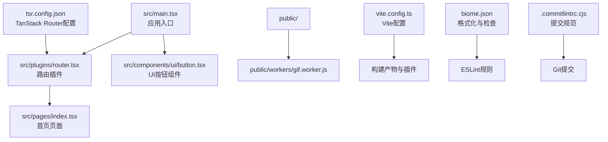
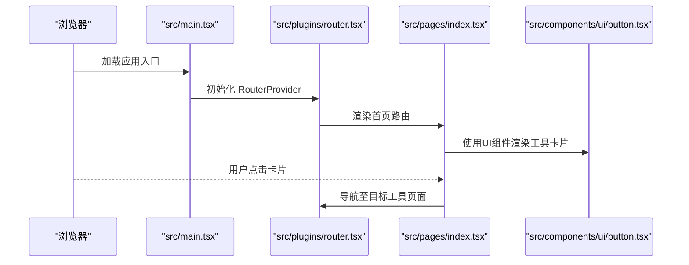
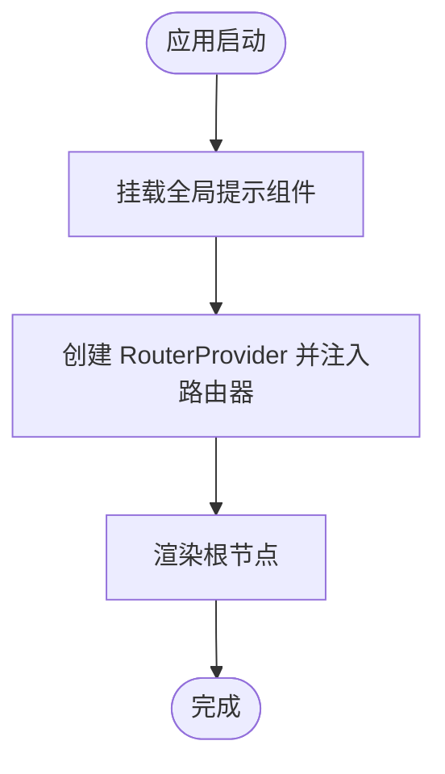
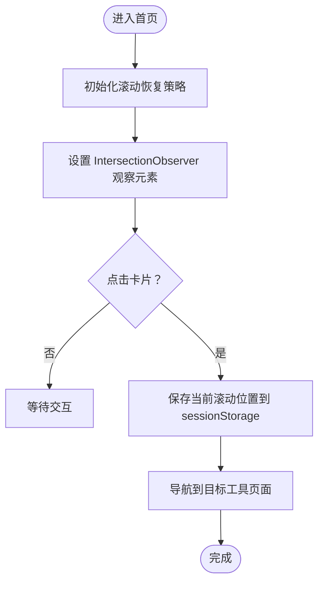
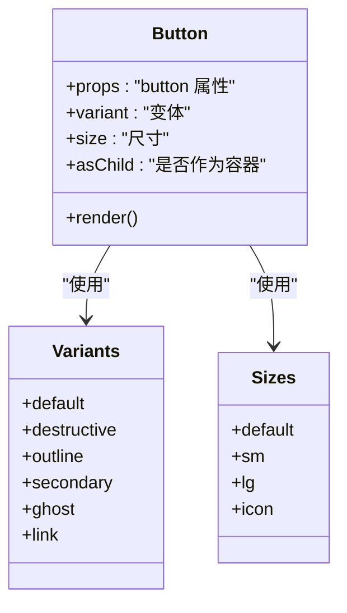
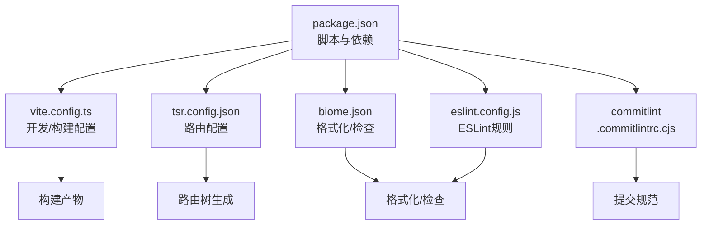

# 开发指南

<cite>
**本文引用的文件列表**
- [README.md](file://README.md)
- [package.json](file://package.json)
- [vite.config.ts](file://vite.config.ts)
- [biome.json](file://biome.json)
- [eslint.config.js](file://eslint.config.js)
- [.commitlintrc.cjs](file://.commitlintrc.cjs)
- [tsr.config.json](file://tsr.config.json)
- [src/main.tsx](file://src/main.tsx)
- [src/plugins/router.tsx](file://src/plugins/router.tsx)
- [src/pages/index.tsx](file://src/pages/index.tsx)
- [src/components/ui/button.tsx](file://src/components/ui/button.tsx)
</cite>

## 目录
1. [简介](#简介)
2. [项目结构](#项目结构)
3. [核心组件](#核心组件)
4. [架构总览](#架构总览)
5. [详细组件分析](#详细组件分析)
6. [依赖分析](#依赖分析)
7. [性能考虑](#性能考虑)
8. [故障排查指南](#故障排查指南)
9. [结论](#结论)
10. [附录](#附录)

## 简介
本指南面向新贡献者，提供从零开始的实践性开发流程，涵盖环境准备、依赖安装、开发服务器启动、构建与预览，以及项目的目录结构、代码规范与提交规范。同时给出标准的开发工作流，帮助你快速上手并高质量地贡献代码。

## 项目结构
项目采用模块化组织，核心目录与职责如下：
- src/
  - components/：公共UI组件与业务组件
    - ui/：基于 shadcn/ui 的可复用UI组件库
  - pages/：页面级组件，由 TanStack Router 管理
  - plugins/：插件与配置，如路由插件
  - main.tsx：应用入口，挂载 RouterProvider 与全局提示组件
- public/：静态资源与 Web Worker
- 构建与工具配置：vite.config.ts、tsr.config.json、biome.json、eslint.config.js、.commitlintrc.cjs、package.json

图表来源
- [src/main.tsx](file://src/main.tsx#L1-L19)
- [src/plugins/router.tsx](file://src/plugins/router.tsx#L1-L19)
- [src/pages/index.tsx](file://src/pages/index.tsx#L1-L295)
- [src/components/ui/button.tsx](file://src/components/ui/button.tsx#L1-L59)
- [vite.config.ts](file://vite.config.ts#L1-L96)
- [tsr.config.json](file://tsr.config.json#L1-L6)
- [biome.json](file://biome.json#L1-L274)
- [.commitlintrc.cjs](file://.commitlintrc.cjs#L1-L93)

章节来源
- [README.md](file://README.md#L100-L124)

## 核心组件
- 应用入口与路由
  - 应用入口负责挂载全局提示组件与 RouterProvider，并渲染根节点
  - 路由插件基于 TanStack Router 生成的 routeTree，提供默认 404 处理
- 页面组件
  - 首页页面按分类展示工具卡片，点击进入对应工具页面
- UI 组件
  - UI 组件库基于 shadcn/ui 与 Tailwind CSS，提供变体与尺寸等可组合能力

章节来源
- [src/main.tsx](file://src/main.tsx#L1-L19)
- [src/plugins/router.tsx](file://src/plugins/router.tsx#L1-L19)
- [src/pages/index.tsx](file://src/pages/index.tsx#L1-L295)
- [src/components/ui/button.tsx](file://src/components/ui/button.tsx#L1-L59)

## 架构总览
下图展示了从入口到页面与UI组件的整体调用链路，以及构建与路由生成的关键配置。

图表来源
- [src/main.tsx](file://src/main.tsx#L1-L19)
- [src/plugins/router.tsx](file://src/plugins/router.tsx#L1-L19)
- [src/pages/index.tsx](file://src/pages/index.tsx#L1-L295)
- [src/components/ui/button.tsx](file://src/components/ui/button.tsx#L1-L59)

## 详细组件分析

### 应用入口与路由
- 入口职责
  - 挂载全局提示组件与 RouterProvider
  - 条件渲染根节点，避免重复挂载
- 路由职责
  - 基于 routeTree 生成路由器
  - 提供默认 404 页面与返回首页链接

图表来源
- [src/main.tsx](file://src/main.tsx#L1-L19)
- [src/plugins/router.tsx](file://src/plugins/router.tsx#L1-L19)

章节来源
- [src/main.tsx](file://src/main.tsx#L1-L19)
- [src/plugins/router.tsx](file://src/plugins/router.tsx#L1-L19)

### 页面组件（首页）
- 功能要点
  - 分类展示工具卡片
  - 使用 IntersectionObserver 控制滚动动画
  - 使用 sessionStorage 记录滚动位置，保证导航体验
  - 点击卡片触发路由跳转

图表来源
- [src/pages/index.tsx](file://src/pages/index.tsx#L1-L295)

章节来源
- [src/pages/index.tsx](file://src/pages/index.tsx#L1-L295)

### UI 组件（Button）
- 设计要点
  - 使用变体与尺寸的组合，支持不同视觉风格与尺寸
  - 支持作为容器元素渲染子元素（Slot）
  - 通过工具函数合并类名，保持样式一致性

图表来源
- [src/components/ui/button.tsx](file://src/components/ui/button.tsx#L1-L59)

章节来源
- [src/components/ui/button.tsx](file://src/components/ui/button.tsx#L1-L59)

## 依赖分析
- 构建与运行
  - Vite 作为开发服务器与打包工具
  - Bun 作为运行时与包管理器
- 路由与页面
  - TanStack Router 负责路由树生成与页面导航
- UI 与样式
  - shadcn/ui + Tailwind CSS 提供组件与样式体系
- 工具库
  - ffmpeg、qrcode、sonner、react-dropzone、html2canvas 等用于具体工具功能
- 代码质量与提交规范
  - Biome 负责格式化与检查
  - ESLint 提供 TypeScript 与 React Hooks 规则
  - Commitlint 结合 cz-git 强制提交信息规范

图表来源
- [package.json](file://package.json#L1-L89)
- [vite.config.ts](file://vite.config.ts#L1-L96)
- [tsr.config.json](file://tsr.config.json#L1-L6)
- [biome.json](file://biome.json#L1-L274)
- [eslint.config.js](file://eslint.config.js#L1-L28)
- [.commitlintrc.cjs](file://.commitlintrc.cjs#L1-L93)

章节来源
- [package.json](file://package.json#L1-L89)
- [vite.config.ts](file://vite.config.ts#L1-L96)
- [tsr.config.json](file://tsr.config.json#L1-L6)
- [biome.json](file://biome.json#L1-L274)
- [eslint.config.js](file://eslint.config.js#L1-L28)
- [.commitlintrc.cjs](file://.commitlintrc.cjs#L1-L93)

## 性能考虑
- 构建优化
  - 按依赖分包（如 pdf、image、converter、utils 等），减少重复打包
  - Terser 压缩与移除 console/debugger
  - 压缩插件开启 Brotli 压缩，提升传输效率
- 开发体验
  - 自动打开浏览器、跨域隔离头配置，便于本地调试
- 可视化分析
  - Rollup 可视化报告，定位大体积模块与拆分策略

章节来源
- [vite.config.ts](file://vite.config.ts#L1-L96)

## 故障排查指南
- 开发服务器无法启动
  - 确认已安装 Bun 并使用 bun install 安装依赖
  - 检查端口占用与跨域隔离头配置
- 路由跳转异常
  - 确认 TanStack Router 路由树已生成且路径正确
  - 检查页面组件的路由注册与导航逻辑
- 样式或组件未生效
  - 确认 Tailwind CSS 与 shadcn/ui 配置正确
  - 检查组件类名合并与变体参数
- 代码检查失败
  - 使用 Biome 与 ESLint 规则进行修复
  - 提交前确保通过本地检查

章节来源
- [vite.config.ts](file://vite.config.ts#L1-L96)
- [tsr.config.json](file://tsr.config.json#L1-L6)
- [biome.json](file://biome.json#L1-L274)
- [eslint.config.js](file://eslint.config.js#L1-L28)

## 结论
本指南提供了从环境准备到开发、构建与预览的完整流程，明确了目录结构与各模块职责，并给出了代码规范与提交规范的落地方法。建议新贡献者在首次开发前先完成环境搭建与基础检查，再按照标准工作流推进功能开发与 PR 提交流程。

## 附录

### 环境搭建与开发流程（逐步操作）
- 克隆仓库
  - 使用 git clone 克隆项目到本地
- 安装依赖
  - 使用 bun install 安装项目依赖
- 启动开发服务器
  - 使用 bun dev 启动本地开发服务器
- 构建项目
  - 使用 bun run build 生成生产构建
- 预览生产版本
  - 使用 bun preview 预览构建结果

章节来源
- [README.md](file://README.md#L76-L98)

### 目录结构说明
- src/components/ui/：可复用UI组件，统一风格与交互
- src/pages/：页面级组件，按功能划分，由路由驱动
- src/plugins/：插件与配置，如路由插件
- public/：静态资源与 Web Worker
- 构建与工具配置：vite.config.ts、tsr.config.json、biome.json、eslint.config.js、.commitlintrc.cjs、package.json

章节来源
- [README.md](file://README.md#L100-L124)

### 代码规范与提交规范
- 代码检查与格式化
  - 使用 Biome 进行格式化与检查
  - 使用 ESLint 进行 TypeScript 与 React Hooks 规则检查
- 提交信息规范
  - 使用 Commitlint 强制提交类型与格式
  - 支持中文类型与范围选择，结合 cz-git 交互式提交

章节来源
- [README.md](file://README.md#L126-L152)
- [biome.json](file://biome.json#L1-L274)
- [eslint.config.js](file://eslint.config.js#L1-L28)
- [.commitlintrc.cjs](file://.commitlintrc.cjs#L1-L93)

### 标准开发工作流
- 从 main 分支创建特性分支
- 开发与测试
- 本地通过 ESLint/Biome/Commitlint 检查
- 推送分支并创建 Pull Request
- 等待代码审查与合并

章节来源
- [README.md](file://README.md#L153-L162)