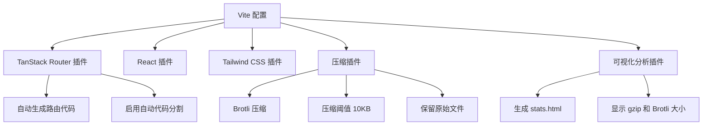
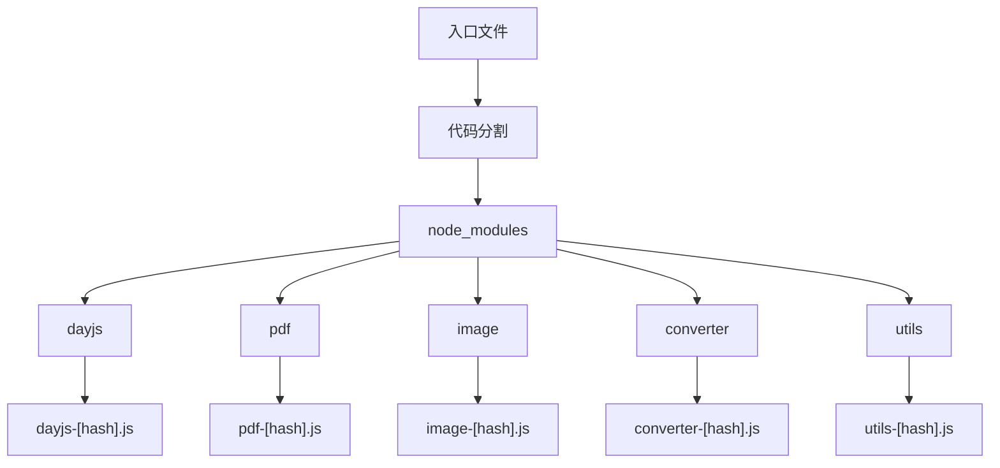
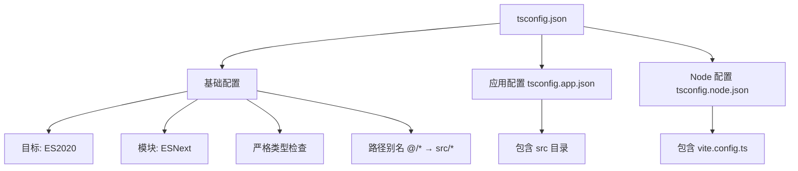
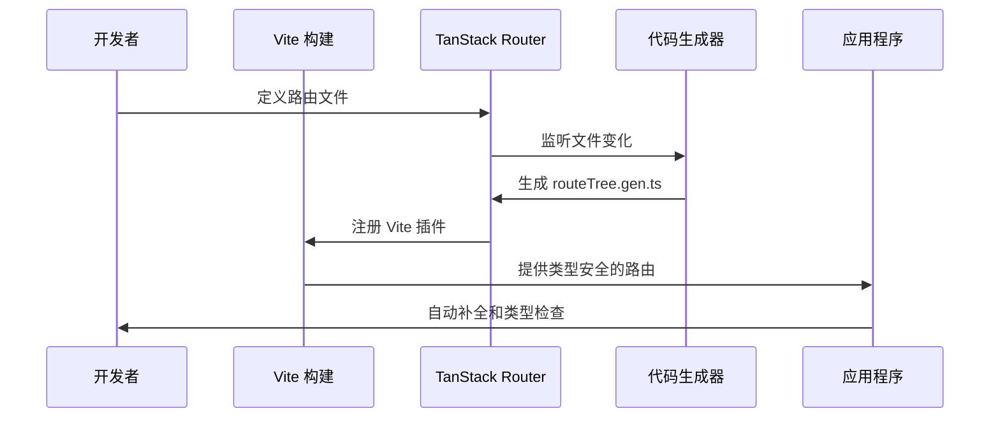

# 技术栈与依赖

<cite>
**本文档中引用的文件**   
- [package.json](file://package.json)
- [vite.config.ts](file://vite.config.ts)
- [tsconfig.json](file://tsconfig.json)
- [tsconfig.app.json](file://tsconfig.app.json)
- [tsconfig.node.json](file://tsconfig.node.json)
- [src/plugins/router.tsx](file://src/plugins/router.tsx)
- [src/main.tsx](file://src/main.tsx)
- [src/index.css](file://src/index.css)
- [components.json](file://components.json)
</cite>

## 目录
1. [项目概述](#项目概述)
2. [核心依赖分析](#核心依赖分析)
3. [Vite 构建配置详解](#vite-构建配置详解)
4. [TypeScript 编译配置](#typescript-编译配置)
5. [技术栈协同工作机制](#技术栈协同工作机制)
6. [配置修改指导](#配置修改指导)

## 项目概述

本项目是一个基于 React 19、Vite 6 和 Bun 构建的现代化工具集合应用，集成了多种实用的在线工具，涵盖文件处理、编码转换、网络工具、地理坐标和开发辅助等多个领域。项目采用最新的前端技术栈，通过 TanStack Router 实现路由管理，使用 Tailwind CSS 4 进行样式设计，并集成 pdf-lib 和 @ffmpeg/ffmpeg 等库实现核心功能。整体架构注重高性能、良好的开发者体验和代码可维护性。

**Section sources**
- [README.md](file://README.md#L1-L297)

## 核心依赖分析

### 生产依赖

项目的核心生产依赖包括：

- **React 19**: 作为前端框架的基础，提供最新的 React 特性和性能优化
- **@tanstack/react-router**: 现代化的路由解决方案，支持类型安全的路由定义和自动代码分割
- **Tailwind CSS 4**: 实用优先的 CSS 框架，配合 @tailwindcss/vite 插件实现高效的样式开发
- **pdf-lib**: 用于在浏览器端创建和修改 PDF 文档，支持 PDF 合并、转换等功能
- **@ffmpeg/ffmpeg**: WebAssembly 版本的 FFmpeg，用于视频处理和格式转换，特别是视频转 GIF 功能
- **shadcn/ui 组件库**: 基于 Radix UI 和 Tailwind CSS 的可复用组件，提供按钮、卡片、表格等 UI 元素

这些依赖共同构成了项目的核心功能基础，其中 React 19 提供了现代的 UI 开发体验，TanStack Router 确保了类型安全的路由系统，而 FFmpeg 和 pdf-lib 则实现了关键的文件处理能力。

**Section sources**
- [package.json](file://package.json#L18-L58)

### 开发依赖

开发依赖主要包括：

- **Vite 6**: 下一代前端构建工具，提供快速的开发服务器和高效的生产构建
- **@vitejs/plugin-react**: Vite 的 React 插件，支持 React 19 的新特性
- **@tanstack/router-plugin**: 为 TanStack Router 提供 Vite 集成，实现路由代码的自动生成功能
- **vite-plugin-compression**: 在构建时生成压缩文件，支持 Brotli 压缩以减小文件体积
- **rollup-plugin-visualizer**: 生成构建产物的可视化分析报告，帮助优化代码分割
- **TypeScript**: 提供静态类型检查，增强代码的可维护性和开发体验

这些开发工具共同提升了开发效率和构建质量，特别是 Vite 的快速热重载和按需编译特性，极大地改善了开发体验。

**Section sources**
- [package.json](file://package.json#L60-L83)

## Vite 构建配置详解

### 插件配置

Vite 配置中集成了多个关键插件：



**Diagram sources**
- [vite.config.ts](file://vite.config.ts#L10-L22)

**Section sources**
- [vite.config.ts](file://vite.config.ts#L1-L22)

### 服务器配置

开发服务器配置包含重要的安全策略：

- **自动打开**: `open: true` 配置使开发服务器启动后自动在浏览器中打开
- **CORS 策略**: 通过设置 `Cross-Origin-Opener-Policy` 和 `Cross-Origin-Embedder-Policy` 头部，实现跨源隔离，这是使用 WebAssembly（如 FFmpeg）所必需的安全措施

这些配置确保了开发环境的安全性和便利性，特别是跨源策略的设置对于集成 FFmpeg 等需要 WebAssembly 支持的库至关重要。

**Section sources**
- [vite.config.ts](file://vite.config.ts#L23-L29)

### 别名配置

项目配置了路径别名以简化模块导入：


**Diagram sources**
- [vite.config.ts](file://vite.config.ts#L30-L34)

通过 `@` 别名指向 `src` 目录，开发者可以使用更简洁的相对路径导入模块，提高了代码的可读性和可维护性。

**Section sources**
- [vite.config.ts](file://vite.config.ts#L30-L34)

### 构建优化策略

#### 代码分割配置

构建配置中的 `manualChunks` 函数实现了智能的代码分割策略：



**Diagram sources**
- [vite.config.ts](file://vite.config.ts#L44-L74)

该策略将第三方依赖按功能分组打包，将 PDF 相关库、图片处理库、SCSS 转换库等分别打包到独立的 chunk 中，实现了按需加载，优化了首屏加载性能。

**Section sources**
- [vite.config.ts](file://vite.config.ts#L35-L74)

#### 压缩与混淆

生产构建配置了高级的压缩和混淆策略：

- **Brotli 压缩**: 使用 `vite-plugin-compression` 插件生成 `.br` 文件，对于大于 10KB 的资源进行 Brotli 压缩，通常比 Gzip 提供更好的压缩率
- **Terser 混淆**: 配置 `terserOptions` 移除 `console.log` 和 `debugger` 语句，减小生产包体积并提高安全性
- **文件命名策略**: 使用哈希值命名输出文件，实现长效缓存

这些优化措施共同确保了生产环境的高性能和安全性。

**Section sources**
- [vite.config.ts](file://vite.config.ts#L14-L21)
- [vite.config.ts](file://vite.config.ts#L85-L90)

#### 依赖预构建优化

通过 `optimizeDeps.exclude` 配置，项目排除了 `@ffmpeg/ffmpeg` 和 `@ffmpeg/util` 的预构建处理：

```mermaid
flowchart LR
A[Vite 依赖预构建] --> B{是否排除?}
B --> |是| C[跳过预构建]
B --> |否| D[正常预构建]
C --> E[@ffmpeg/ffmpeg]
C --> F[@ffmpeg/util]
```

**Diagram sources**
- [vite.config.ts](file://vite.config.ts#L92-L94)

这一配置避免了大型 WebAssembly 模块在开发服务器启动时的长时间预构建过程，显著提升了开发服务器的启动速度。

**Section sources**
- [vite.config.ts](file://vite.config.ts#L92-L94)

## TypeScript 编译配置

### 编译选项分析

项目使用了多个 TypeScript 配置文件来区分不同环境的编译需求：



**Diagram sources**
- [tsconfig.json](file://tsconfig.json#L1-L32)
- [tsconfig.app.json](file://tsconfig.app.json#L1-L32)
- [tsconfig.node.json](file://tsconfig.node.json#L1-L25)

**Section sources**
- [tsconfig.json](file://tsconfig.json#L1-L32)
- [tsconfig.app.json](file://tsconfig.app.json#L1-L32)
- [tsconfig.node.json](file://tsconfig.node.json#L1-L25)

### 核心编译选项

#### 目标与模块配置

- **目标版本**: `ES2020` 确保了对现代 JavaScript 特性的支持，同时保持了良好的浏览器兼容性
- **模块系统**: `ESNext` 允许使用最新的 ES 模块语法，与 Vite 的原生 ES 模块支持完美配合
- **JSX 转换**: `react-jsx` 配置使用新的 JSX 转换机制，无需在每个文件中导入 React

#### 类型检查严格性

项目启用了严格的类型检查模式：

- `strict: true` 启用所有严格的类型检查选项
- `noUnusedLocals: true` 禁止未使用的局部变量
- `noUnusedParameters: true` 禁止未使用的函数参数
- `noFallthroughCasesInSwitch: true` 防止 switch 语句中的意外贯穿

这些严格的类型检查规则有助于在编译时捕获潜在的错误，提高代码质量和可维护性。

#### 路径别名

通过 `baseUrl` 和 `paths` 配置，项目实现了与 Vite 相同的路径别名：

```json
{
  "baseUrl": ".",
  "paths": {
    "@/*": ["src/*"]
  }
}
```

这一配置确保了 TypeScript 编译器能够正确解析 `@/` 开头的导入语句，与 Vite 的运行时行为保持一致。

## 技术栈协同工作机制

### 整体架构协同

```mermaid
graph TB
subgraph "开发环境"
A[React 19] --> B[Vite 6]
B --> C[TanStack Router]
B --> D[Tailwind CSS]
B --> E[TypeScript]
end
subgraph "生产环境"
F[代码分割] --> G[PDF Chunk]
F --> H[Image Chunk]
F --> I[Converter Chunk]
G --> J[pdf-lib]
H --> K[html2canvas]
I --> L[sass]
end
subgraph "功能实现"
M[视频转GIF] --> N[@ffmpeg/ffmpeg]
O[PDF合并] --> P[pdf-lib]
Q[二维码生成] --> R[qrcode]
end
A --> |组件开发| C
C --> |路由管理| B
D --> |样式应用| A
E --> |类型检查| A
```

**Diagram sources**
- [package.json](file://package.json#L1-L89)
- [vite.config.ts](file://vite.config.ts#L1-L96)
- [tsconfig.json](file://tsconfig.json#L1-L32)

各技术组件协同工作，形成了一个高效、可维护的开发和运行环境。React 19 提供了现代化的 UI 开发体验，Vite 6 作为构建工具提供了快速的开发服务器和高效的生产构建，TanStack Router 实现了类型安全的路由系统，Tailwind CSS 提供了灵活的样式解决方案，而 TypeScript 则确保了代码的类型安全。

**Section sources**
- [package.json](file://package.json#L1-L89)
- [vite.config.ts](file://vite.config.ts#L1-L96)
- [tsconfig.json](file://tsconfig.json#L1-L32)

### 路由系统集成

TanStack Router 与 Vite 的集成实现了现代化的路由工作流：



**Diagram sources**
- [vite.config.ts](file://vite.config.ts#L6)
- [src/plugins/router.tsx](file://src/plugins/router.tsx#L1-L19)

通过 `@tanstack/router-plugin`，项目实现了路由配置的自动代码生成和类型推断，开发者在使用路由时可以获得完整的类型安全和自动补全支持。

**Section sources**
- [vite.config.ts](file://vite.config.ts#L6)
- [src/plugins/router.tsx](file://src/plugins/router.tsx#L1-L19)

## 配置修改指导

### 添加新的 Vite 插件

要添加新的 Vite 插件，遵循以下步骤：

1. 通过包管理器安装插件：
   ```bash
   bun add -D vite-plugin-example
   ```

2. 在 `vite.config.ts` 中导入并配置插件：
   ```typescript
   import examplePlugin from 'vite-plugin-example'
   
   export default defineConfig({
     plugins: [
       // 现有插件...
       examplePlugin({
         // 插件配置选项
       }),
     ],
   })
   ```

3. 根据插件需求调整其他配置，如需要在 `optimizeDeps.exclude` 中排除某些模块。

**Section sources**
- [vite.config.ts](file://vite.config.ts#L1-L96)

### 调整 TypeScript 编译选项

修改 TypeScript 配置时，根据目标环境选择正确的配置文件：

- **应用代码**: 修改 `tsconfig.app.json` 或 `tsconfig.json`
- **Vite 配置**: 修改 `tsconfig.node.json`

常见调整包括：

- **目标版本**: 修改 `target` 字段以支持不同的 JavaScript 版本
- **严格模式**: 根据项目需求调整 `strict` 及其子选项
- **路径别名**: 在 `paths` 中添加新的别名映射

修改后，确保相关文件的导入语句与新的配置保持一致。

**Section sources**
- [tsconfig.json](file://tsconfig.json#L1-L32)
- [tsconfig.app.json](file://tsconfig.app.json#L1-L32)
- [tsconfig.node.json](file://tsconfig.node.json#L1-L25)