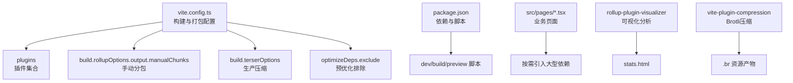
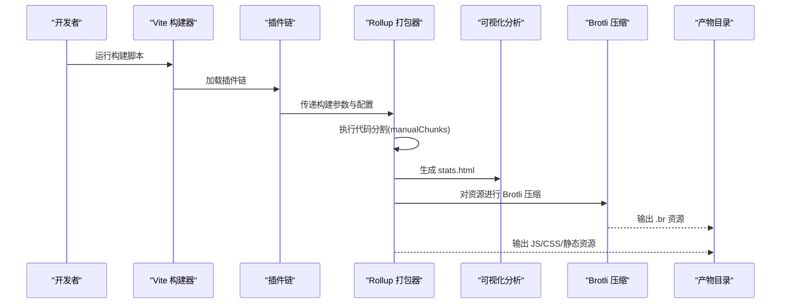
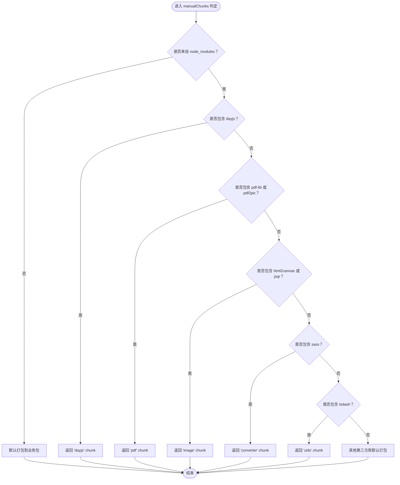
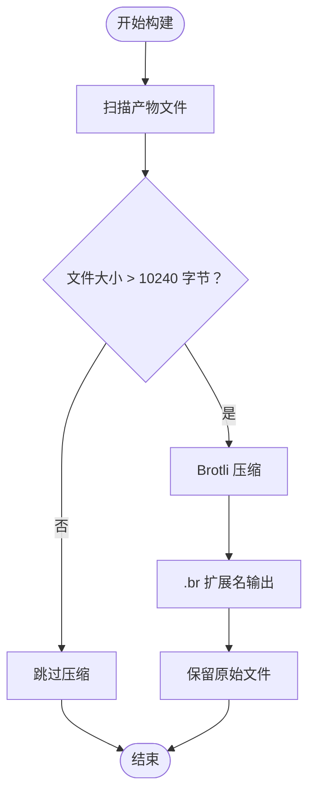
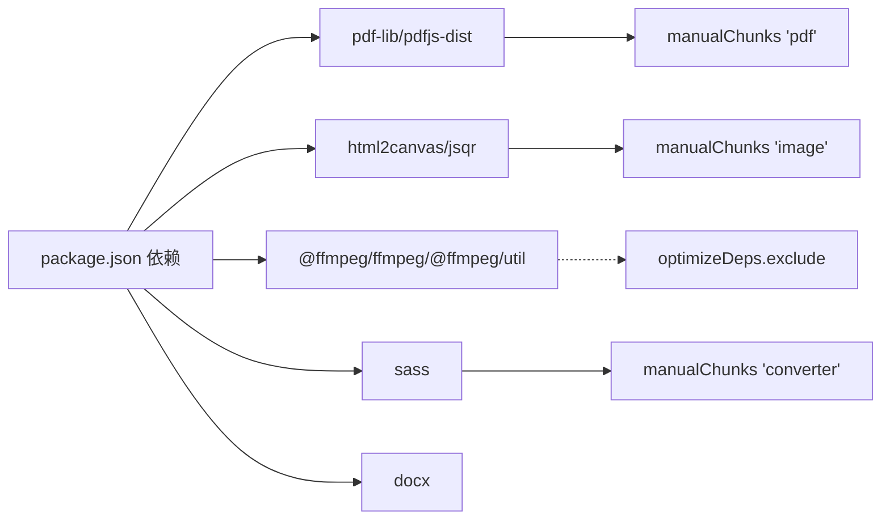

# 构建与性能优化

<cite>
**本文引用的文件**
- [vite.config.ts](file://vite.config.ts)
- [package.json](file://package.json)
- [README.md](file://README.md)
- [src/pages/imageToPdf.tsx](file://src/pages/imageToPdf.tsx)
- [src/pages/pdfMerger.tsx](file://src/pages/pdfMerger.tsx)
- [src/pages/scssConverter.tsx](file://src/pages/scssConverter.tsx)
- [src/pages/videoToGif.tsx](file://src/pages/videoToGif.tsx)
- [src/pages/imageCompressor.tsx](file://src/pages/imageCompressor.tsx)
- [src/pages/pdfToWord.tsx](file://src/pages/pdfToWord.tsx)
</cite>

## 目录
1. [简介](#简介)
2. [项目结构](#项目结构)
3. [核心组件](#核心组件)
4. [架构总览](#架构总览)
5. [详细组件分析](#详细组件分析)
6. [依赖分析](#依赖分析)
7. [性能考量](#性能考量)
8. [故障排查指南](#故障排查指南)
9. [结论](#结论)
10. [附录](#附录)

## 简介
本文件围绕项目构建流程与性能优化策略展开，重点依据 vite.config.ts 的配置，系统阐述 Vite 的构建配置如何提升应用性能与用户体验。内容涵盖：
- manualChunks 如何将大型依赖（如 pdf-lib、@ffmpeg/ffmpeg、sass）拆分为独立代码块（'pdf'、'image'、'converter'），实现按需加载、降低初始包体积
- vite-plugin-compression 插件的 Brotli 压缩策略、阈值与保留原文件的权衡
- terserOptions 中移除 console 与 debugger 的生产环境优化
- rollup-plugin-visualizer 的使用与 stats.html 可视化分析
- 面向开发者的实践建议：如何调整代码分割策略与压缩设置以获得更佳性能

## 项目结构
项目采用 Vite + React + TanStack Router 的现代前端工程化方案，页面模块化组织，构建配置集中在 vite.config.ts，依赖管理在 package.json 中统一维护。

图表来源
- [vite.config.ts](file://vite.config.ts#L1-L96)
- [package.json](file://package.json#L1-L89)

章节来源
- [vite.config.ts](file://vite.config.ts#L1-L96)
- [package.json](file://package.json#L1-L89)
- [README.md](file://README.md#L1-L124)

## 核心组件
- 构建与打包配置（vite.config.ts）
  - 插件链：TanStack Router、React、TailwindCSS、vite-plugin-compression、rollup-plugin-visualizer
  - 服务与安全头：CSP/COOP/COEP
  - 路径别名：@ -> src
  - Rollup 输出命名与 manualChunks
  - Terser 生产压缩
  - 依赖预优化排除
- 依赖与脚本（package.json）
  - 生产依赖包含 pdf-lib、@ffmpeg/ffmpeg、sass 等重型库
  - 开发脚本：dev/build/preview/lint

章节来源
- [vite.config.ts](file://vite.config.ts#L1-L96)
- [package.json](file://package.json#L1-L89)

## 架构总览
下图展示了构建阶段的关键流程与优化点，从插件装配到产物产出，再到可视化分析与压缩策略。

图表来源
- [vite.config.ts](file://vite.config.ts#L1-L96)

## 详细组件分析

### 代码分割策略：manualChunks
manualChunks 通过将 node_modules 中的包按类别归类到独立 chunk，实现按需加载与缓存复用，显著降低首屏体积与加载时间。

- 分组规则
  - pdf：pdf-lib、pdf2pic
  - image：html2canvas、jsqr
  - converter：sass
  - dayjs：单独分包
  - utils：lodash

- 作用与收益
  - 将大型依赖拆分为独立 chunk，避免与业务代码同包，提升缓存命中率
  - 按功能域划分，便于按需加载，减少初始下载量
  - 降低重复依赖带来的包体积膨胀

图表来源
- [vite.config.ts](file://vite.config.ts#L35-L75)

章节来源
- [vite.config.ts](file://vite.config.ts#L35-L75)

### 压缩策略：vite-plugin-compression（Brotli）
vite-plugin-compression 在构建阶段对资源进行 Brotli 压缩，配合阈值与扩展名控制，平衡压缩效果与带宽利用。

- 关键配置
  - 算法：brotliCompress
  - 阈值：10240 字节（仅对超过阈值的资源进行压缩）
  - 扩展名：.br
  - 删除源文件：false（保留原始文件，便于回退与调试）

- 适用场景
  - 静态资源（JS/CSS/字体/图片）在生产环境优先使用 .br
  - 服务器需支持 Brotli 压缩（现代浏览器广泛支持）

图表来源
- [vite.config.ts](file://vite.config.ts#L14-L21)

章节来源
- [vite.config.ts](file://vite.config.ts#L14-L21)

### 生产优化：terserOptions 移除 console 与 debugger
生产环境通过 Terser 移除 console 与 debugger，减少包体积并避免调试信息泄露。

- 配置要点
  - drop_console: true
  - drop_debugger: true

- 影响
  - 减少冗余日志与调试代码
  - 降低 JS 体积，提升加载速度
  - 建议在本地开发保留这些语句以便调试

章节来源
- [vite.config.ts](file://vite.config.ts#L85-L90)

### 可视化分析：rollup-plugin-visualizer
rollup-plugin-visualizer 生成 stats.html，直观展示各 chunk 的体积构成，帮助定位优化点。

- 关键配置
  - open: false（不自动打开浏览器）
  - filename: "stats.html"
  - gzipSize: true
  - brotliSize: true

- 使用建议
  - 构建后查看 stats.html，关注大体积 chunk 与重复依赖
  - 结合 manualChunks 调整分包策略，减少公共依赖重复打包

章节来源
- [vite.config.ts](file://vite.config.ts#L77-L83)

### 依赖预优化排除：optimizeDeps.exclude
针对体积巨大且按需加载的依赖（如 @ffmpeg/ffmpeg、@ffmpeg/util），通过 exclude 排除在预优化之外，避免预打包带来的内存与时间成本。

- 目的
  - 降低首次启动时的依赖扫描与预构建时间
  - 由业务页面按需动态导入，进一步实现懒加载

章节来源
- [vite.config.ts](file://vite.config.ts#L92-L94)

### 业务页面与大型依赖的关联
- pdf 相关页面
  - pdf-lib：用于 PDF 合并与处理
  - pdfjs-dist：用于 PDF 文本提取
- 图片处理页面
  - html2canvas：页面截图
  - jsqr：二维码识别
- 视频转 GIF 页面
  - @ffmpeg/ffmpeg：浏览器内视频转 GIF
- SCSS 转换页面
  - sass：编译 SCSS 为 CSS

这些页面在运行时才引入对应依赖，结合 manualChunks 的分组，形成“按需加载”的闭环。

章节来源
- [src/pages/pdfMerger.tsx](file://src/pages/pdfMerger.tsx#L1-L183)
- [src/pages/pdfToWord.tsx](file://src/pages/pdfToWord.tsx#L1-L267)
- [src/pages/imageToPdf.tsx](file://src/pages/imageToPdf.tsx#L1-L626)
- [src/pages/videoToGif.tsx](file://src/pages/videoToGif.tsx#L1-L375)
- [src/pages/scssConverter.tsx](file://src/pages/scssConverter.tsx#L1-L182)

## 依赖分析
- 生产依赖中包含大量重型库，如 pdf-lib、@ffmpeg/ffmpeg、sass、html2canvas、js-beautify、docx 等，这些库天然适合通过 manualChunks 拆分，避免与业务代码同包。
- optimizeDeps.exclude 将 @ffmpeg/ffmpeg、@ffmpeg/util 排除在预优化之外，减少预构建成本。
- 服务器端需开启 Brotli 压缩，以充分利用 .br 资源；同时保留原始文件便于回退与调试。

图表来源
- [package.json](file://package.json#L18-L59)
- [vite.config.ts](file://vite.config.ts#L35-L94)

章节来源
- [package.json](file://package.json#L18-L59)
- [vite.config.ts](file://vite.config.ts#L35-L94)

## 性能考量
- 代码分割
  - 将大型依赖拆分为独立 chunk，结合浏览器缓存策略，提升二次访问性能
  - 对于频繁更新的业务代码，尽量避免与大依赖同包
- 压缩策略
  - Brotli 压缩对文本类资源（JS/CSS）效果显著，建议在服务器端启用
  - 阈值设置合理，避免对小文件进行压缩造成额外开销
- 生产优化
  - 移除 console 与 debugger，减少包体积与潜在安全风险
  - 保留原始文件便于回退与问题排查
- 可视化分析
  - 定期生成 stats.html，识别大体积 chunk 与重复依赖，持续优化分包策略
- 依赖加载
  - 对体积巨大的依赖（如 @ffmpeg/ffmpeg）采用按需加载，避免首屏负担

## 故障排查指南
- 构建后未生成 stats.html
  - 检查 rollup-plugin-visualizer 的配置与构建命令
  - 确认构建脚本已执行
- Brotli 资源未生效
  - 确认服务器已启用 Brotli 压缩
  - 检查 .br 文件是否存在
- 首屏加载慢
  - 使用 stats.html 分析大体积 chunk，调整 manualChunks 分组
  - 对非关键路径的依赖采用动态导入
- 控制台仍有日志
  - 确认生产环境已启用 Terser 并移除了 console 与 debugger
- 依赖预优化导致启动缓慢
  - 确认 @ffmpeg/ffmpeg、@ffmpeg/util 已在 optimizeDeps.exclude 中排除

章节来源
- [vite.config.ts](file://vite.config.ts#L77-L94)

## 结论
通过合理的 manualChunks 分组、Brotli 压缩、生产环境优化与可视化分析，项目在保证功能完整性的同时，显著提升了构建效率与运行性能。建议持续结合 stats.html 与实际用户反馈，迭代优化分包策略与压缩配置，以获得更优的用户体验。

## 附录
- 实践建议
  - 动态导入：对体积大且非首屏必需的依赖（如 @ffmpeg/ffmpeg）采用动态导入
  - 分包粒度：根据页面使用频率与依赖体量，调整 manualChunks 的分组策略
  - 压缩策略：在服务器端启用 Brotli，合理设置阈值，平衡压缩比与带宽
  - 可视化：定期生成并分析 stats.html，识别优化点
  - 日志清理：仅在开发环境保留 console 与 debugger，生产环境保持精简