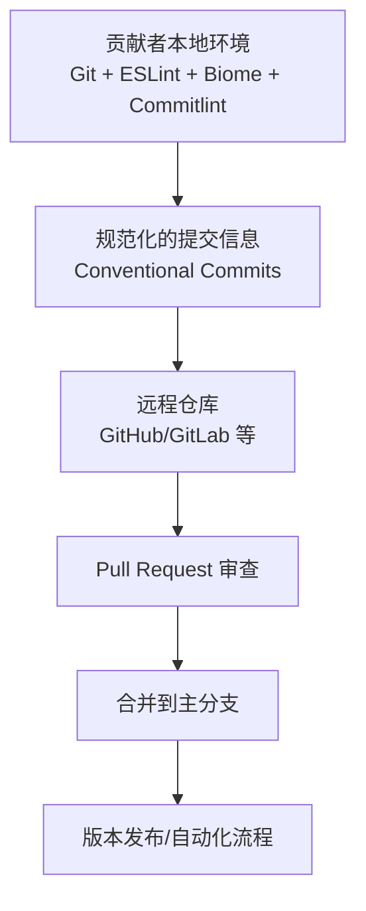
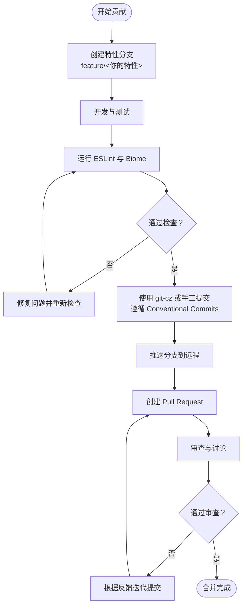

# 贡献规范

<cite>
**本文引用的文件**
- [README.md](file://README.md)
- [.commitlintrc.cjs](file://.commitlintrc.cjs)
- [eslint.config.js](file://eslint.config.js)
- [biome.json](file://biome.json)
</cite>

## 目录
1. [引言](#引言)
2. [项目结构](#项目结构)
3. [核心组件](#核心组件)
4. [架构总览](#架构总览)
5. [详细组件分析](#详细组件分析)
6. [依赖分析](#依赖分析)
7. [性能考虑](#性能考虑)
8. [故障排查指南](#故障排查指南)
9. [结论](#结论)
10. [附录](#附录)

## 引言
本贡献规范旨在帮助社区成员高效、一致地为项目做出贡献。内容基于 README.md 的“贡献指南”与 .commitlintrc.cjs 的提交信息规范，明确从 Fork 到 PR 合并的完整流程；强调代码质量要求（ESLint 与 Biome），并系统讲解 Conventional Commits 标准及提交信息格式。同时提供使用 git-cz（commitizen）引导生成规范提交信息的建议，以及 PR 审查与合并的注意事项。

## 项目结构
本项目采用 React + TypeScript + Vite + Bun 技术栈，代码质量由 ESLint、Biome 与 Commitlint 三套工具共同保障。贡献者在本地需安装并运行这些工具以确保提交符合规范。

- 代码规范工具
  - ESLint：用于 JavaScript/TypeScript 语法与最佳实践检查
  - Biome：统一格式化、导入排序与静态规则检查
  - Commitlint：约束 Git 提交信息格式，保证历史可读性与自动化能力

- 提交信息规范来源
  - README.md 明确了提交信息格式与类型说明
  - .commitlintrc.cjs 扩展 conventional commits 并补充项目特定规则与交互提示

- 开发流程要点
  - Fork 项目后创建特性分支（推荐以 feature/ 前缀命名）
  - 开发完成后执行代码检查与格式化，提交并通过 PR 审查后合并

章节来源
- file://README.md#L126-L162
- file://README.md#L173-L184

## 核心组件
- 提交信息规范（Conventional Commits）
  - 类型集合：feat、fix、docs、style、refactor、perf、test、build、ci、chore、revert、wip、workflow、types、release 等
  - 结构：类型(范围): 描述
  - 可选正文与脚注，正文换行符使用“|”
  - README 与 .commitlintrc.cjs 均强调类型与主题不可为空，且对头部长度、主体换行等有严格校验

- 代码质量工具
  - ESLint：推荐使用官方推荐规则集，并启用 React Hooks 与刷新相关规则
  - Biome：开启格式化、导入排序与 Linter，针对 TS/TSX 设置多项严格规则
  - Commitlint：基于 conventional 配置扩展，强制类型枚举与长度/换行等规则

章节来源
- file://README.md#L126-L162
- file://.commitlintrc.cjs#L1-L93
- file://eslint.config.js#L1-L28
- file://biome.json#L1-L274

## 架构总览
下图展示了贡献流程中各工具与规范的关系，以及提交信息在版本控制中的作用。

图表来源
- [README.md](file://README.md#L126-L162)
- [.commitlintrc.cjs](file://.commitlintrc.cjs#L1-L93)

## 详细组件分析

### 提交信息规范（Conventional Commits）
- 类型与含义
  - feat：新增功能
  - fix：修复缺陷
  - docs：文档更新
  - style：代码格式化（不影响功能）
  - refactor：重构（不含 bug 修复与功能新增）
  - perf：性能优化
  - test：测试相关
  - build：构建流程或外部依赖变更
  - ci：CI 配置或脚本修改
  - chore：对构建过程或辅助工具的更改
  - revert：回滚某次提交
  - wip/workflow/types/release：扩展类型，便于更细粒度的分类

- 提交信息格式
  - 结构：类型(范围): 描述
  - 正文换行使用“|”，可选脚注
  - 主题与类型不可为空，头部最大长度受限

- 工具与交互
  - .commitlintrc.cjs 基于 conventional 配置扩展，提供中文交互提示与 emoji 类型选择
  - 支持 Breaking Changes 的范围限定（默认允许 feat、fix）

- 使用 git-cz（commitizen）的好处
  - 交互式引导，降低记忆负担
  - 自动校验类型与长度，减少重复修改
  - 统一团队提交风格，利于自动化语义化版本与变更日志生成

章节来源
- file://README.md#L126-L162
- file://.commitlintrc.cjs#L1-L93

### 代码质量工具链（ESLint 与 Biome）
- ESLint
  - 使用官方推荐规则集与 TypeScript ESLint 推荐规则
  - 启用 React Hooks 与刷新相关规则，确保 React 最佳实践
  - 忽略 dist 目录，避免对构建产物进行检查

- Biome
  - 开启格式化、导入排序与 Linter
  - 针对 TS/TSX 设置多项严格规则（正确性、可疑性、复杂度、风格等）
  - 对 React Hook 使用场景设置警告与错误级别规则
  - 配置包含若干覆盖项，按文件类型与场景细化规则

- 贡献者建议
  - 在提交前先运行 ESLint 与 Biome，确保无错误与警告
  - 若 IDE 支持 Biome/ESLint 插件，可在保存时自动修复
  - 避免在提交中包含格式化无关的噪音差异，保持提交聚焦

章节来源
- file://eslint.config.js#L1-L28
- file://biome.json#L1-L274

### 提交流程与 PR 审查
- 基本流程
  - Fork 项目至个人账号
  - 创建特性分支（推荐 feature/AmazingFeature）
  - 开发、测试、格式化与检查
  - 推送分支并创建 Pull Request
  - 等待审查与讨论，根据反馈迭代提交
  - 通过后由维护者合并

- PR 审查要点
  - 提交信息是否符合 Conventional Commits
  - 是否满足 ESLint 与 Biome 规范
  - 是否包含必要的测试与说明
  - 是否尽量保持每次提交聚焦单一变更

章节来源
- file://README.md#L173-L184

### 提交信息生成流程（概念示意）
以下流程图展示从开始到完成一次规范提交的典型步骤，帮助理解工具与流程的关系。

图表来源
- [README.md](file://README.md#L126-L162)
- [.commitlintrc.cjs](file://.commitlintrc.cjs#L1-L93)

## 依赖分析
- 工具耦合关系
  - ESLint 与 Biome 分别负责语法与格式化，二者互补，共同提升代码质量
  - Commitlint 依赖 conventional 配置，结合 .commitlintrc.cjs 的扩展规则，形成统一的提交约束
  - git-cz 作为交互式工具，可直接调用 cz-git 的配置，实现可视化选择类型与范围

- 外部依赖与集成点
  - conventional commits 生态广泛，便于与语义化版本、变更日志生成等工具衔接
  - cz-git 提供中文交互与 emoji 类型，降低沟通成本

章节来源
- file://README.md#L126-L162
- file://.commitlintrc.cjs#L1-L93

## 性能考虑
- 提交信息校验
  - 使用 Commitlint 与 cz-git 可在本地快速发现格式问题，减少后续反复修改
- 代码检查效率
  - ESLint 与 Biome 建议在本地启用增量检查与 IDE 插件，缩短等待时间
- PR 审查效率
  - 规范的提交信息与高质量的代码能显著降低审查成本，提高合并速度

## 故障排查指南
- 提交信息被拒绝
  - 检查类型是否在允许列表内，主题与类型是否为空
  - 确认头部长度、正文换行符与脚注格式是否符合要求
  - 如使用 cz-git，确认交互选择是否正确

- ESLint/Biome 报错
  - 优先修复错误级别规则；警告级别规则建议在本地修复后再提交
  - 确认 IDE 插件已启用，或在提交前手动运行检查

- PR 审查未通过
  - 根据审查意见修改提交，必要时拆分提交以提升可读性
  - 确保每次提交聚焦单一变更，避免“大杂烩”

章节来源
- file://.commitlintrc.cjs#L1-L93
- file://eslint.config.js#L1-L28
- file://biome.json#L1-L274

## 结论
遵循本贡献规范，能够帮助贡献者以最小成本产出高质量代码与清晰的提交历史。通过 ESLint、Biome 与 Commitlint 的协同，配合 git-cz 的交互式体验，项目将保持一致的风格与良好的可维护性。PR 审查应重点关注提交信息规范、代码质量与变更范围，确保贡献顺利合并。

## 附录
- 常用命令参考（来自 README）
  - 克隆、安装、启动、构建、预览
  - 开发流程：从创建分支到提交与 PR

章节来源
- file://README.md#L78-L98
- file://README.md#L153-L161