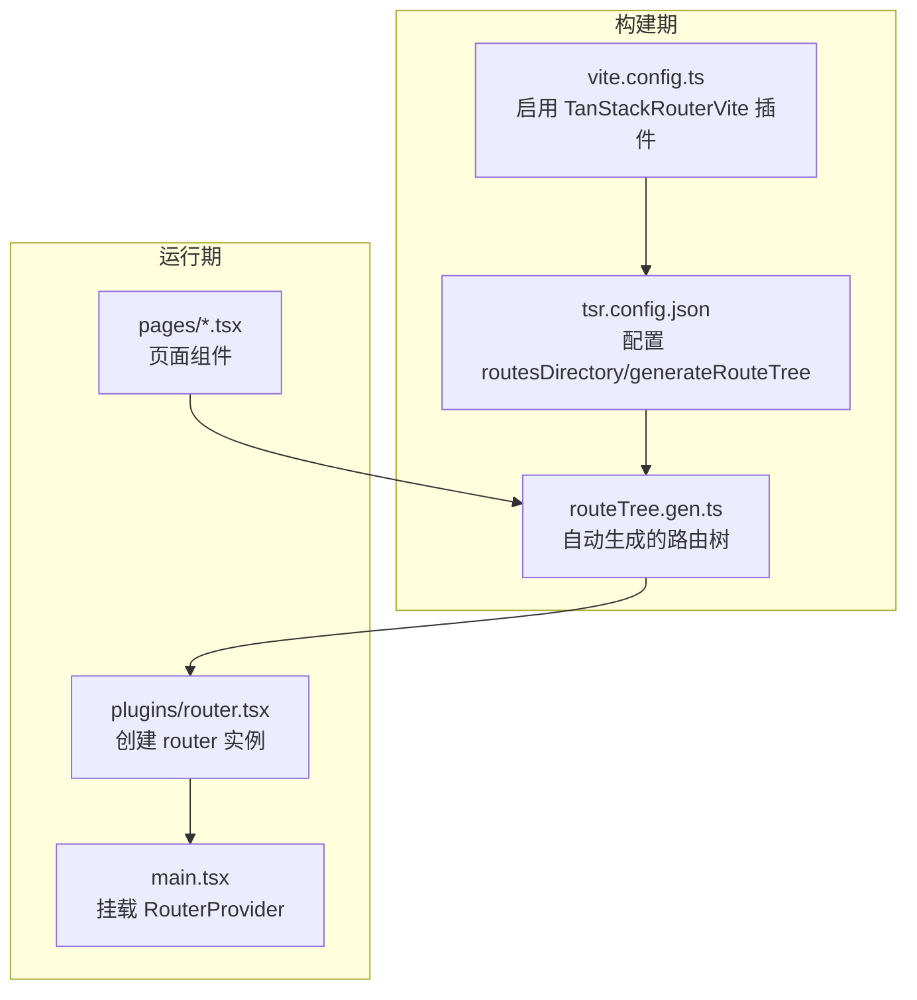
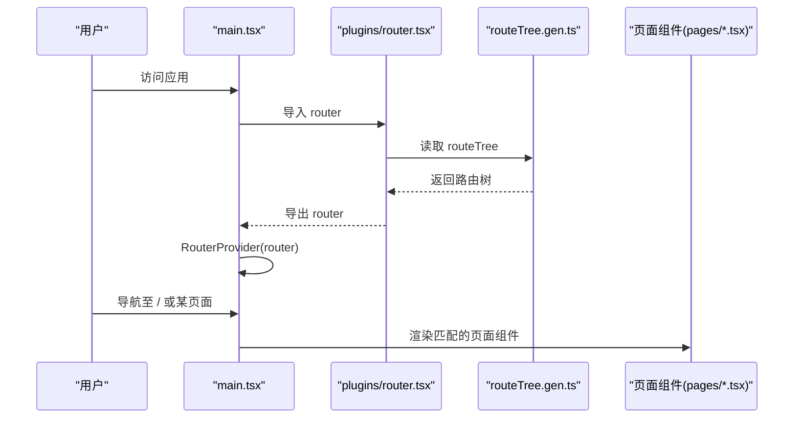
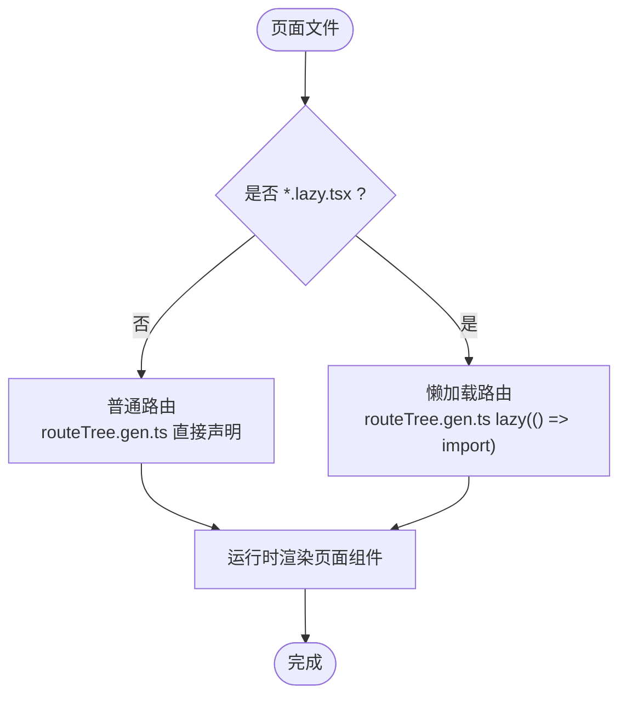
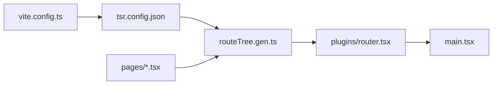

# 路由与导航

<cite>
**本文引用的文件**
- [tsr.config.json](file://tsr.config.json)
- [vite.config.ts](file://vite.config.ts)
- [src/plugins/router.tsx](file://src/plugins/router.tsx)
- [src/main.tsx](file://src/main.tsx)
- [src/routeTree.gen.ts](file://src/routeTree.gen.ts)
- [src/pages/index.tsx](file://src/pages/index.tsx)
- [src/pages/videoToGif.tsx](file://src/pages/videoToGif.tsx)
- [src/pages/pdfMerger.tsx](file://src/pages/pdfMerger.tsx)
- [src/pages/jsonToTs.lazy.tsx](file://src/pages/jsonToTs.lazy.tsx)
- [src/pages/signature.lazy.tsx](file://src/pages/signature.lazy.tsx)
</cite>

## 目录
1. [简介](#简介)
2. [项目结构](#项目结构)
3. [核心组件](#核心组件)
4. [架构总览](#架构总览)
5. [详细组件分析](#详细组件分析)
6. [依赖关系分析](#依赖关系分析)
7. [性能考量](#性能考量)
8. [故障排查指南](#故障排查指南)
9. [结论](#结论)
10. [附录](#附录)

## 简介
本文件围绕基于 @tanstack/react-router 的文件路由系统，系统性解析以下主题：
- tsr.config.json 如何驱动路由自动生成
- src/plugins/router.tsx 如何创建与配置路由实例
- src/routeTree.gen.ts 的生成过程与作用，作为“文件系统结构与运行时路由”的桥梁
- pages/ 目录下的页面文件（如 videoToGif.tsx、pdfMerger.tsx）如何自动映射到 URL 路径
- *.lazy.tsx 页面（如 jsonToTs.lazy.tsx、signature.lazy.tsx）的懒加载机制及其对性能的贡献
- 新增页面的完整流程与路由钩子的使用方式

## 项目结构
该工程采用“文件路由”模式，通过配置文件指定路由目录，构建阶段由 @tanstack/router-plugin 自动生成路由树文件，运行时由 @tanstack/react-router 加载该路由树并渲染页面。

图表来源
- [vite.config.ts](file://vite.config.ts#L1-L22)
- [tsr.config.json](file://tsr.config.json#L1-L6)
- [src/routeTree.gen.ts](file://src/routeTree.gen.ts#L1-L20)
- [src/plugins/router.tsx](file://src/plugins/router.tsx#L1-L19)
- [src/main.tsx](file://src/main.tsx#L1-L18)

章节来源
- [vite.config.ts](file://vite.config.ts#L1-L22)
- [tsr.config.json](file://tsr.config.json#L1-L6)
- [src/routeTree.gen.ts](file://src/routeTree.gen.ts#L1-L20)
- [src/plugins/router.tsx](file://src/plugins/router.tsx#L1-L19)
- [src/main.tsx](file://src/main.tsx#L1-L18)

## 核心组件
- 构建期插件与配置
  - Vite 插件：TanStackRouterVite，开启 React 目标与自动代码分割
  - 路由配置：tsr.config.json 指定路由目录、生成文件位置与命名风格
- 运行期路由实例
  - src/plugins/router.tsx 创建 router，并注入默认 404 组件
  - src/main.tsx 使用 RouterProvider 挂载路由
- 路由树生成
  - src/routeTree.gen.ts 由插件自动生成，包含所有页面路由与懒加载路由
- 页面组件
  - pages/ 下的每个文件对应一个路由路径，普通页面直接加载；*.lazy.tsx 对应懒加载路由

章节来源
- [vite.config.ts](file://vite.config.ts#L1-L22)
- [tsr.config.json](file://tsr.config.json#L1-L6)
- [src/plugins/router.tsx](file://src/plugins/router.tsx#L1-L19)
- [src/main.tsx](file://src/main.tsx#L1-L18)
- [src/routeTree.gen.ts](file://src/routeTree.gen.ts#L1-L20)

## 架构总览
下面的序列图展示了从启动到渲染页面的关键流程。

图表来源
- [src/main.tsx](file://src/main.tsx#L1-L18)
- [src/plugins/router.tsx](file://src/plugins/router.tsx#L1-L19)
- [src/routeTree.gen.ts](file://src/routeTree.gen.ts#L1-L20)

## 详细组件分析

### 配置与生成：tsr.config.json 与 Vite 插件
- tsr.config.json
  - routesDirectory：路由目录为 src/pages
  - generatedRouteTree：生成的路由树文件为 src/routeTree.gen.ts
  - routeFileIgnorePrefix：忽略以特定前缀开头的文件（此处为 -）
  - quoteStyle：生成文件的引号风格
- Vite 插件 TanStackRouterVite
  - target: "react"
  - autoCodeSplitting: true，启用自动代码分割，与 *.lazy.tsx 懒加载配合更佳

章节来源
- [tsr.config.json](file://tsr.config.json#L1-L6)
- [vite.config.ts](file://vite.config.ts#L1-L22)

### 路由树生成：src/routeTree.gen.ts 的职责
- 自动生成的文件，包含：
  - 对 pages/ 下每个页面的路由声明与更新
  - 对 *.lazy.tsx 的懒加载路由声明，使用 lazy(() => import(...))
  - 为每个路由提供类型信息（FileRoutesByPath/FullPath/Id 等）
  - 将所有路由挂载到根路由下，形成完整的 routeTree
- 该文件是“文件系统结构与运行时路由”的桥梁，运行时由 plugins/router.tsx 读取并传给 createRouter

章节来源
- [src/routeTree.gen.ts](file://src/routeTree.gen.ts#L1-L20)
- [src/routeTree.gen.ts](file://src/routeTree.gen.ts#L46-L120)
- [src/routeTree.gen.ts](file://src/routeTree.gen.ts#L257-L490)
- [src/routeTree.gen.ts](file://src/routeTree.gen.ts#L713-L787)

### 路由实例：src/plugins/router.tsx
- 从 routeTree.gen.ts 导入 routeTree
- 调用 createRouter 创建 router，并设置默认 404 组件
- 通过模块扩展声明 router 注册类型，便于全局使用

章节来源
- [src/plugins/router.tsx](file://src/plugins/router.tsx#L1-L19)

### 应用入口：src/main.tsx
- 导入 router 并通过 RouterProvider 挂载
- 同时引入全局通知组件，提升用户体验

章节来源
- [src/main.tsx](file://src/main.tsx#L1-L18)

### 页面映射与懒加载：pages/ 目录与 *.lazy.tsx
- 普通页面（如 videoToGif.tsx、pdfMerger.tsx）
  - 文件名即路由路径，例如 videoToGif.tsx -> /videoToGif
  - 由 routeTree.gen.ts 直接声明并加载
- 懒加载页面（如 jsonToTs.lazy.tsx、signature.lazy.tsx）
  - 文件名即路由路径，例如 jsonToTs.lazy.tsx -> /jsonToTs
  - 由 routeTree.gen.ts 通过 lazy(() => import(...)) 延迟加载，减少首屏体积
  - 页面内部使用 createLazyFileRoute 定义路由与组件

图表来源
- [src/routeTree.gen.ts](file://src/routeTree.gen.ts#L46-L120)
- [src/pages/jsonToTs.lazy.tsx](file://src/pages/jsonToTs.lazy.tsx#L1-L10)
- [src/pages/signature.lazy.tsx](file://src/pages/signature.lazy.tsx#L1-L10)

章节来源
- [src/routeTree.gen.ts](file://src/routeTree.gen.ts#L46-L120)
- [src/pages/videoToGif.tsx](file://src/pages/videoToGif.tsx#L1-L20)
- [src/pages/pdfMerger.tsx](file://src/pages/pdfMerger.tsx#L1-L15)
- [src/pages/jsonToTs.lazy.tsx](file://src/pages/jsonToTs.lazy.tsx#L1-L10)
- [src/pages/signature.lazy.tsx](file://src/pages/signature.lazy.tsx#L1-L10)

### 路由钩子与导航：在页面中使用
- 导航钩子
  - useNavigate：用于编程式导航，如返回首页或跳转到其他页面
- 参数传递
  - 可通过 to、params、search 等字段向目标路由传递参数
- 示例参考
  - videoToGif.tsx 使用 useNavigate 返回首页
  - pdfMerger.tsx 使用 useNavigate 返回首页
  - jsonToTs.lazy.tsx 使用 useNavigate 返回首页

章节来源
- [src/pages/videoToGif.tsx](file://src/pages/videoToGif.tsx#L1-L20)
- [src/pages/pdfMerger.tsx](file://src/pages/pdfMerger.tsx#L1-L15)
- [src/pages/jsonToTs.lazy.tsx](file://src/pages/jsonToTs.lazy.tsx#L1-L10)

## 依赖关系分析
- 构建期
  - vite.config.ts 启用 TanStackRouterVite 插件，负责扫描 pages/ 并生成 routeTree.gen.ts
  - tsr.config.json 提供生成规则（目录、输出、命名风格）
- 运行期
  - main.tsx 挂载 RouterProvider
  - plugins/router.tsx 创建 router 并注入 routeTree.gen.ts
  - routeTree.gen.ts 提供完整的路由树与类型信息
  - pages/ 下的页面文件通过文件名映射到路由路径

图表来源
- [vite.config.ts](file://vite.config.ts#L1-L22)
- [tsr.config.json](file://tsr.config.json#L1-L6)
- [src/routeTree.gen.ts](file://src/routeTree.gen.ts#L1-L20)
- [src/plugins/router.tsx](file://src/plugins/router.tsx#L1-L19)
- [src/main.tsx](file://src/main.tsx#L1-L18)

章节来源
- [vite.config.ts](file://vite.config.ts#L1-L22)
- [tsr.config.json](file://tsr.config.json#L1-L6)
- [src/routeTree.gen.ts](file://src/routeTree.gen.ts#L1-L20)
- [src/plugins/router.tsx](file://src/plugins/router.tsx#L1-L19)
- [src/main.tsx](file://src/main.tsx#L1-L18)

## 性能考量
- 自动代码分割
  - Vite 插件 TanStackRouterVite 开启 autoCodeSplitting，结合 *.lazy.tsx，可显著降低首屏体积
- 懒加载策略
  - *.lazy.tsx 页面仅在访问时加载，适合体积较大或不常用的页面
- 构建优化
  - vite.config.ts 中的 manualChunks 与压缩策略进一步优化打包体积与加载速度
- 运行时优化
  - routeTree.gen.ts 生成精确的路由树与类型，避免运行时动态拼装带来的开销

章节来源
- [vite.config.ts](file://vite.config.ts#L1-L22)
- [src/routeTree.gen.ts](file://src/routeTree.gen.ts#L1-L20)
- [src/pages/jsonToTs.lazy.tsx](file://src/pages/jsonToTs.lazy.tsx#L1-L10)
- [src/pages/signature.lazy.tsx](file://src/pages/signature.lazy.tsx#L1-L10)

## 故障排查指南
- 路由未生效
  - 确认 tsr.config.json 的 routesDirectory 与 generatedRouteTree 路径正确
  - 确认 vite.config.ts 已启用 TanStackRouterVite 插件
  - 重启开发服务器，确保重新生成 routeTree.gen.ts
- 页面无法找到
  - 检查页面文件名是否符合路由约定（不含非法字符）
  - 若为懒加载页面，确认文件名以 .lazy.tsx 结尾且路径与文件名一致
- 导航异常
  - 确认页面内使用了正确的路由钩子（如 useNavigate）
  - 检查 to、params、search 等参数是否正确传递
- 构建报错
  - 检查 @tanstack/router-plugin 与 @tanstack/react-router 版本兼容性
  - 清理缓存并重新安装依赖

章节来源
- [tsr.config.json](file://tsr.config.json#L1-L6)
- [vite.config.ts](file://vite.config.ts#L1-L22)
- [src/routeTree.gen.ts](file://src/routeTree.gen.ts#L1-L20)
- [src/pages/videoToGif.tsx](file://src/pages/videoToGif.tsx#L1-L20)
- [src/pages/pdfMerger.tsx](file://src/pages/pdfMerger.tsx#L1-L15)

## 结论
本项目采用 @tanstack/react-router 的文件路由方案，通过 tsr.config.json 与 TanStackRouterVite 插件在构建期自动生成路由树，运行期由 plugins/router.tsx 创建 router 并挂载到 main.tsx。pages/ 目录下的页面文件通过文件名映射到 URL，其中 *.lazy.tsx 采用懒加载策略优化性能。新增页面只需在 pages/ 下创建文件即可自动注册路由，配合路由钩子可轻松实现导航与参数传递。

## 附录

### 新增页面的完整流程
- 在 src/pages/ 目录下创建新页面文件（例如 myPage.tsx）
- 若该页面需要懒加载，将其命名为 *.lazy.tsx（例如 myPage.lazy.tsx）
- 启动开发服务器，等待插件自动生成 routeTree.gen.ts
- 在任意页面中使用 useNavigate 或 Link 组件进行导航
- 如需编程式参数传递，可在 to、params、search 中传参

章节来源
- [tsr.config.json](file://tsr.config.json#L1-L6)
- [vite.config.ts](file://vite.config.ts#L1-L22)
- [src/routeTree.gen.ts](file://src/routeTree.gen.ts#L1-L20)
- [src/pages/videoToGif.tsx](file://src/pages/videoToGif.tsx#L1-L20)
- [src/pages/pdfMerger.tsx](file://src/pages/pdfMerger.tsx#L1-L15)