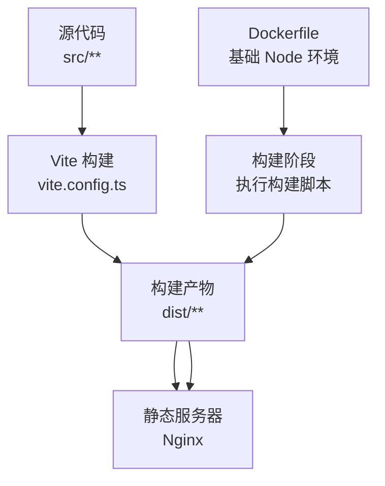
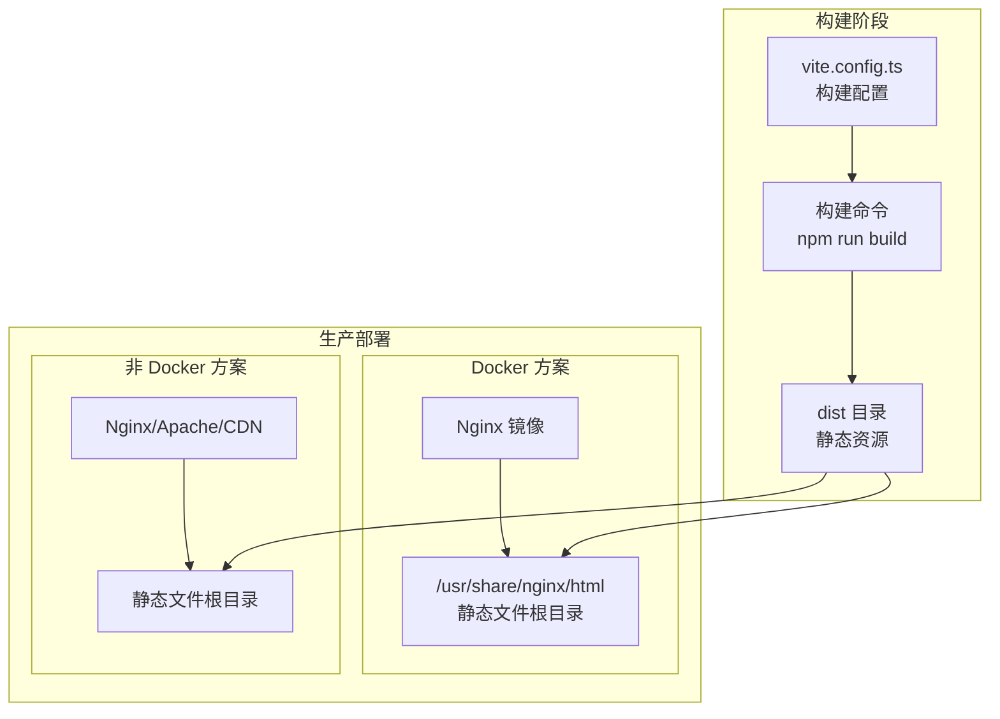
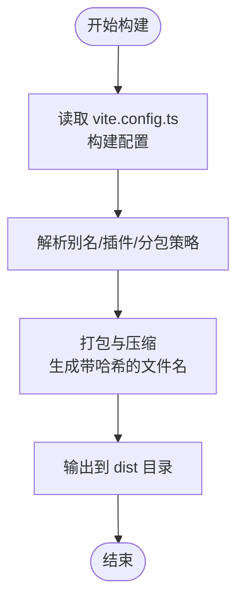
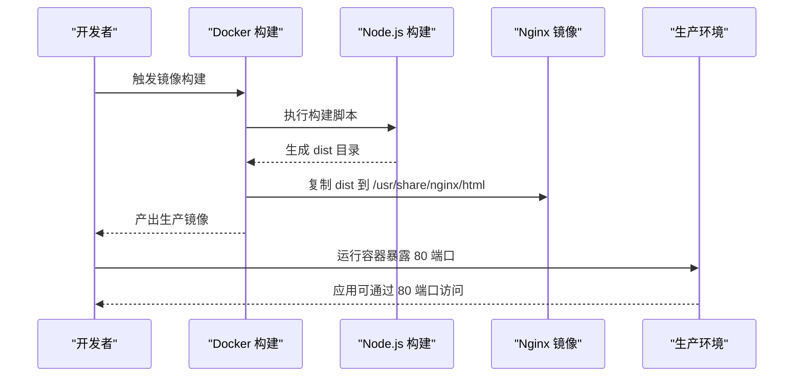
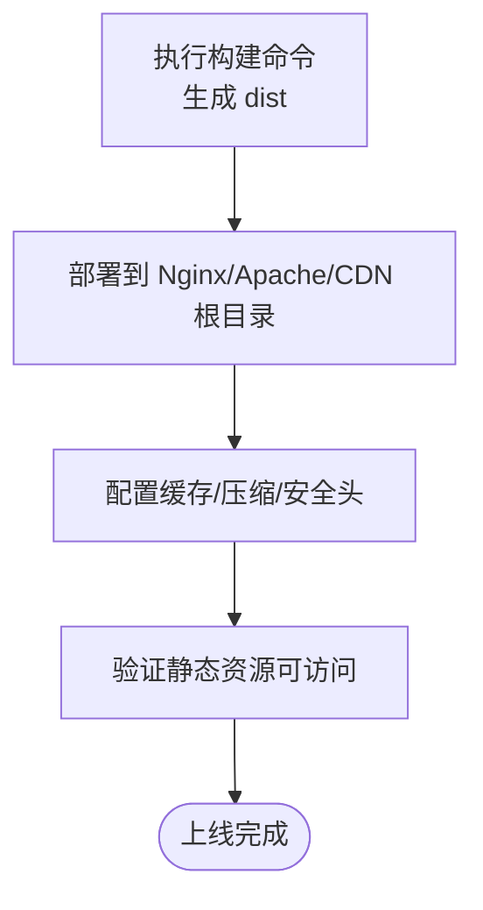
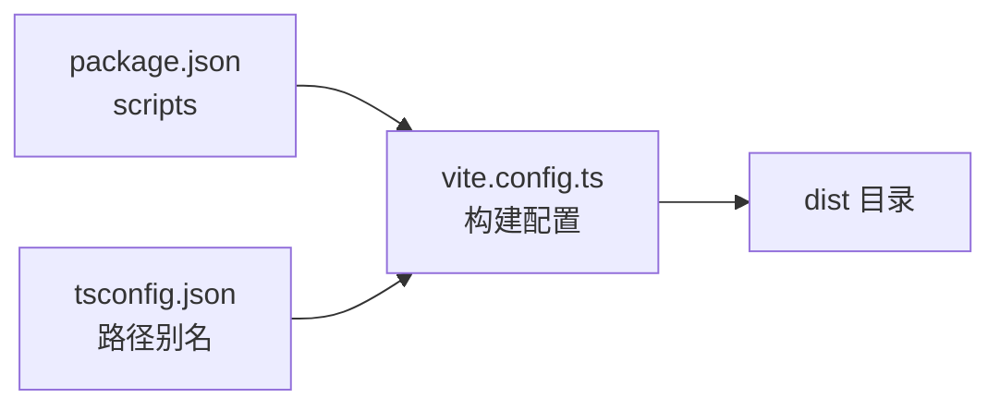

# 部署说明

<cite>
**本文引用的文件**
- [Dockerfile](file://Dockerfile)
- [vite.config.ts](file://vite.config.ts)
- [package.json](file://package.json)
- [README.md](file://README.md)
- [tsconfig.json](file://tsconfig.json)
</cite>

## 目录
1. [简介](#简介)
2. [项目结构](#项目结构)
3. [核心组件](#核心组件)
4. [架构总览](#架构总览)
5. [详细组件分析](#详细组件分析)
6. [依赖分析](#依赖分析)
7. [性能考虑](#性能考虑)
8. [故障排查指南](#故障排查指南)
9. [结论](#结论)
10. [附录](#附录)

## 简介
本文件面向运维与开发团队，提供一套完整且可操作的部署方案，覆盖：
- 基于 Docker 的生产镜像构建与运行（含 Nginx 作为静态服务器）
- 非 Docker 环境下将 Vite 构建产物部署到任意静态 Web 服务器（Nginx/Apache/CDN）
- 对 vite.config.ts 中构建配置的理解，尤其是输出文件名带哈希与资源路径策略
- 部署检查清单，确保应用稳定上线

## 项目结构
该仓库采用 Vite + React + Bun 的现代前端工程，构建产物默认输出至 dist 目录。Dockerfile 当前仅包含基础 Node.js 环境，需配合构建脚本与 Nginx 镜像完成生产部署。

图表来源
- [vite.config.ts](file://vite.config.ts#L1-L96)
- [Dockerfile](file://Dockerfile#L1-L3)

章节来源
- [README.md](file://README.md#L78-L100)
- [package.json](file://package.json#L10-L17)

## 核心组件
- 构建配置与产物输出
  - Vite 构建配置定义了目标、压缩、分包策略及输出文件命名规则（带哈希），并开启 Terser 去除 console/debugger。
  - 构建产物默认输出到 dist 目录，后续由 Nginx 提供静态服务。
- Docker 镜像
  - 当前 Dockerfile 仅安装 Node.js，未包含 Nginx 或构建产物复制逻辑；建议在实际生产中扩展为多阶段构建镜像，或在容器外挂载 dist 目录。
- Web 服务器
  - 生产环境推荐使用 Nginx/Apache/CDN 提供静态文件服务，以获得更好的缓存、压缩与安全能力。

章节来源
- [vite.config.ts](file://vite.config.ts#L35-L91)
- [Dockerfile](file://Dockerfile#L1-L3)
- [package.json](file://package.json#L10-L17)

## 架构总览
下图展示了从构建到上线的整体流程，以及在 Docker 与非 Docker 环境下的差异：

图表来源
- [vite.config.ts](file://vite.config.ts#L35-L91)
- [package.json](file://package.json#L10-L17)

## 详细组件分析

### Vite 构建配置与产物命名（带哈希）
- 关键点
  - 输出文件命名规则：引入文件、入口文件、资源文件均采用带哈希的命名策略，有利于浏览器强缓存与版本隔离。
  - 分包策略：通过手动分包将第三方库按类别拆分，减少单文件体积并提升缓存命中率。
  - 压缩与分析：启用 Brotli 压缩与可视化分析，便于性能优化与容量评估。
  - 生产优化：开启 Terser 去除 console/debugger，降低体积并避免泄露调试信息。
- 影响
  - 静态资源 URL 将包含哈希，需确保 Web 服务器正确提供缓存头与资源路径解析。
  - 分包策略影响首次加载体积与缓存粒度，建议结合 CDN 与预加载策略优化首屏。

图表来源
- [vite.config.ts](file://vite.config.ts#L1-L96)

章节来源
- [vite.config.ts](file://vite.config.ts#L35-L91)
- [tsconfig.json](file://tsconfig.json#L24-L29)

### Docker 镜像与启动流程
- 现状
  - 当前 Dockerfile 仅安装 Node.js，未包含 Nginx 或构建产物复制逻辑。
- 建议的生产镜像思路
  - 多阶段构建：第一阶段使用 Node.js 构建 dist；第二阶段使用 Nginx 镜像，将 dist 复制到 Nginx 的静态目录（例如 /usr/share/nginx/html），并设置默认端口 80。
  - 运行参数：容器启动时暴露 80 端口，Nginx 默认监听 80。
- 注意事项
  - 若使用容器内 Nginx，需确保静态资源路径与缓存头正确配置。
  - 若使用外部 Nginx/Apache/CDN，建议将 dist 目录挂载或通过 CI/CD 发布到对应服务器。

图表来源
- [Dockerfile](file://Dockerfile#L1-L3)
- [package.json](file://package.json#L10-L17)
- [vite.config.ts](file://vite.config.ts#L35-L91)

章节来源
- [Dockerfile](file://Dockerfile#L1-L3)
- [package.json](file://package.json#L10-L17)

### 非 Docker 环境部署（Nginx/Apache/CDN）
- 步骤
  - 在本地或 CI/CD 机器执行构建命令，生成 dist 目录。
  - 将 dist 目录中的静态文件部署到 Nginx/Apache 的静态根目录（例如 /usr/share/nginx/html 或站点根目录）。
  - 配置 Web 服务器的缓存头、压缩（gzip/Brotli）、安全头（如跨源隔离相关头）。
  - 如使用 CDN，确保缓存键包含哈希，避免旧版本缓存。
- 与 Vite 配置的关系
  - 构建产物带哈希，有利于 CDN 缓存与回源策略。
  - 路由与资源路径需与实际部署路径一致，避免 404。

图表来源
- [package.json](file://package.json#L10-L17)
- [vite.config.ts](file://vite.config.ts#L35-L91)

章节来源
- [package.json](file://package.json#L10-L17)
- [README.md](file://README.md#L78-L100)

## 依赖分析
- 构建与运行依赖
  - 构建脚本由 package.json 中的 scripts 定义，使用 Vite 执行构建。
  - Vite 配置由 vite.config.ts 提供，包含插件、分包、压缩与输出策略。
- 路径与别名
  - tsconfig.json 中配置了路径别名，有助于在构建与运行时保持一致的模块解析行为。

图表来源
- [package.json](file://package.json#L10-L17)
- [vite.config.ts](file://vite.config.ts#L1-L96)
- [tsconfig.json](file://tsconfig.json#L24-L29)

章节来源
- [package.json](file://package.json#L10-L17)
- [vite.config.ts](file://vite.config.ts#L1-L96)
- [tsconfig.json](file://tsconfig.json#L24-L29)

## 性能考虑
- 输出文件命名带哈希
  - 优点：强缓存与版本隔离，利于 CDN 与浏览器缓存。
  - 注意：需确保 Web 服务器正确返回缓存头，避免缓存污染。
- 分包策略
  - 将第三方库按类别拆分，可提升缓存命中率，减少重复下载。
- 压缩与分析
  - Brotli 压缩与可视化分析有助于降低传输体积并定位性能瓶颈。
- 生产优化
  - Terser 去除 console/debugger，减少体积并避免调试信息泄露。

章节来源
- [vite.config.ts](file://vite.config.ts#L35-L91)

## 故障排查指南
- 构建失败
  - 确认已安装依赖并执行构建脚本。
  - 检查构建配置是否正确，尤其是分包与输出策略。
- 静态资源 404
  - 确认 dist 目录已完整部署到 Web 服务器根目录。
  - 检查资源路径与哈希是否匹配，确认缓存头与重写规则。
- 缓存问题
  - 若出现旧版本资源，确认 CDN/浏览器缓存策略与哈希版本。
- Docker 镜像无法启动
  - 确认镜像包含 Nginx 并正确复制 dist 到静态目录。
  - 确认容器暴露 80 端口并映射到宿主机。

章节来源
- [package.json](file://package.json#L10-L17)
- [vite.config.ts](file://vite.config.ts#L35-L91)
- [Dockerfile](file://Dockerfile#L1-L3)

## 结论
- 本项目默认使用 Vite 构建，产物位于 dist 目录，适合部署到任意静态 Web 服务器。
- 当前 Dockerfile 仅提供 Node.js 环境，建议扩展为多阶段构建镜像或在容器外挂载 dist 目录。
- 通过带哈希的输出文件名与合理的分包策略，可显著提升缓存效率与首屏性能。
- 建议在生产环境中统一配置缓存头、压缩与安全头，确保稳定性与安全性。

## 附录

### 部署检查清单（运维）
- 构建与产物
  - 已执行构建命令并生成 dist 目录
  - dist 目录包含完整静态资源（含带哈希的 JS/CSS/媒体文件）
- Web 服务器配置
  - 已将 dist 目录部署到静态根目录
  - 已配置缓存头、压缩（gzip/Brotli）与安全头
  - 路由与资源路径正确，无 404
- Docker 部署（可选）
  - 已构建包含 Nginx 的生产镜像
  - 已将 dist 复制到 Nginx 静态目录
  - 容器已暴露 80 端口并可正常访问
- CDN/缓存（可选）
  - CDN 缓存键包含哈希，避免旧版本缓存
  - 回源策略与缓存 TTL 合理
- 性能与安全
  - 已启用 Brotli 压缩与可视化分析
  - 已移除 console/debugger，避免调试信息泄露
  - 跨源隔离相关头（如 COOP/COEP）按需配置

章节来源
- [package.json](file://package.json#L10-L17)
- [vite.config.ts](file://vite.config.ts#L35-L91)
- [Dockerfile](file://Dockerfile#L1-L3)