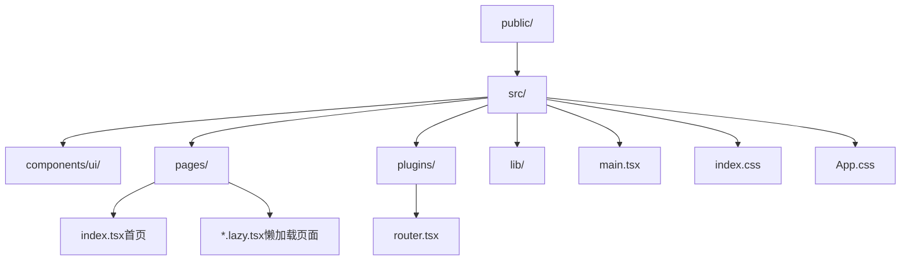
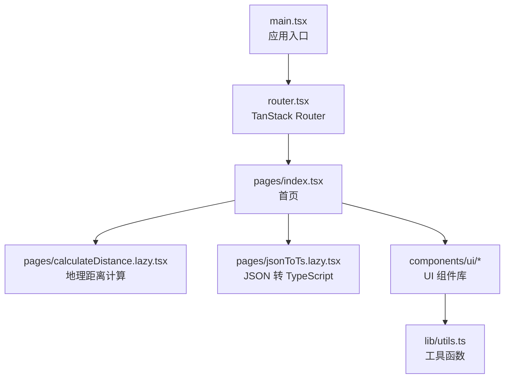
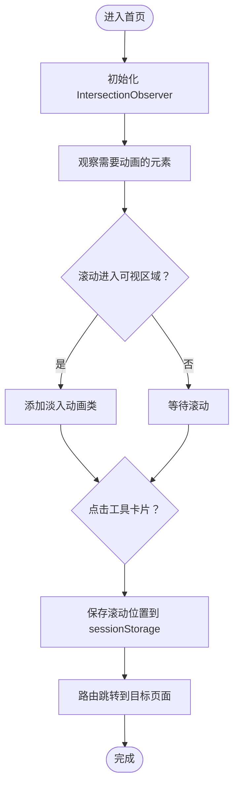
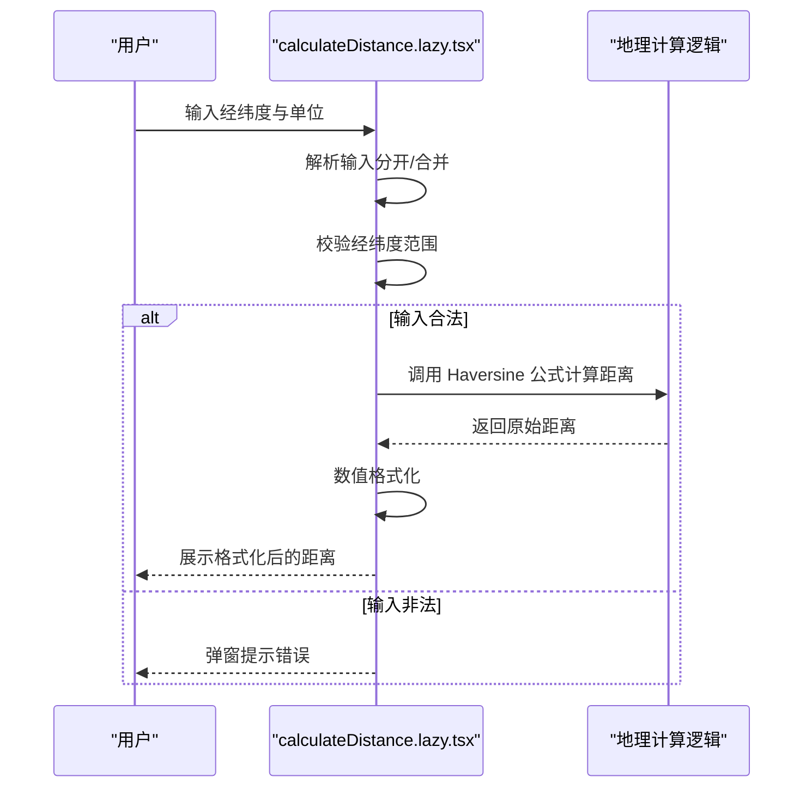
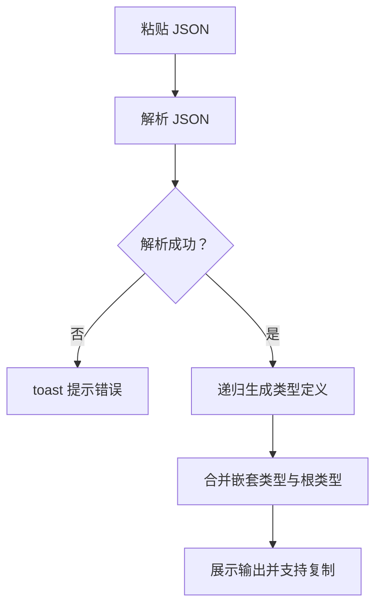
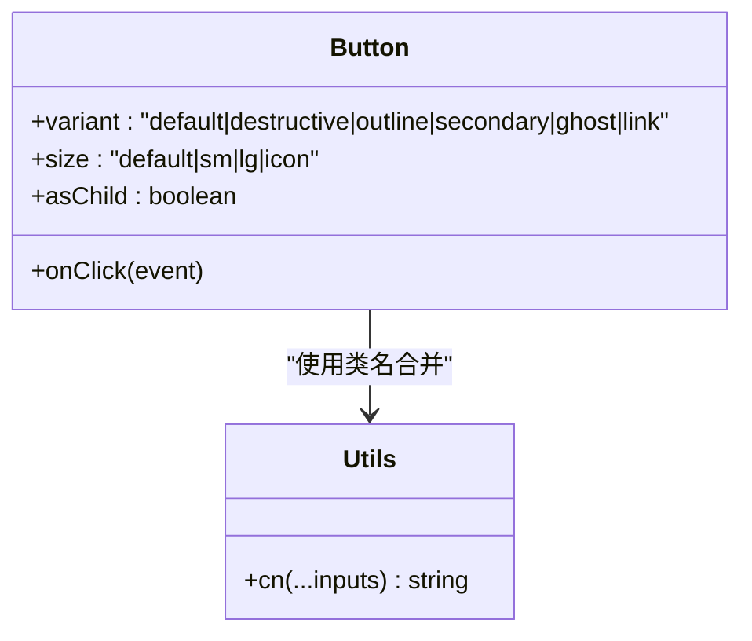
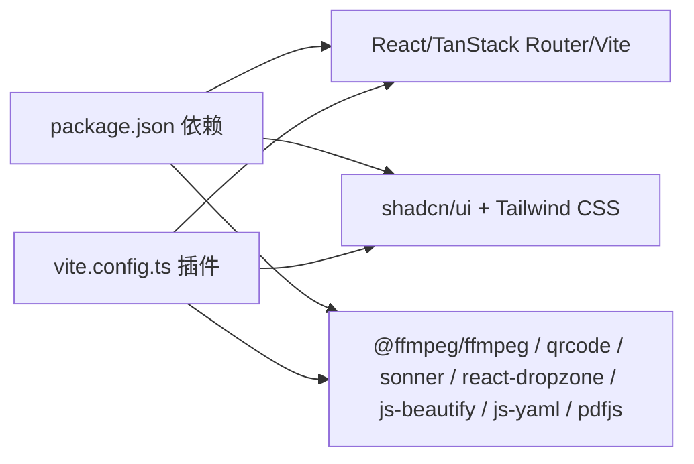

# 项目概述

<cite>
**本文引用的文件**
- [README.md](file://README.md)
- [package.json](file://package.json)
- [vite.config.ts](file://vite.config.ts)
- [tsconfig.json](file://tsconfig.json)
- [src/main.tsx](file://src/main.tsx)
- [src/plugins/router.tsx](file://src/plugins/router.tsx)
- [src/pages/index.tsx](file://src/pages/index.tsx)
- [src/pages/calculateDistance.lazy.tsx](file://src/pages/calculateDistance.lazy.tsx)
- [src/pages/jsonToTs.lazy.tsx](file://src/pages/jsonToTs.lazy.tsx)
- [src/components/ui/button.tsx](file://src/components/ui/button.tsx)
- [src/lib/utils.ts](file://src/lib/utils.ts)
- [components.json](file://components.json)
</cite>

## 目录
1. [引言](#引言)
2. [项目结构](#项目结构)
3. [核心组件](#核心组件)
4. [架构总览](#架构总览)
5. [详细组件分析](#详细组件分析)
6. [依赖分析](#依赖分析)
7. [性能考量](#性能考量)
8. [故障排查指南](#故障排查指南)
9. [结论](#结论)
10. [附录](#附录)

## 引言
本项目是一个基于 React 19 + TypeScript + Vite 6 + Bun 的现代化在线工具集合平台，旨在为开发者、设计师与普通用户提供一站式多功能工具解决方案。项目覆盖五大功能领域：
- 文件处理：PDF 合并/转 Word、图片转 PDF、图片压缩、视频转 GIF、图片转 base64、图片元数据查看、图片水印等
- 编码转换：JSON 转 TypeScript、十六进制与字符串互转、颜色转换、时间戳转换、YAML/JSON 转换
- 网络工具：WebSocket 客户端、HTTP 状态码、HTTP 请求头、端口工具
- 地理坐标：经纬度距离计算、WGS84 与 GCJ02 坐标系转换
- 开发辅助：JSON/CSS/JS 格式化、SCSS 转 CSS、ASCII 表、二维码生成、HTML 转 JS、签名生成、浏览器标签导入

项目采用纯前端架构，所有处理逻辑均在浏览器内完成，无需后端服务，具备极佳的隐私性与可用性。技术选型优势包括：
- React 19 的新特性支持与更优的并发渲染能力
- Vite 6 的极速开发体验与按需编译
- Bun 运行时的高性能与低延迟
- shadcn/ui + Tailwind CSS 4 带来的现代化 UI 体验与一致的组件风格

## 项目结构
项目采用“按功能域划分”的组织方式，核心目录如下：
- public：静态资源与 Web Worker
- src：
  - components/ui：基于 shadcn/ui 的通用 UI 组件库
  - pages：页面级组件，包含首页与各工具页面；大量页面以懒加载形式存在
  - plugins：路由插件与 TanStack Router 集成
  - lib：工具函数与第三方资源封装
  - 主入口 main.tsx、全局样式 index.css、App.css
- 构建与配置：vite.config.ts、tsconfig.json、components.json、tsr.config.json 等

图表来源
- [src/main.tsx](file://src/main.tsx#L1-L19)
- [src/plugins/router.tsx](file://src/plugins/router.tsx#L1-L19)
- [src/pages/index.tsx](file://src/pages/index.tsx#L1-L295)
- [vite.config.ts](file://vite.config.ts#L1-L96)

章节来源
- [README.md](file://README.md#L100-L124)
- [package.json](file://package.json#L1-L89)
- [vite.config.ts](file://vite.config.ts#L1-L96)
- [tsconfig.json](file://tsconfig.json#L1-L32)

## 核心组件
- 应用入口与路由
  - main.tsx：挂载 RouterProvider 与全局提示组件，负责应用根节点渲染
  - router.tsx：基于 TanStack Router 的路由实例，包含默认 404 处理
- 首页与导航
  - index.tsx：首页聚合展示五大类工具，支持滚动状态记忆与进入子页面前的状态保存
- UI 组件库
  - button.tsx：基于 class-variance-authority 的按钮变体与尺寸系统
  - 其他通用组件位于 components/ui 下，统一由 shadcn/ui 配置管理
- 工具页面
  - 以 lazy 页面为主，按需加载，降低首屏体积
  - 示例：calculateDistance.lazy.tsx（地理距离计算）、jsonToTs.lazy.tsx（JSON 转 TypeScript）

章节来源
- [src/main.tsx](file://src/main.tsx#L1-L19)
- [src/plugins/router.tsx](file://src/plugins/router.tsx#L1-L19)
- [src/pages/index.tsx](file://src/pages/index.tsx#L1-L295)
- [src/components/ui/button.tsx](file://src/components/ui/button.tsx#L1-L59)
- [src/pages/calculateDistance.lazy.tsx](file://src/pages/calculateDistance.lazy.tsx#L1-L203)
- [src/pages/jsonToTs.lazy.tsx](file://src/pages/jsonToTs.lazy.tsx#L1-L167)

## 架构总览
整体架构采用“纯前端 + 懒加载 + 组件化”的设计，数据流与渲染流程如下：
- 入口 main.tsx -> RouterProvider -> 路由解析 -> 页面组件 -> UI 组件
- 首页 index.tsx 负责分类展示工具卡片，点击后通过路由跳转至对应懒加载页面
- 懒加载页面按需下载，减少初始包体，提升首屏性能
- UI 组件通过 shadcn/ui + Tailwind CSS 提供一致的视觉与交互体验

图表来源
- [src/main.tsx](file://src/main.tsx#L1-L19)
- [src/plugins/router.tsx](file://src/plugins/router.tsx#L1-L19)
- [src/pages/index.tsx](file://src/pages/index.tsx#L1-L295)
- [src/pages/calculateDistance.lazy.tsx](file://src/pages/calculateDistance.lazy.tsx#L1-L203)
- [src/pages/jsonToTs.lazy.tsx](file://src/pages/jsonToTs.lazy.tsx#L1-L167)
- [src/components/ui/button.tsx](file://src/components/ui/button.tsx#L1-L59)
- [src/lib/utils.ts](file://src/lib/utils.ts#L1-L18)

## 详细组件分析

### 首页组件（index.tsx）
- 功能要点
  - 分类聚合展示五大类工具，每个类别包含若干具体工具
  - 使用 IntersectionObserver 实现滚动进入时的淡入动画
  - 进入子页面前将当前滚动位置写入 sessionStorage，返回时恢复滚动位置
  - 点击工具卡片触发路由跳转，进入对应懒加载页面
- 数据与渲染
  - categories 结构驱动页面布局与导航
  - Card 组件承载标题与描述，点击事件触发导航
- 可扩展性
  - 新增工具只需在 categories 中添加条目即可自动出现在首页
  - 动画与滚动状态管理可复用于其他页面

图表来源
- [src/pages/index.tsx](file://src/pages/index.tsx#L1-L295)

章节来源
- [src/pages/index.tsx](file://src/pages/index.tsx#L1-L295)

### 懒加载页面示例（calculateDistance.lazy.tsx）
- 功能要点
  - 支持两种输入模式：分开输入两组经纬度、合并输入“经度,纬度”
  - 支持三种单位：米、千米、英里
  - 使用 Haversine 公式计算两点间球面距离，并进行数值格式化
  - 输入校验与范围校验，防止非法输入
- 数据流
  - 用户输入 -> 解析坐标 -> 参数校验 -> 距离计算 -> 格式化输出
- 错误处理
  - 非法输入弹窗提示
  - 超出范围经纬度弹窗提示

图表来源
- [src/pages/calculateDistance.lazy.tsx](file://src/pages/calculateDistance.lazy.tsx#L1-L203)

章节来源
- [src/pages/calculateDistance.lazy.tsx](file://src/pages/calculateDistance.lazy.tsx#L1-L203)

### 懒加载页面示例（jsonToTs.lazy.tsx）
- 功能要点
  - 将 JSON 字符串转换为 TypeScript 接口定义
  - 自动生成嵌套类型与数组类型
  - 支持复制输出到剪贴板
- 数据流
  - 用户粘贴 JSON -> 解析 JSON -> 递归生成类型定义 -> 合并嵌套类型 -> 输出
- 错误处理
  - 非法 JSON 抛错并提示 toast

图表来源
- [src/pages/jsonToTs.lazy.tsx](file://src/pages/jsonToTs.lazy.tsx#L1-L167)

章节来源
- [src/pages/jsonToTs.lazy.tsx](file://src/pages/jsonToTs.lazy.tsx#L1-L167)

### UI 组件（button.tsx）
- 设计要点
  - 基于 class-variance-authority 的变体与尺寸系统
  - 支持 asChild 透传语义标签
  - 与 Tailwind CSS 类合并工具协同
- 使用场景
  - 首页卡片点击、页面内操作按钮、复制按钮等

图表来源
- [src/components/ui/button.tsx](file://src/components/ui/button.tsx#L1-L59)
- [src/lib/utils.ts](file://src/lib/utils.ts#L1-L18)

章节来源
- [src/components/ui/button.tsx](file://src/components/ui/button.tsx#L1-L59)
- [src/lib/utils.ts](file://src/lib/utils.ts#L1-L18)

## 依赖分析
- 运行时与框架
  - Bun v1.0.x、React 19、TanStack Router v1.114.4、Vite 6.2.0
- UI 与样式
  - shadcn/ui + Tailwind CSS 4.0.11，组件别名与样式配置由 components.json 管理
- 工具库
  - @ffmpeg/ffmpeg（视频处理）、qrcode（二维码）、sonner（提示）、react-dropzone（拖拽）、html2canvas（截图）、js-beautify（格式化）、js-yaml/pdfjs 等
- 构建与开发
  - Vite 插件链：@tanstack/router-plugin、@vitejs/plugin-react、@tailwindcss/vite、vite-plugin-compression、rollup-plugin-visualizer
  - TypeScript 配置启用 bundler 模式与路径别名

图表来源
- [package.json](file://package.json#L1-L89)
- [vite.config.ts](file://vite.config.ts#L1-L96)
- [components.json](file://components.json#L1-L21)

章节来源
- [package.json](file://package.json#L1-L89)
- [vite.config.ts](file://vite.config.ts#L1-L96)
- [components.json](file://components.json#L1-L21)

## 性能考量
- 懒加载策略
  - 大量页面采用 lazy 加载，减少首屏包体与初次渲染压力
- 代码分割
  - Vite/rollup 按依赖特征手动分包（如 pdf、image、converter、utils 等），提升缓存命中率
- 压缩与可视化
  - 启用 Brotli 压缩与可视化报告，便于分析体积构成
- 构建优化
  - Terser 去除 console 与 debugger，减少生产包体积
- 运行时优化
  - Bun 运行时提供更快的启动与执行速度，适合工具类应用的即时响应

章节来源
- [vite.config.ts](file://vite.config.ts#L36-L91)

## 故障排查指南
- 路由与导航
  - 若页面无法跳转或 404，请检查路由配置与页面文件命名是否与路由树一致
- 懒加载页面空白
  - 确认页面文件存在且导出 Route 与组件，检查网络加载状态
- UI 样式异常
  - 检查 components.json 的 aliases 与 tailwind 配置是否正确
- 构建报错
  - 检查 TypeScript 配置与 bundler 模式，确认路径别名 @/* 正确
- 性能问题
  - 使用可视化报告分析包体组成，按需拆分与移除未使用的依赖

章节来源
- [src/plugins/router.tsx](file://src/plugins/router.tsx#L1-L19)
- [components.json](file://components.json#L1-L21)
- [tsconfig.json](file://tsconfig.json#L1-L32)
- [vite.config.ts](file://vite.config.ts#L1-L96)

## 结论
本项目以“纯前端 + 懒加载 + 组件化”为核心架构，围绕五大功能领域提供实用工具，具备良好的可扩展性与模块化设计。借助 React 19、Vite 6、Bun 与 shadcn/ui + Tailwind CSS 的现代技术栈，项目在开发体验、运行性能与用户体验方面均达到较高水准。对于初学者，建议从首页与基础 UI 组件入手，逐步理解路由与懒加载机制；对于高级开发者，可在现有基础上扩展新工具、优化性能与完善测试体系。

## 附录
- 学习路径建议
  - 第一步：阅读 README 与项目结构，理解五大功能领域
  - 第二步：浏览首页 index.tsx，了解分类与导航机制
  - 第三步：查看 UI 组件（如 button.tsx），掌握组件使用与样式系统
  - 第四步：研究懒加载页面示例（如 calculateDistance.lazy.tsx、jsonToTs.lazy.tsx），理解数据流与错误处理
  - 第五步：探索构建配置（vite.config.ts、tsconfig.json、components.json），理解打包与样式配置
- 在线体验与贡献
  - README 提供在线演示链接与贡献指南，可参考进行二次开发与功能扩展

章节来源
- [README.md](file://README.md#L1-L199)
- [src/pages/index.tsx](file://src/pages/index.tsx#L1-L295)
- [src/components/ui/button.tsx](file://src/components/ui/button.tsx#L1-L59)
- [src/pages/calculateDistance.lazy.tsx](file://src/pages/calculateDistance.lazy.tsx#L1-L203)
- [src/pages/jsonToTs.lazy.tsx](file://src/pages/jsonToTs.lazy.tsx#L1-L167)
- [vite.config.ts](file://vite.config.ts#L1-L96)
- [tsconfig.json](file://tsconfig.json#L1-L32)
- [components.json](file://components.json#L1-L21)